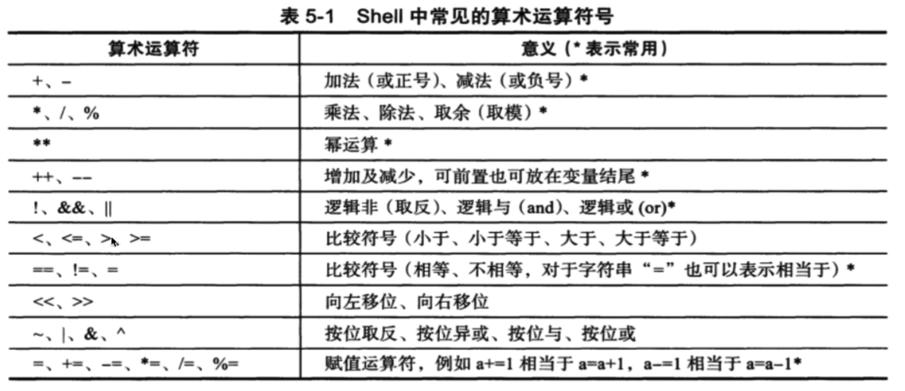
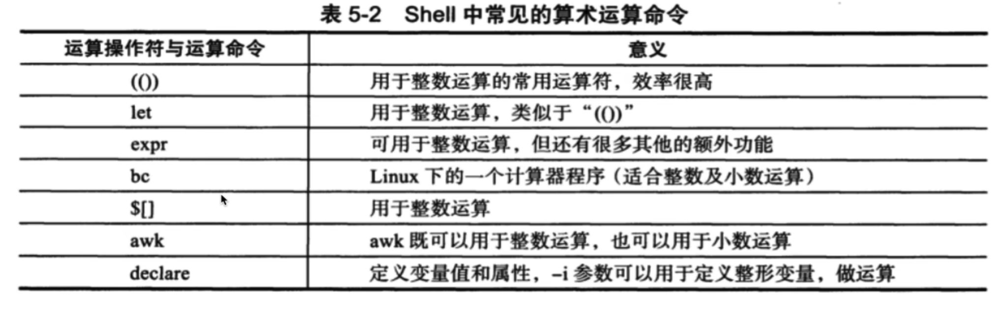
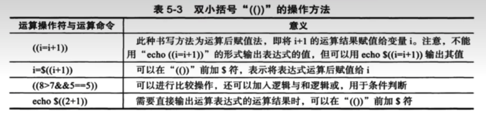

# 10.shell的数学运算和双小括号

> shell 的一些基础命令，只支持整数的运算，小数的运算需要如 bc 这样的命令才支持





## 10.1.用于数值计算的命令

### 10.1.1.双小括号 (())



```
[root@VM-0-4-centos ~]# echo ((8>7))
-bash: 未预期的符号 `(' 附近有语法错误
[root@VM-0-4-centos ~]# echo $((8>7))
1
[root@VM-0-4-centos ~]# echo $((6>7))
0
[root@VM-0-4-centos ~]# 
```

> 需要直接输出运算表达式的运算结果时，可以再 (()) 前加 $ 符号

```
[root@VM-0-4-centos ~]# num=5
[root@VM-0-4-centos ~]# ((num=num*3))
[root@VM-0-4-centos ~]# echo $num
15
[root@VM-0-4-centos ~]# 
```

```
[root@VM-0-4-centos ~]# a=5
[root@VM-0-4-centos ~]# echo $((++a))
6
[root@VM-0-4-centos ~]# echo $((a++))
6
[root@VM-0-4-centos ~]# echo $a
7
[root@VM-0-4-centos ~]#
```


```bash
#!/bin/bash
# 写一个 + - * \ 的脚本
printf_usage() {
  printf "Please enter an inter\n"
  # 给脚本的执行结果，赋予一个状态码，退出码
  exit 1
}

# read -p "提示信息"   接收用户输入的变量
read -p "Please input your number: " firstnum

# 对用户的输入进行判断 if 语句
# 限制用户必须输入数字
# 中括号前后必须有一个空格，是固定语法
# -n 是if的语句，对字符串进行判断，如果字符串为空，条件就不成立，如果字符串不为空，条件成立
# sed 的作用就是把字符串, 假如是 "qwer123" 进行替换，把所有的数字都替换为空，那么就剩下其他非数字的内容
if [ -n "`echo $firstnum|sed 's/[0-9]//g'`" ]
  then 
    printf_usage
fi

# 输入运算符号
read -p "Please input your operator: " operator

# 对符号进行判断 限制为 + - * /
if [ "${operator}" != "+" ] && [ "${operator}" != "-" ] && [ "${operator}" != "*" ] && [ "${operator}" != "/" ]
  then
    echo "只允许输入 + = * /"
    exit 2
fi

read -p "Please input your number: " secondnum

if [ -n "`echo $secondnum|sed 's/[0-9]//g'`" ]
  then 
    printf_usage
fi

# shell 中 * 号 要加 \ 还没试，不知道说的对不对
echo "${firstnum}${operator}${secondnum}结果是: $((${firstnum}${operator}${secondnum}))"

```

```bash
#!/bin/bash
echo $(($1))
```

### 10.1.2.let命令运算

let 命令执行等同于 双小括号，但是双小括号效率更高

```
[root@VM-0-4-centos ~]# num=1
[root@VM-0-4-centos ~]# let num = num + 1
-bash: let: =: 语法错误: 期待操作数 （错误符号是 "="）
[root@VM-0-4-centos ~]# let num=num+1
[root@VM-0-4-centos ~]# $num
-bash: 2: 未找到命令
[root@VM-0-4-centos ~]# echo $num
2
[root@VM-0-4-centos ~]# 
```


### 10.1.3.开发检查 nginx 是否运行的脚本

while 循环
```
[root@VM-0-4-centos ~]# while true;do echo "hello world";sleep 1;done
hello world
hello world
hello world
hello world
```

```bash
#!/bin/bash

CheckUrl() {
  timeout=5
  fails=0
  success=0

  # 循环检测， 循环执行一些命令
  while true
    do
      wget --timeout=${timeout} --tries=1 http://pythonav.cn/ -q -o /dev/null

      # echo $?
      # if 的条件参数 -ne 是不等于的意思
      if [ $? -ne 0 ]
        then let fails=fails+1 # 失败次数加 1
      else 
        let success+=1
      fi

      # -ge 大于等于的意思
      if [ $success -ge 1 ]
        then echo "网站还在运行"
        # 返回一个状态码 0
        exit 0
      fi

      # 当错误次数大于等于2的时候，就警告，发邮件等等
      if [ ${fails} -ge 2 ]
        then echo "该网站挂了"
        # 返回一个状态码 0
        exit 2
      fi

    done
}

CheckUrl
```