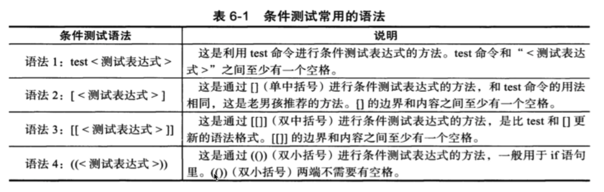
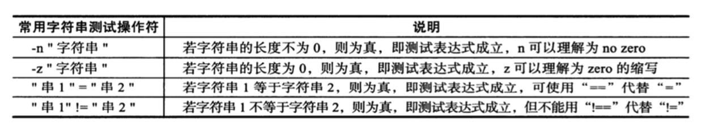
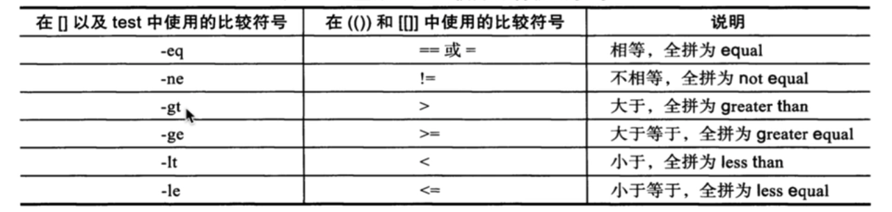
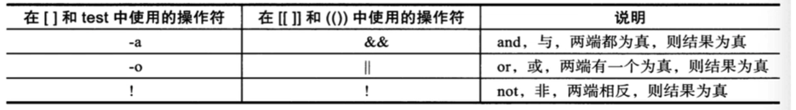
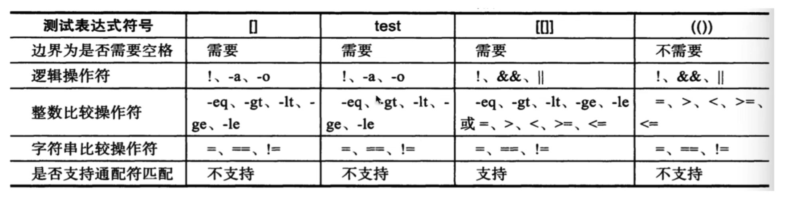

# 13.shell条件测试

## 13.1.read

shell 变量除了直接赋值 或者传入变量，还有就是 read 命令读取

read 也是内置命令

```
-p 设置提示信息
-t 等待用户输入超时，timeout
read -p "请输入：" vars
```

```
[root@VM-0-4-centos ~]# read -t 15 -p "请你输入你的名字， 年龄：" your_name your_age
请你输入你的名字， 年龄：zs 18
[root@VM-0-4-centos ~]# echo $your_name $your_age
zs 18
[root@VM-0-4-centos ~]# 
```

## 13.2.条件测试

得到真假的概念

### 13.2.1.shell提供条件测试语句



1. test命令

test命令评估一个表达式，它的结果是真，还是假，如果条件为真，那么命令执行的状态码结果就为0，否则不为0，通过 $? 取值

> 真为 0， 假为 1

* test语法参数大全

```
-e 该文件是否存在，（普通文件，目录），存在就为真，否则为假（常用）
-f 该文件名是否为文件（file）（常用）
-d 该文件名是否为目录（directory）（常用）
-b 该文件名是否为一个 block device 装置
-c 该文件名是否为一个 character device 装置
-s 该文件名是否为一个 Socket 文件
-p 该文件名是否为一个 FIFO(pipe) 文件
-p 该文件名是否为一个 连结档

# 关于文件的权限侦测，如 test -r filename
-r 侦测该文件是否具有 可读 属性
-w 侦测该文件是否具有 可写 属性
-x 侦测该文件是否具有 可执行 属性
-u 侦测该文件是否具有 SUID 属性
-g 侦测该文件是否具有 SGID 属性
-k 侦测该文件是否具有 Sticky bit 属性
-s 侦测该文件是否为 非空白文件
 
# 两个文件之间的比较 如： test file1 -nt file2
-nt (newer than) 判断 file1 是否比 file2 新
-ot (older than) 判断 file1 是否比 file2 旧
-ef 判断 file2 与 file2 是否为同一个文件，可用在判断 hard link 的判定上。主要意义在判定，两个文件是否均指向同一个 inode 

# 关于两个整数之间的判定(针对变量数值大小比较判断)，如 test n1 -eq n2
-eq 两数值相等 (equal)
-ne 两数值不等 (not equal)
-gt n1 大于 n2 (greater than)
-lt n1 小于 n2 (less than)
-ge n1 大于等于 n2 (greater than or equal)
-le n1 小于等于 n2 (less than or equal)

# 判定字符串的数据
test -z string 判定字符串是否为 0 (判断字符串为空) ？ 若 string 为空字符串，则为 true
test -n string 判定字符串是否为 0 (判断字符串不为空) ？ 若 string 为空字符串，则为 false
注：-n 亦可省略
test str1 = str2 判断 str1 是否等于 str2，若相等，则回传 true
test str1 != str2 判断 str1 是否不等于 str2，若相等，则回传 false

# 多重条件判断，例如： test -r filename -a -x filename
-a (and) 两状况同时成立！例如 test -r file -a -x file, 则 file 同时具有 r 与 x 权限时，才回传 true
-o (or) 两状况任意一个成立！例如 test -r file -o -x file, 则 file 具有 r 或 x 权限时，就可回传 true
！ 反向状态， 如 test ! -x file, 当 file 不具有 x 时，回传 true
```

* 简单演示

```
[root@VM-0-4-centos /]# test -e hello.py
[root@VM-0-4-centos /]# echo $?
1
[root@VM-0-4-centos /]# ls
app  boot  dev  home  lib64       media  mydata  proc  run   srv  tmp  var
bin  data  etc  lib   lost+found  mnt    opt     root  sbin  sys  usr
[root@VM-0-4-centos /]# test -e home
[root@VM-0-4-centos /]# echo $?
0
```

* test 命令实践

```
# -e
[root@VM-0-4-centos tmp]# test -e heihei.txt && echo "这个嘿嘿文件已存在" || echo "这个嘿嘿文件不存在"
这个嘿嘿文件不存在
[root@VM-0-4-centos tmp]# test -e heihei.txt && echo "这个嘿嘿文件已存在" || touch heihei.txt
[root@VM-0-4-centos tmp]# test -e heihei.txt && echo "这个嘿嘿文件已存在" || touch heihei.txt
这个嘿嘿文件已存在
[root@VM-0-4-centos tmp]# 

# -f
[root@VM-0-4-centos tmp]# test -f happy && echo ok || echo no
no
[root@VM-0-4-centos tmp]# 

# -d
[root@VM-0-4-centos tmp]# test -d happy && echo ok || echo no
no
[root@VM-0-4-centos tmp]# 

# -z
```

2. 中括号

脚本中经常进行条件测试， 用的最多的，都是中括号 []

test 和 [] 作用是一样的

> 注意的点： 中括号，前后的空格必须有
> 在条件测试中使用变量，必须添加双引号

```
# -f
[root@VM-0-4-centos tmp]# touch happy.txt
[root@VM-0-4-centos tmp]# file1="happy.txt"
[root@VM-0-4-centos tmp]# [ -f "$file1" ] && echo ok || echo no
ok
[root@VM-0-4-centos tmp]# rm happy.txt
rm：是否删除普通空文件 "happy.txt"？y
[root@VM-0-4-centos tmp]# [ -f "${file1}" ] && echo ok || echo no
no
[root@VM-0-4-centos tmp]# 

# -d
[ -d dir_name ]
```

3. 双中括号

和 中括号 类似


> 系统脚本 /etc/init.d/

### 13.2.2.字符串比较



> 对于字符串变量的比较，一定要给变量添加双引号 "$name" 
> 等于号左右两边也需要有空格

```
MacBook-Pro-7:~ j$ name=zs
MacBook-Pro-7:~ j$ [ "$name" = "zs"  ]
MacBook-Pro-7:~ j$ echo $?
0

MacBook-Pro-7:~ j$ [ -f "Music"  ]
MacBook-Pro-7:~ j$ echo $?
1
MacBook-Pro-7:~ j$ [ !  -f "Music"  ]
MacBook-Pro-7:~ j$ echo $?
0
```

### 13.2.3.shell数值比较



1. 在中括号中，以及 test 中数值测试的用法

> 中括号中，使用数学比较符号，请添加转译符号 比如 \>， != 不用加反斜杠

```
MacBook-Pro-7:~ j$ [ 2 > 1 ] && echo yes || echo no
yes
MacBook-Pro-7:~ j$ [ 1 > 2 ] && echo yes || echo no
yes
MacBook-Pro-7:~ j$ [ 1 \> 2 ] && echo yes || echo no
no
MacBook-Pro-7:~ j$ [ 1 -ge 2 ] && echo yes || echo no
no
MacBook-Pro-7:~ j$ test "$n1" -eq "$n2" && echo yes || echo no
no
MacBook-Pro-7:~ j$ test "$n1" -lt "$n2" && echo yes || echo no
yes
MacBook-Pro-7:~ j$ test "$n1" !=  "$n2" && echo yes || echo no
yes
MacBook-Pro-7:~ j$ test "$n1" =  "$n2" && echo yes || echo no
no
```

2. 双中括号

> 对单括号的补充，双括号还支持正则处理
> 在双括号中， 就不要转译符号了

```
MacBook-Pro-7:~ j$ [[ 5 > 6 ]] && echo yes || echo no
no
MacBook-Pro-7:~ j$ [[ 5 < 6 ]] && echo yes || echo no
yes
MacBook-Pro-7:~ j$ [[ 5 = 6 ]] && echo yes || echo no
no
MacBook-Pro-7:~ j$ [[ 5 != 6 ]] && echo yes || echo no
yes
MacBook-Pro-7:~ j$ 
MacBook-Pro-7:~ j$ [[ 5 -lt 6 ]] && echo yes || echo no
yes
```

## 13.3.逻辑操作符号

```
&& -a     与 运算， 两边都为真，结果为真
|| -o     或 运算， 两边有一个为真，结果为真
```



### 13.3.1.实践

```
[root@VM-0-4-centos ~]# [ -f "$file1" -a -f "$file2" ] && echo yes || echo no
yes
[root@VM-0-4-centos ~]# 
[root@VM-0-4-centos ~]# a="";b="zs"
[root@VM-0-4-centos ~]# test -n "$a" && echo yes || echo no
no
[root@VM-0-4-centos ~]# test -n "$b" && echo yes || echo no
yes
[root@VM-0-4-centos ~]# [[ -n "$a" && "$a" = "$b"  ]] && echo yes || echo no
no
[root@VM-0-4-centos ~]# a="zs"
[root@VM-0-4-centos ~]# [[ -n "$a" && "$a" = "$b"  ]] && echo yes || echo no
yes
[root@VM-0-4-centos ~]# a="ls"
[root@VM-0-4-centos ~]# [[ -n "$a" && "$a" = "$b"  ]] && echo yes || echo no
no
[root@VM-0-4-centos ~]# [[ -n "$a" && ! "$a" = "$b"  ]] && echo yes || echo no
yes
[root@VM-0-4-centos ~]# [[ -n "$a" && "$a" != "$b"  ]] && echo yes || echo no
yes
```

## 13.4.逻辑运算脚本开发

```bash
#!/bin/bash

read -p "Please input a number: " var1

[ "$var1" -eq "1" ] && {
  echo "输入了一个1"
  exit 0
}

[ "$var1" -eq "2" ] && {
  echo "输入了一个2"
  exit 0
}

[ "$var1" -ne "2" -a "$var1" -ne "1" ] && {
  echo "输入了1或者2"
  exit 1
}
```

> 最常用的就是 中括号，搭配 -gt -lt 如此用法即可

```
[ $a -gt $b ]
```



### 13.4.1.实践

```bash
#!/bin/bash

path=/shell-program/test_scripts/

[ ! -d "$path" ] && mkdir $path -p

cat <<END
  1.:[install lamp]
  2.:[install lnmp]
  3.:[exit]
  pls input the num you want:
END

read num

expr $num + 1 &> /dev/null

[ $? -ne 0 ] && {
  echo "Ten num must is {1|2|3}"
  exit 1
}

[ "$num" -eq "1" ] && {
  echo "start installing ... lamp"
  sleep 2;

  # 判断是否有可执行权限，有就执行，没有提示
  # [ -x "$path/lamp.sh"  ] || {
  #   echo "The file is error..."
  #   exit 1
  # }
  # $path/lamp.sh

  # 运行脚本，直接运行不好么？？？
  source $path/lamp.sh
  exit $?
}

[ "$num" -eq "2" ] && {
  echo "start installing ... lnmp"
  sleep 2;

  # 判断是否有可执行权限，有就执行，没有提示
  # [ -x "$path/lnmp.sh"  ] || {
  #   echo "The file is error..."
  #   exit 1
  # }
  # $path/lnmp.sh

  # 运行脚本，直接运行不好么？？？
  source $path/lnmp.sh
  exit $?
}

[ "$num" -eq "3" ] && {
  echo "byebye"
}
```
