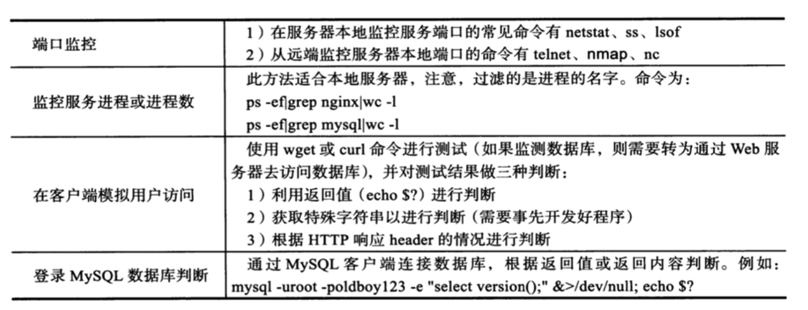

# 14.if表达式

## 14.1.if语句

### 14.1.1.单分支表达式

```bash
if <条件表达式>
  then 
    代码
fi

if <条件表达式>; then 
    代码
fi
```

### 14.1.2.双分支表达式

```bash
if <条件表达式>
  then 
    if <条件表达式>; then 
      代码
    fi
fi
```

### 14.1.3.if-else 处理

```bash
if <条件表达式>;then 
  逻辑代码
else
  逻辑代码
fi
```

### 14.1.4.多分支处理

```
if 如果。。。 then
elif 又如果。。。 then
else 否则。。。 不需要 then 的

if elif 嵌套一般不超过 3 层
```

```bash
if <条件表达式>;then 
  逻辑代码
elif <条件表达式>;then
  逻辑代码
elif <条件表达式>;then
  逻辑代码
else
  逻辑代码
fi
```

## 14.2.if实践

```bash
#!/bin/bash

if [ -f /etc/hosts ]  ;then
  echo "[] it's ok"
fi

if [[ -f /etc/hosts ]]  ;then
  echo "[[]] it's ok"
fi

if test -f /etc/hosts ;then
  echo "test it's ok"
fi
```

## 14.3.开发系统监测脚本

监测 linux 剩余可用内存，如果小于 100M， 就发邮件给运维；
并且该脚本加入 crontab, 每三分钟检查一次内存

* 获取内存 free -m， 获取 available 的数据，它是现实系统可以提供给应用程序可用内存的大小

```
# free -m 获取内存情况
[root@VM-0-4-centos ~]# free -m
              total        used        free      shared  buff/cache   available
Mem:           1837        1539          74           1         224         139
Swap:             0           0           0
# 获取 available 的值
[root@VM-0-4-centos ~]# free -m |awk 'NR==2 {print $NF}'
140
[root@VM-0-4-centos ~]# 

[root@VM-0-4-centos test_scripts]# grep  "^p" lnmpOrlampInstall.sh -n
3:path=/shell_program/test_scripts/
[root@VM-0-4-centos test_scripts]# 
[root@VM-0-4-centos test_scripts]# cat lnmpOrlampInstall.sh | grep "^p" -n -i
3:path=/shell_program/test_scripts/
```

* 检查内存的脚本
```bash 
#!/bin/bash

FreeMem=`free -m |awk 'NR==2 {print $NF}'`
CHARS="Current memory is $FreeMem"
targetFile="/shell_program/test_scripts/messages.txt"

if [ "$FreeMem" -lt "2100" ] ;then
  echo $CHARS|tee $targetFile
  # mail -s "主题" 收件人 < 内容
  # mail -s "`date +%F-%T`$CHARS" 596737739@qq.com < $targetFile
  echo "内存不足，抓紧维护服务器"
fi
```

* 犹豫 jenkins 老自动停止运行，做了两种方案： mac 做了全局命令，手动检查；这是第二种 使用 crontab， linux 定时检查，下边是脚本
```bash
#!/bin/bash

dockerPs=`docker ps`
jenId="426fae94ea33"

result=$(echo $dockerPs | grep "${jenId}")


if [[ "$result" != "" ]] ;then
    echo "I'm running"
else
    docker start 426fae94ea33
fi
```

* 编辑 crontab
```
# 每三分钟执行一下脚本，并把执行的结果写到黑洞文件中
*/3 * * * * /bin/bash /shell_program/test_scripts/check_jen.sh &>/dev/null

*/3 * * * * /bin/bash /shell_program/test_scripts/check_jen.sh &>/shell_program/test_scripts/jen_message.txt
```

* 写 crontab 文件
```
# crontab -e 编辑 crontab 文件
[root@VM-0-4-centos test_scripts]# crontab -e
crontab: installing new crontab
# 查看 crontab 文件
[root@VM-0-4-centos test_scripts]# crontab -l 
*/3 * * * * /bin/bash /shell_program/test_scripts/check_jen.sh &>/shell_program/test_scripts/jen_message.txt
```

## 14.4.开发比较脚本

```bash
#!/bin/bash

a="$1"
b="$2"

# expr $a + $b &> /dev/null
expr $a + $b

[ $? -ne 0 ] && {
  echo "Argument must be a number"
  exit 1
}

if test -z "$a" ; then 
  echo "请输入两个参数"
  exit 1
fi

if [ -z "$b" ] ; then 
  echo "请输入第二个参数"
  exit 1
fi


if [ "$a" -gt "$b" ] ; then
  echo "a greater then b"
  exit 0
elif [ "$a" -eq "$b" ] ; then
  echo "a equal b"
  exit 0
else
  echo "a less then b"
  exit 0
fi

```

## 14.4.开发 mysql 监控脚本



* 通过服务器本地端口监控 mysql 的状态
```
# 获取条数
[root@VM-0-4-centos ~]# netstat -tunlp | grep mysql | wc -l
0
[root@VM-0-4-centos ~]# ss -tunlp|grep 端口号|wc -l
2
[root@VM-0-4-centos ~]# lsof -i tcp:端口号
COMMAND     PID USER   FD   TYPE    DEVICE SIZE/OFF NODE NAME
docker-pr 13066 root    4u  IPv4 385442267      0t0  TCP *:dyna-access (LISTEN)
docker-pr 13070 root    4u  IPv6 385442279      0t0  TCP *:dyna-access (LISTEN)
[root@VM-0-4-centos ~]# lsof -i tcp:端口号|wc -l
3
```

### 14.4.1.远程监控 mysql 端口

* 安装

```
# nmap 端口扫描
yum install telnet nmap nc -y
```


```
# nmap 使用 查看端口 监测是否是 open
nmap 127.0.0.1 -p 3360
[root@VM-0-4-centos ~]# nmap 127.0.0.1 -p 3360

Starting Nmap 6.40 ( http://nmap.org ) at 2023-05-11 14:51 CST
Nmap scan report for VM-0-4-centos (127.0.0.1)
Host is up (0.000056s latency).
PORT     STATE  SERVICE
3360/tcp closed unknown

Nmap done: 1 IP address (1 host up) scanned in 0.24 seconds
[root@VM-0-4-centos ~]# nmap 127.0.0.1 -p 3360 | grep open | wc -l
0
```

* telnet 

```
[root@VM-0-4-centos ~]# echo -e "\n" | telnet 127.0.0.1 3360
Trying 127.0.0.1...
telnet: connect to address 127.0.0.1: Connection refused
[root@VM-0-4-centos ~]# 
# 连接失败
[root@VM-0-4-centos ~]# echo -e "\n" | telnet 127.0.0.1 3360 2>/dev/null |grep Connected
# 连接通的
[root@VM-0-4-centos ~]# echo -e "\n" | telnet 127.0.0.1 端口 2>/dev/null |grep Connected
Connected to 127.0.0.1.
[root@VM-0-4-centos ~]# echo -e "\n" | telnet 127.0.0.1 端口 2>/dev/null |grep Connected |wc -l
1
```

* 进程监测

```
[root@VM-0-4-centos ~]# ps -ef | grep mysql | grep -v grep | wc -l
5
```

* 脚本

```
#!/bin/bash

echo "----方法1"

if [ `netstat -tunlp | grep 端口号 | wc -l` -gt "1" ] ;then
  echo "netstat MySQL is running."
else
  echo "MySQL is stopped"
  # systemctl start mariadb
fi
#!/bin/bash

echo "----方法2"

if [ `ss -tunlp | grep 端口号 | wc -l` -gt "1" ] ;then
  echo "ss MySQL is running."
else
  echo "MySQL is stopped"
  # systemctl start mariadb
fi

echo "----方法3"

if [ `lsof -i tcp:端口号 | wc -l` -gt "1" ] ;then
  echo "ss MySQL is running."
else
  echo "MySQL is stopped"
  # systemctl start mariadb
fi

# php node 开发脚本
# node /shell_program/test_scripts/check_mysql_1.js

# if [ "$?" -eq 0 ] ;then
#   echo "ss MySQL is running."
# else
#   echo "MySQL is stopped"
#   # systemctl start mariadb
# fi
```

## 14.5.rsync

```
[root@VM-0-4-centos test_scripts]# which rsync
/usr/bin/rsync
# 查看配置文件
[root@VM-0-4-centos test_scripts]# ls -l /etc/rsyncd.conf 
-rw-r--r-- 1 root root 458 4月   1 2020 /etc/rsyncd.conf
# 查看 rsync 是否运行
[root@VM-0-4-centos test_scripts]# netstat -tunlp|grep 873
# 启动 rsync
[root@VM-0-4-centos test_scripts]# /usr/bin/rsync --daemon
[root@VM-0-4-centos test_scripts]# netstat -tunlp|grep 873
tcp        0      0 0.0.0.0:873             0.0.0.0:*               LISTEN      9010/rsync          
tcp6       0      0 :::873                  :::*                    LISTEN      9010/rsync    
# 停止 rsync
[root@VM-0-4-centos test_scripts]# pkill rsync
[root@VM-0-4-centos test_scripts]# netstat -tunlp|grep 873
[root@VM-0-4-centos test_scripts]#
```

* 控制 rsync 脚本
```bash
#!/bin/bash

# -ne 条件 不等于 $# 传递给脚本的参数个数  $0 取得的脚本文件名
# chmod +x /etc/init.d/cc_rsync
# chmod +x /shell_program/test_scripts/rsync_cc

params1="start"
params2="stop"
params3="restart"
allArgvs="{$params1|$params2|$params3}"
tip="Usage: $0 $allArgvs"

if [ "$#" -ne 1 ] ;then
  echo $tip
  exit 1
fi

# 当用户选择启动 rsync

if [ "$1" =  "$params1" ] ;then
  /usr/bin/rsync --daemon
  sleep 2
  # 验证端口是否启动了
  if [ `netstat -tunlp|grep rsync|wc -l` -ge "1" ] ;then 
    echo "Rsyc is started!!!"
    exit 0
  fi
elif [ "$1" =  "$params2" ] ;then
  killall rsync &>/dev/null
  sleep 2
  if [ `netstat -tunlp|grep rsync|wc -l` -eq "0" ] ;then 
    echo "Rsyc is stopped!!!"
    exit 0
  fi
elif [ "$1" = "$params3" ] ;then
  killall rsync &>/dev/null
  sleep 1
  killpro=`netstat -tunlp|grep rsync|wc -l`
  /usr/bin/rsync --daemon
  sleep 1
  startpro=`netstat -tunlp|grep rsync|wc -l`
  if [ "$killpro" -eq "0" -a "$startpro" -ge "1" ] ;then 
    echo "Rsyc is restart!!!"
    exit 0
  fi
else 
  echo $tip
  exit 1
fi
```


