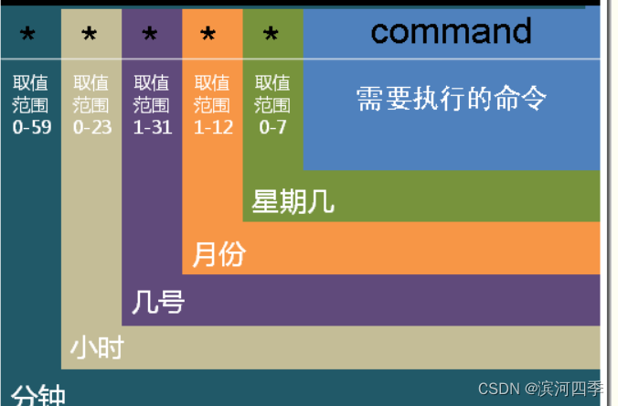

# 17.【Linux】 定时任务调度详解(crontab)

## 17.1.概述

crontab命令用于设置周期性被执行的指令。该命令从标准输入设备读取指令，并将 其存放于“crontab”文件中，以供之后读取和执行。

可以使用crontab定时处理离线任务，比如每天凌晨2点更新数据等，经常用于系统 任务调度。

## 17.2.服务启动和关闭

```
一般Linux系统中都会装有 crontab ，如果没有安装可以使用下面的命令安装：

yum -y install crontabs

crontab 服务的启动和关闭命令如下：

centos7服务管理命令，centos7之前版本使用service管理

systemctl start crond     # 启动服务

systemctl stop crond     # 关闭服务

systemctl restart crond  # 重启服务

systemctl reload crond  # 重新载入配置

systemctl status crond   # 查看crontab服务状态 #

可以使用下面的命令加入开机启动 systemctl enable crond
```

## 17.3.服务启动和关闭

任务调度全局配置 crontab 全局任务调度配置在如下的目录：

文件 | 说明
---  | ---
cron.daily/	| 是每天执行一次的job
cron.weekly/ |	是每个星期执行一次的job
cron.monthly/ |	是每月执行一次的job
cron.hourly/ |	是每个小时执行一次的job
cron.d/ |	是系统自动定期需要做的任务
crontab |	是设定定时任务执行文件
cron.deny |	文件就是用于控制不让哪些用户使用Crontab的功能

## 17.4.用户配置文件

每个用户都有自己的 crontab 配置文件，使用 crontab -e 命令进行编辑。保存后系 统会自动存放与 /var/spool/cron/ 目录中，文件以用户名命名。

linux的 crontab 服务每隔一分钟去读取一 次 /var/spool/cron , /etc/crontab , /etc/cron.d 下面所有的内容。

```
crontab命令一览：
crontab -e : 编辑当前用户的定时任务列表
crontab -l : 查看当前用户的定时任务列表
crontab -r : 删除当前用户的定时任务列表
```

## 17.5.crontab定时任务格式

crontab每一条记录为一个定时任务，定时人遵循相应的定义规则。



```
其中前面的5个星号表示的含义如下：

minute ：表示分钟，可以是从0到59之间的任何整数。
hour ：表示小时，可以是从0到23之间的任何整数。
day ：表示日期，可以是从1到31之间的任何整数。
month ：表示月份，可以是从1到12之间的任何整数。
week ：表示星期几，可以是从0到7之间的任何整数，这里的0或7代表星期日。command ：要执行的命令，可以是系统命令，也可以是自己编写的脚本文件。
每一个星号部分可用下面的特殊符号：

星号（*）：通配符匹配，代表所有可能的值。
逗号（,）：可以用逗号隔开的值指定一个列表范围，例如，“1,2,5,7,8,9”。
中杠（-）：可以用整数之间的中杠表示一个整数范围，例如“2-6”表示 “2,3,4,5,6”。
正斜线（/）：可以用正斜线指定时间的间隔频率，例如“0-23/2”表示每两小时执 行一次。同时正斜线可以和星号一起使用，例如*/10，如果用在minute字段， 表示每十分钟执行一次。
```

## 17.5.crontab定时任务实例

```
下面列举常用的时间频次示例。

00 05 * * * : 每天凌晨5点执行
20 12 1,10,20 * * : 每个月的1号，10号，20号的12:20执行
10 1 * * 6,0 : 表示每周六、周日的1:10分执行
0,30 18-23 * * * : 每天18:00至23:00之间每隔30分钟执行
0 23-7/1 * * * : 晚上11点到早上7点之间，每隔一小时执行
0 6-12/3 * 10 * : 每年10月的每天早上6点到12点每隔3个小时执行一次
30 17 * * 1-5 : 周一到周五下午5点30分执行一次 0 */2 * * * ：每两个小时执行一次
例如：

每隔一分钟打印一次时间

* * * * * echo "echo `date`" >> ~/1.txt
```

## 17.6.输入输出重定向

在上面更新数据定时任务的实例中，如果执行的时候有错误信息输出，会输出到哪儿呢？

例如：每隔一分钟列出/root下和/aaa下的目录和文件；因为/aaa目录不存在所以会报错

```
* * * * * ls /root /asss >> ~/1.txt 2>&1
```

## 17.7.时间处理 (将每天的日志输入到不同的文件)

再回顾上面的更新任务，它是将每一天的运行结果都重定向到 update.log 文件，如 果输出比较多，我们就需要每一天输出的不同的文件，可以通过在输出目录中指定日 期用来分割。如下：

date 函数中的 % 需要转义。

```
30 12 * * * echo "echo `date`" >> ~/"time_`date +\%Y\%m\%d`.txt"
```

每天12：30都打印时间到当天的文件里，比如今天是8月5号，8月6号就有一个文件：


原文链接：https://blog.csdn.net/weixin_65690979/article/details/126176083
