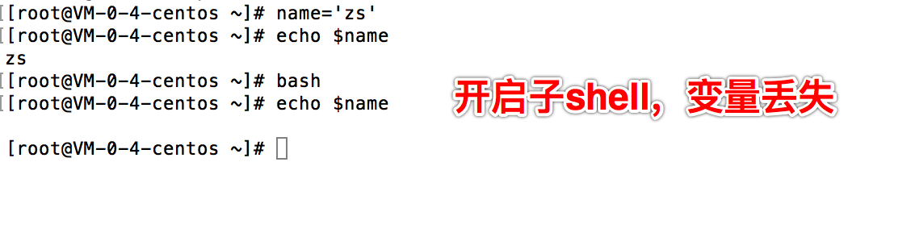

# 5.shell变量

## 5.1.本地变量

定义 shell变量，变量名不需要加 $

本地变量只在当前 shell 生存期生效



## 5.2.变量定义

1. 变量名要求：数字，字母，下划线组成，可以是字母或是下划线开头
2. 变量名严格区分大小写

## 5.3.取出变量值

1. 单引号，所见即所得，强引用
2. 双引号，输出引号里所有内容，识别特殊符号，弱引用
3. 无引号，连续的符号可以不加引号，空格会引起歧义，最好使用双引号
4. 反引号，引用命令执行结果，等于 $() 用法

## 5.4.特殊变量

shell的特殊变量，用在如 脚本， 函数传递参数使用， 有如下特殊的， 位置参数变量

1. $0 获取 shell 脚本文件名，以及脚本路径
2. $n 获取 shell 脚本的n个参数， n在1-9之间，如 $1, $2, $9, 大于9则需要写 ${10}, 参数空格隔开
3. $# 获取 shell 脚本的后面的参数总个数
4. $* 获取 shell 脚本所有参数，不加引号等同于 $@ 作用，加上引号 "$*" 作用是 接收所有参数为单个字符串， "$1 $2..."
5. $@ 不加引号效果同上，加引号，是接受所有参数为独立字符串， 如 "$1", "$2"
"$3" ..., 空格保留

```sh
#! /bin/bash

echo '特殊变量 $0 $1 $2... 的实践'
echo '结果：' $0 $1 $2

echo '##########################'
echo '特殊变量 $# 获取参数总个数'
echo '结果：' $#

echo '##########################'
echo '特殊变量 $* 获取参数总个数'
echo '结果：' $*

echo '##########################'
echo '特殊变量 $@ 获取参数总个数'
echo '结果：' $@
```

```
MacBook-Pro-7:shell学习1 j$ sh ./test.sh 1 2 3 4 5 6
特殊变量 $0 $1 $2... 的实践
结果： ./test.sh 1 2
##########################
特殊变量 $# 获取参数总个数
结果： 6
##########################
特殊变量 $* 获取参数总个数
结果： 1 2 3 4 5 6
##########################
特殊变量 $@ 获取参数总个数
结果： 1 2 3 4 5 6
```

* $* $@ 区别

```sh
#!/bin/bash
echo "print each param from \$\*"
for var in "$*"
do 
  echo "$var"
done

echo "print each param from \$\@"
for var in "$@"
do 
  echo "$var"
done
```

```
MacBook-Pro-7:shell学习1 j$ sh ./test.sh 1 2 3 4 5 6
print each param from $\*
1 2 3 4 5 6
print each param from $\@
1
2
3
4
5
6
```

## 5.5.特殊状态变量

1. $? 上一次命令执行返回值，0 正确，非 0 失败
2. \$\$ 当前 shell 进程号
3. $! 上一次后台进程的 PID
4. $_ 得到上一次命令的最后一个参数

## 5.5.1.查找特殊变量的方式

```
man bash

搜索 Special Parameters
```

## 5.5.2.脚本控制返回值

> [ $# -ne 2 ] [] 与符号和数字之间必须有空格 

```sh
#!/bin/bash

# $# 获取参数个数    -ne 不等于的情况 && 并且
[ $# -ne 2 ] && {
  echo "must be two args"
  exit 119 # 终止程序运行，且返回 119 状态码 提供当前 shell 的 $? 变量，若是在函数里可以用 return 119 用法
}
echo ok
```

运行完 echo $? // 打印上一次执行结果

## 5.5.3.获取上一次后台执行的程序 PID， $!获取

```
[root@VM-0-4-centos ~]#  nohup ping baidu.com & 1> /dev/null
[1] 19283
[root@VM-0-4-centos ~]# nohup: 忽略输入并把输出追加到"nohup.out"

[root@VM-0-4-centos ~]# echo $!
19283
[root@VM-0-4-centos ~]# ps -ef|grep ping
root     19283 19196  0 15:37 pts/0    00:00:00 ping baidu.com
root     19827 19196  0 15:39 pts/0    00:00:00 grep --color=auto ping
```

## 5.5.3.当前执行的程序 ID， $$ 获取 

```
echo "当前脚本执行id: $$"
```

## 5.5.3.获取上一次命令最后一个参数 $_

```
MacBook-Pro-7:shell学习1 j$ echo $_
2
```


