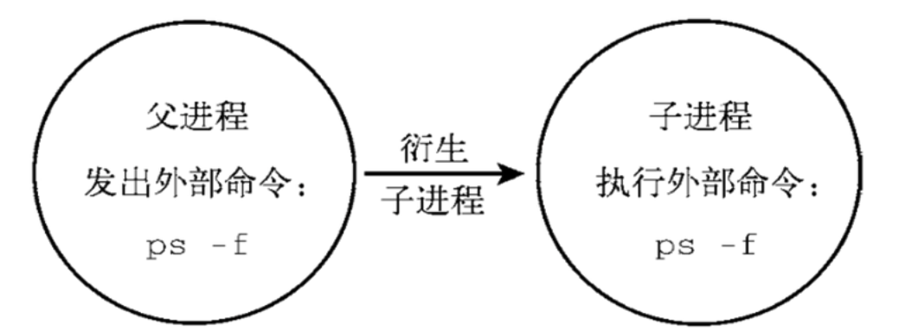

# 7.父子shell

* source 和 点， 执行脚本，只在当前 shell 环境中执行生效
* 指定 bash sh 解释器运行脚本，是开启 subshell，开启子 shell 运行脚本命令
* ./script, 都会指定 shebang， 通过解释器运行，也是开启 subshell 运行脚本命令

## 7.1.ps管理进程命令

```bash
ps -ef 
-f  显示 UID  PID  PPID
-e  列出所有进程信息，如同 -A 选项 option

# 通过一条命令，检查父子 shell 关系
ps -ef --forest 
```

输入 bash 就可以进入子进程， exit 退出当前（一个）进程

## 7.2.创建进程列表（创建子进程）

### 7.2.1.创建子进程运行的意义

不影响当前窗口的使用


### 7.2.2.创建方式 小括号

执行一系列shell命令

```
ls;cd;pwd;echo "hello world"
```

* shell 的进程列表理念，需要使用 （）小括号, 如下执行方式称之为进程列表。开启小括号就是开启子shell运行命令

```bash
(ls;cd;pwd;echo "hello world")
(ls;cd /;pwd;echo $BASH_SUBSHELL)
```

* 多层括号，子 shell 嵌套运行

一个括号开启一个shell运行命令

```bash
(ls;cd;pwd;echo "hello world")
(ls;cd /;pwd;(echo $BASH_SUBSHELL))
```


## 7.3.检查是否在子进程shell BASH_SUBSHELL

该变量特点，如果是 0， 就是在当前 shell 环境执行的，否则就是开辟子shell去运行的

```
echo $BASH_SUBSHELL
```

## 7.4.linux的内外置命令

内置命令： 在系统启动时就加载入内存，常驻内存，执行效率更高，但是占用资源。

外置命令： 系统需要从硬盘中读取程序文件，再读入内存加载

### 7.4.1.外置命令

自己单独下载的文件系统命令，处于 bash shell 之外的程序

```
/bin
/usr/bin
/sbin
/usr/sbin
```

* 特点
一定会开启子进程执行

```
[root@VM-0-4-centos ~]# ps -f --forest
UID        PID  PPID  C STIME TTY          TIME CMD
root     14871 14833  0 10:08 pts/0    00:00:00 -bash
root     15974 14871  0 10:12 pts/0    00:00:00  \_ ps -f --forest
root     13373 13082  0  2022 pts/0    00:00:00 /bin/bash
root     13751 13373  0  2022 pts/0    00:00:00  \_ mysql -uroot -px xxxx
```



### 7.4.2.内置命令

* 特点
内置命令不会产生子进程去执行。内置命令和 shell 是一体的，是 shell 的一部分，系统启动后就执行在内存中了

* 验证 type

```
[root@VM-0-4-centos ~]# type cd
cd 是 shell 内嵌

# 查看 linux 的内置 shell 命令
[root@VM-0-4-centos ~]# compgen -b
```
