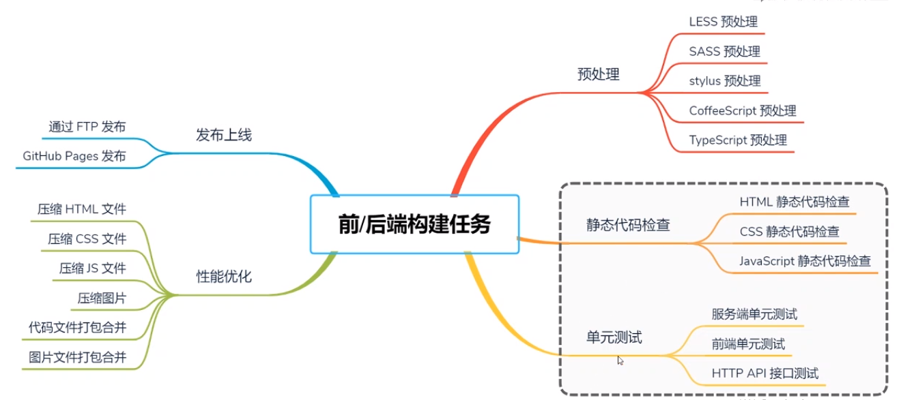
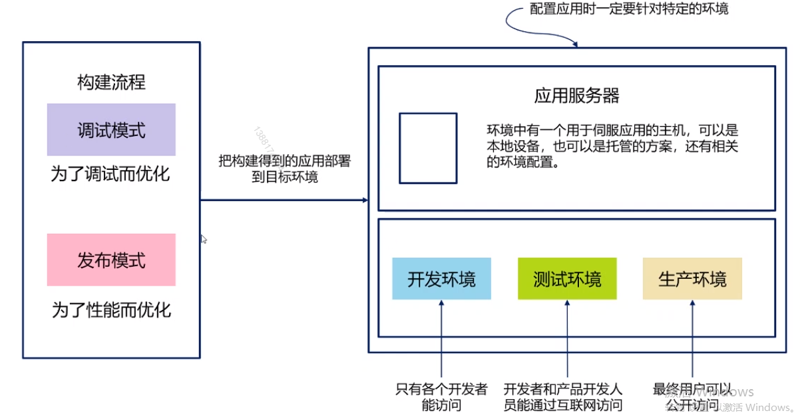
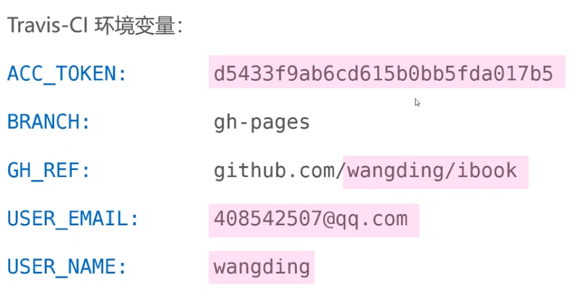

# 1.自动化构建与持续集成

* 掌握自动化构建的概念（狭义和广义）
* 了解自动化构建和人工构建的区别
* 了解前端项目和后端项目自动化构建的差异
* 掌握两个模式和三种环境的概念
* 掌握三类构建工具的使用及构建脚本的编写
* 掌握自动化构建的工作流程
* 了解 GitBook 电子书的自动化构建

## 自动化构建与持续集成

### 前后端常见的构建任务

* 前端 5 类
* 后端 2 类

;

### 软件开发过程

* 版本控制
单一集中的代码仓库

* 自动化构建
无人工干预的编译和构建软件

* 自动化测试
无人工干预的执行单元测试和集成测试

* 持续集成
开发人员每天多次向仓库主干合并代码变更并触发构建和测试任务

* 自动发布
无人工干预的打包和部署

* 持续提交
每个代码变更都及时并入代码仓库

### 自动化构建的优势

* 减少构建，部署出错的可能性
* 提高开发效率，降低开发成本
* 代码更加模块化，易于维护和重构
* 可以有效提升软件质量
* 使软件代码更符合代码规范

;

npm i --production

### 自动化构建的软件支持
* 版本控制系统
	git github
* 构建任务工具
	npm grunt
* 持续集成工具
	travis CL

### 自动化构建的演示

```
1. 在 gitlab 新建一个项目 wdbook， 并勾选 新建 readme，添加 .gitignore: Node, license:MIT Licence
2. 将项目 clone
3. 创建新分支 gh-pages, 用来发布
4. 切换到 master 分支， 新建 ch01.md ch02.md SUMMARY.md(左侧导航栏)
5. 编辑新创建的文件 SUMMARY 文件 
		* [简介](README.md)
		* [第一张](ch01.md)
		* [第二张](ch02.md)
    // 注意前面的 * 
https://www.jianshu.com/p/421cc442f06c
6. npm i -g gitbook-cli

// 7-12 可以不操作
7. 当前目录下 gitbook build， 会构建出 _book
8. 将 _book 添加到 .gitignore 中，后提交到 gitlab
9. cd _book
10. _book 目录下 git init
11 把当前 master 分支推到远程仓库 git push -u origin master:gh-pages
  // 注： 只将 _book 文件下的内容提交到 gh-pages
	这块推不上去，远程没有 gh-pages 分支 
	rm -rf .git
	cd ../
	mv _book ~/tmp
	git checkout gh-pages
	cp .r ~/tmp/_book/* .   // 递归拷贝？
	git push -u origin gh-pages
12. 通过 github 来访问 bkyyou.github.io/wdbook/

13. 编写脚本文件 .travis.yml  注： 第一次编写会失败，因为没有配置环境变量
14. 在 travis 网站 配置环境变量
  点击 more options (右上角) => setting
  在 name value 的地方配置环境变量
  access_token 
    github => setting => developer settings => Personal access tokens
    点击 Generate new token  只选第一项 repo
15. npm init -y 
16. 修改 scripts， exit 0 
    test: 'echo \ " no test specified \ " && exit 0'
17. 将 依赖 放到 package.json 中
    "devDependencies": {
      "gitbook-cli": "^2.3.2"
    }
18. gp -f 强制覆盖
```

构建电子书的两个动作，分别是构建和发布，把这两个动作自动完成
1. gitbook build    // 把 md 文件转成 html 文件
2. git push    // 把 html 文件推送到远程 gh-pages

满足上面需求新建文件  .travis.yml
```
// 新建 文件  .travis.yml
language: node_js
node_js:
  - "node"

after_script:
  // - gitbook install   不需要
  - gitbook build
  // - grunt minify      不需要
  - cd ./_book
  - git init
  - git config user.name "${USER_NAME}"
  - git config user.email "${USER_EMAIL}"
  // - cp ../CNAME .     不需要
  - git add .
  - git commit -m "publish gitbook"
  - git push --force --quiet "https://${ACC_TOKEN}@${GH_REF}" master:${BRANCH}

branches:
  only:
    - master

```

> ${} 里边的是变量，需要在 travis 里面修改， 不想要别人知道敏感信息

配置的环境变量实例
> 粉色是要修改
;

```
// git 缩写命令
git clone repos-url
git add [file1] [file2]  						gaa
git commit -m [message]  						gcmsg 
git push [-u] [remote] [branch] 		gp
git checkout -b gh-pages  					gco -b gh-pages

gsb???   git status 
```

### Travis Cl 默认执行两个脚本

* npm install   安装项目依赖
* npm test    执行测试

package.json 中默认的 test 脚本，会导致 构建失败

```js
{
  "scripts": {
    "test": "echo \"Error: no test specified\" && exit 1"   // 注意这个 1， 应该改成 0
  }
}
```

### Travis Cl 默认依次执行一下九个版本

* before_install
* install   // 安装依赖目录
* before_script 
* before    // 执行构建任务，包括单元测试（run test）
* after_sucess 或者 after_failure 
* after_script   
* before_deploy (可选)
* deploy (可选)   // 执行部署任务
* after_deploy

## 单元测试概念

## 单元测试实战

## 小结