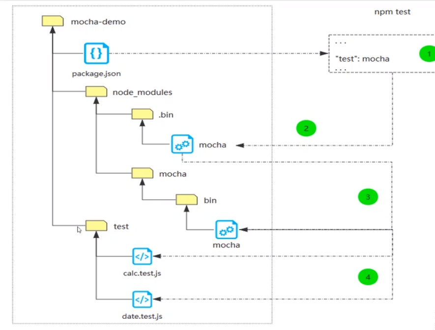

# 2.	单元测试概述

## 软件测试手段

测试和证明

## 黑盒测试和白盒测试

是否了解软件代码

## 静态测试和动态测试

是否运行程序的代码

Static 不运行   检查程序代码  <br>
Dynamic 运行


* 开发人员干的
	* 静态白盒测试  静态代码检查
	* 动态黑盒测试  单元测试

## 单元测试框架

* JUnit java
* numit .net
* MOCHA  ARMA Jest  Javascript

chaijs.com

-D 开发依赖
-S 项目依赖

## 基于 Mocha 的自动化测试框架

* 自动化单元测试
	* 自动化前端代码测试
	* 自动化后端代码测试
* 自动化接口测试
* 自动会 UI 测试

## 测试模式

### TDD

先有测试代码， 后有程序代码

### BDD

先有程序代码， 后有测试代码

## DEMO

#!/usr/bin/node  代码解释器

```js
// sum.js

if(prcoess.argv.length !== 4) {
	console.log('./sum.js x y');
	process.exit(0);
}

let x = process.argv[2];
let y = process.argv[3];

const add = require('./add.js');

// console.log(`${x} + ${y} = ${Number(x) + Number(y)}`)
console.log(`${x} + ${y} = ${add(x, y)}`)

function add(x, y) {
	let _x = Number(x);
	let _y = Number(y);

	if(isNaN(_x) || isNaN(_y)) {
		return NaN
	} else {
		return _x + _y;
	}
}
```

需要给以上代码做模块化

```js
// add.js
function add(x, y) {
	let _x = Number(x);
	let _y = Number(y);

	if(isNaN(_x) || isNaN(_y)) {
		return NaN
	} else {
		return _x + _y;
	}
}
module.exports = add;
```

```
1. 创建一个远程仓库 unit-testing
2. 新建 sum.js   // 代码在上面
3. npm init -y
4. npm i -D mocha chai 
5. 新建一个 test 文件夹， 当前文件夹下新建 add.test.js // 代码在 5.1 中

describe 测试套件
it  测试用例
describe('加法函数的单元测试', function() {
	it('0 + 0 = 0', function(){
		expect(add(0, 0)).to.be.equl(0);
	});

	it('1 + 0 = 1', function() {
		expect(add(1, 0)).to.be.equl(1);
	});
})

6. 执行

6.1 手动执行
执行测试脚本命令 
./node_modules/mocha/bin/mocha test/add.test.js  执行一个文件
./node_modules/mocha/bin/mocha                   执行 test 文件下所有单元测试
./node_modules/.bin/mocha                   执行 test 文件下所有单元测试; 这块有个符号链接，映射，类似于后台设置的映射

6.2
{
	scripts: {
		"test": "mocha"
	}
}
```

```js
// 5.1
// describe 测试套件
// it  测试用例
const add = require('../add');
const expect = require('chai').expect;

describe('加法函数的单元测试', function() {
	it('0 + 0 = 0', function(){
		expect(add(0, 0)).to.be.equl(0);
	});

	it('1 + 0 = 1', function() {
		expect(add(1, 0)).to.be.equl(1);
	});
})
```

;

```
// 这个文件 会 自动执行 npm install 和 npm test
// 新建 文件  .travis.yml
language: node_js
node_js:
  - "node"
branches:
  only:
    - master

```


冒烟测试
./sum.js 3 4
