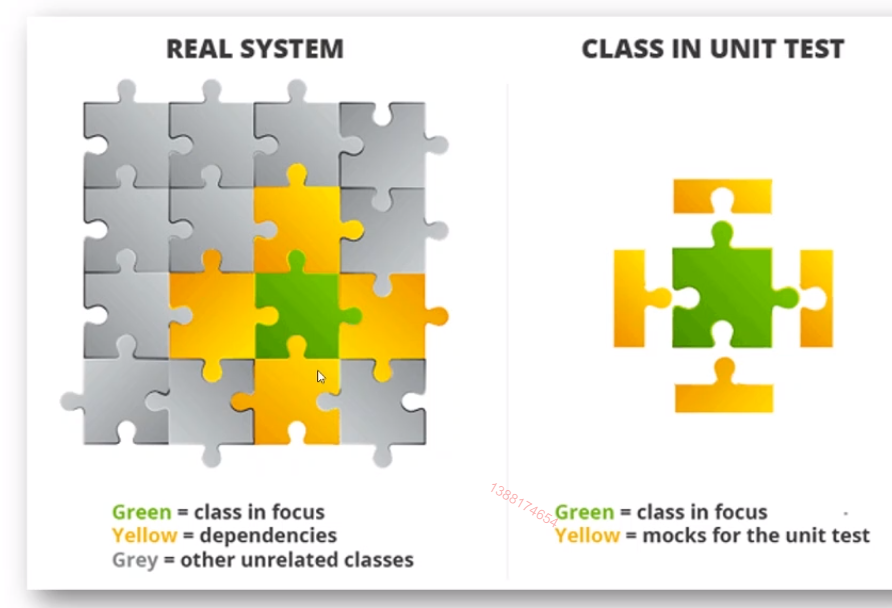
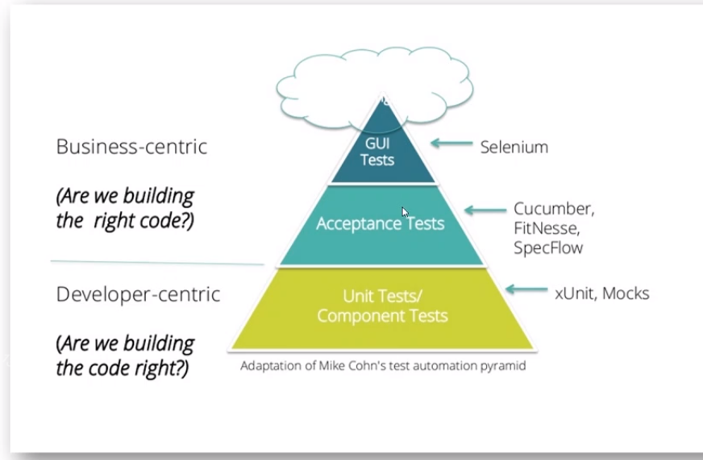
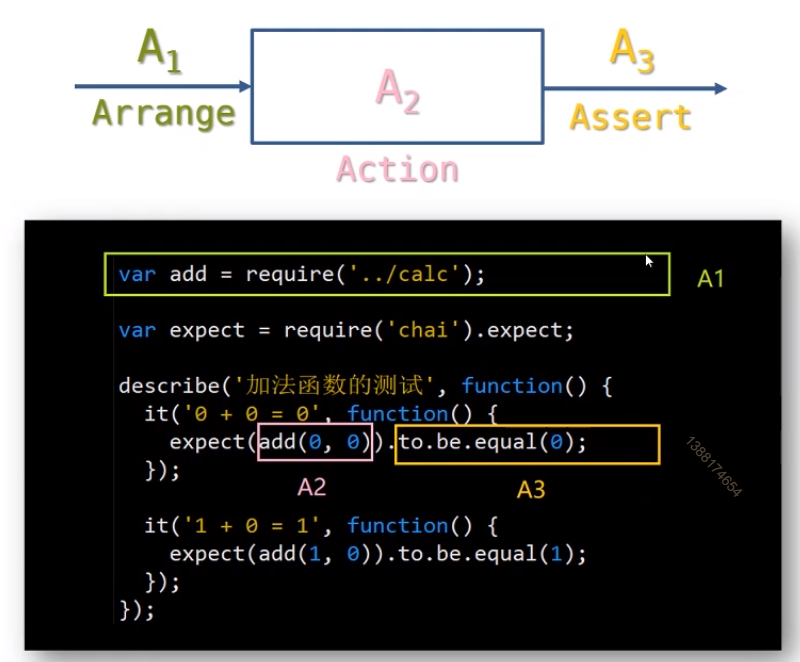
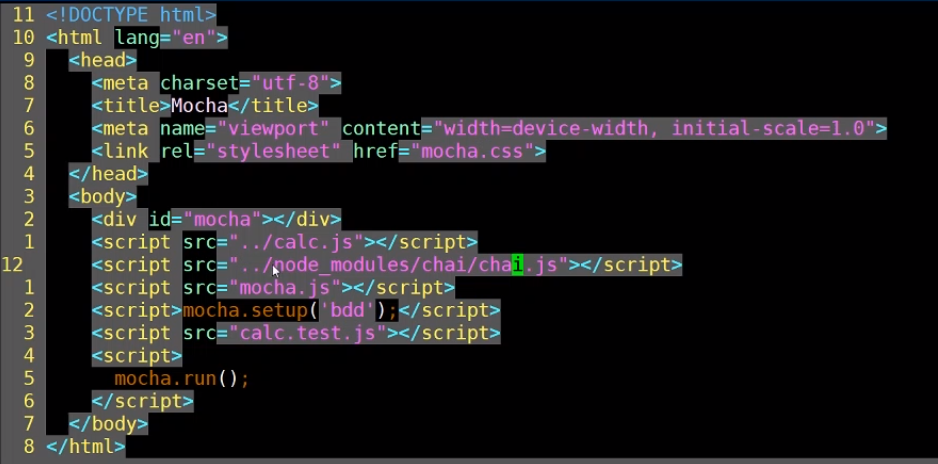

# 3.单元测试实战

## 掌握程序的三种错误类型和软件测试的关系

### 语法错误
### 逻辑错误
### 运行时错误

## 掌握测试的基本概念：单元测试，集成测试

;

;

### 单元测试

隔离测试单个组件

开发人员做的

* 特点：
	* 测试面尽量窄
	* 依赖使用桩件来实现
	* 目的是只测一个组件

纯函数适合单元测试	

### 集成测试

测试不同组件之间的交互

软件工程师做的

* 特点：
	* 测试面尽量广
	* 只有外部资源使用桩件来实现
	* 把应用看成一个整体去测试

集成测试最适合在浏览器中自动进行

> 注意：两种测试都需要编写，两者之间不是相互排斥的

## 了解单元测试的最佳实践

面向对象的开发，单元测试指的是 接口测试， 这里的接口的指的是 类的公共方法，不是http接口

> 只测类中的共有方法

## 掌握单元测试的代码模式

;

## 了解评价单元测试的指标

;

## 掌握四类覆盖率指标

### 行覆盖率(line	coverage)
是否每一行都执行了

### 函数覆盖率(function	coverage)
是否每一函数都被调用了

### 分支覆盖率(branch	coverage)
是否每个if代码块都执行了

### 语句覆盖率(statement	coverage)
是否每一语句都执行了

## 掌握前端代码的单元测试

### DEMO
```
1. npm i -D istanbul
2. 执行
		./node_modules/.bin/istanbul cover ./node_modules/.bin/_mocha  // 注意：是_mocha，将 mocha 作为 istanbul 的子进程执行，istanbul 为主进程 
		./node_modules/.bin/istanbul check-coverage --statement 90  // 语句覆盖率达到 90% 以上

3. cd coverage/lcov-report
		browser-sync start --server --port 8080 --no-open --files . --ignore node_modules
```

### 前端代码测试 DEMO

```js
// 1. 计算的案例

// 2. 重构计算的案例
// calc.js
function Rectangle(w, h) {
	var _w = Number(w);
	var _h = Number(h);

	this.perimeter = () => 2 * (_w + _h);
	this.area = () => _w * _h;
}

// 3. npm init -y

// 4. npm i -D mocha chai istanbul

// 5. 命令 ./node_modules/.bin/moche init test

// 6. 编写单元测试文件
// calc.test.js 
var expect = chai.expect;
describe('矩形计算的单元测试', function() {
	it('w=2, h=3 => p=10, a=6', function() {
		var rect = new Rectangle(2, 3);
		expect(rect.perimeter()).to.be.equal(10);
		expect(rect.area()).to.be.equal(6);
	})
})

// 7. 修改 第五步 运行之后 产生的 index.html
//    见图片 3.5

// 8. 运行命令 browser-sync start --server --port 8080 --no-open --files . --ignore node_modules 

// 9. npm i -D mocha-headless-chrome

// 10. 运行命令 ./node_modules/.bin/mocha-headless-chrome -f test/index.html -a no-sandbox

// 11. 设置命令
{
	"scripts": {
		test: "mocha-headless-chrome -f test/index.html -a no-sandbox"
	}
}
```

3.5
;
