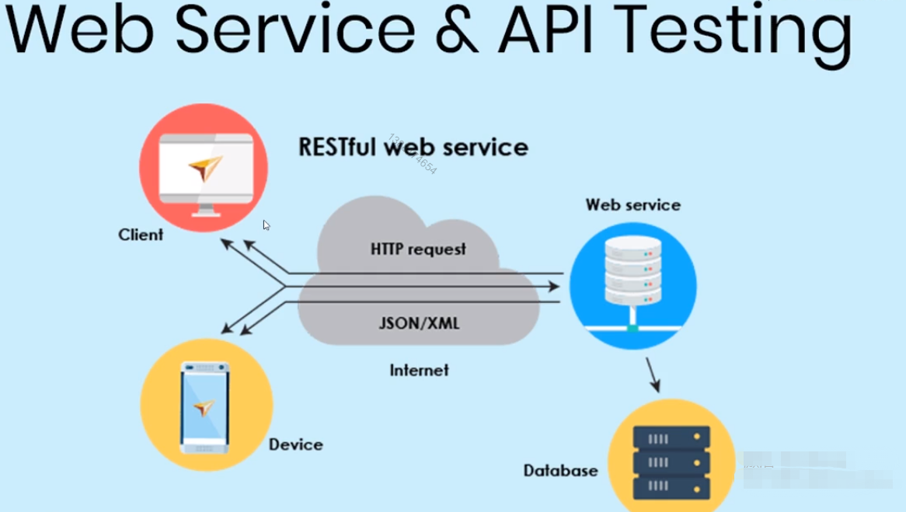

# 4.单元小结

## 	HTTP 接口测试自动化

### 渲染过程
;

### DEMO 

* 请求 
GET / rectangle?width=2&height=3 HTTP/1.1

* 响应 
{"perimeter": 10, "area": 6}

* app.js

```js
const http = require('http'),
      url  = require('url'),
      qs   = require('querystring');

http.createServer((req, res) => {
  console.log(`${req.method} ${req.url} HTTP/${req.httpVersion}`);
  console.log(req.headers);
  console.log();

  var addr = url.parse(req.url);
  if(addr.pathname !== '/rectangle' || req.method !== 'GET') {
    res.end('GET /rectangle?width=2&height=3 HTTP/1.1');
    return;
  }

  var rect = qs.parse(addr.query);

  var r = {
    'area': Number(rect.width) * Number(rect.height),
    'perimeter': 2 * (Number(rect.width) + Number(rect.height))
  }

  res.end(JSON.stringify(r));
}).listen(8080);
```

* 步骤

```js
// 1. 新建 test 文件夹

// 2. npm init -y

// 3. npm i -D mocha chai

// 4. 在 test 文件夹 下 新建 app.test.js
const expect = require('chai').expect,
      http   = require('http');
describe('矩形计算器 HTTP API 自动化测试', function(){
  it('正确请求格式的测试', function(done) {
    http.get('http://localhost:8080/rectangle?width=2&height=3', function(res){
      var result = '';

      res.on('data', function(chunk) { result += chunk; });
      res.on('end', function() {
        var rect = JSON.parse(result);

        expect(rect.area).to.be.equal(6);
        expect(rect.perimeter).to.be.equal(10);
        done();   // chai 中的异步处理
      });
    });
  });
});

// 5. 修改配置文件  
// 5.1 将不是开发依赖删掉
// 5.2
{
  scripts: {
    test: "mocha"
  }
}

// 6. 新建 run-test.sh 文件
// 6.1
// ./app.js&
// ./node_modules/.bin/mocha
// pkill -2 'app.js'
// 6.2
{
  scripts: {
    test: "./run-test.sh"
  }
}

// 7. npm i pm2
// pm2 node.js 生产环境下进程管理工具
{
  scripts: {
    test: "pm2 start app.js && mocha && pm2 stop 'all'"
  }
}
```

> ./app.js&    后台运行代码  pkill -2 'app.js'

## 动态测试技术

当被测函数有明确的输入和输出，而且不同的输入对应的的输入变化不太大，尤其是数据类型变化不太大，才能使用你动态测试技术

```js
// add.test.js
describe('加法函数的动态测试', function() {
  var tests_normal = [
    {args: [0,          0], exp: 0},
    {args: [2,          3], exp: 5},
    {args: [-4,        -2], exp: -6},
    {args: [-4,        10], exp: 6},
    {args: [1,       1023], exp: 1024},
    {args: [2.6,      3.8], exp: 6.4},
    {args: ['2e2', '3e-2'], exp: 200.03}
  ];

  tests_normal.forEach(function(test) {
    it(`${test.args[0]} + ${test.args[1]} = ${test.exp}`, function() {
      expect(add(test.args[0], test.args[1])).to.be.equal(test.exp);
    });
  });

  var tests_ugily = [
    {args: ['a',      'b'], exp: NaN},
    {args: [2,        'a'], exp: NaN},
    {args: [',',        3], exp: NaN}
  ];

  tests_ugily.forEach(function(test) {
    it(`${test.args[0]} + ${test.args[1]} = ${test.exp}`, function() {
      expect(add(test.args[0], test.args[1])).to.be.NaN;
    });
  });
});

// npm test
```

## 单元测试三要素

### 设计可测代码

### 测试用例

### 隔离依赖

## 消除依赖场合

* A 模块调 B 模块， A 和 B 都做单元测试， 测试 A 时， B 可以用 桩来代替
* A 模块做单元测试，B 模块是第三方库; B 不做单元测试； B运行的市场不一定； B 运行的结果不一定

## 了解 sinon 用法

glob | head

gco 上面命令出来的编号

### DEMO

```js
// password.rules.js
const oneUpperCaseRule = (input) => {
  return {
    passed: (input.toLowerCase() !== input),
    reason: 'at least one upper case needed'
  };
};

module.exports = { oneUpperCaseRule };
```

```js
// password-verify.js 
const verifyPassword = (input, rules) => {
  const errors = [];
  rules.forEach(rule => {
    const result = rule(input);
    if (!result.passed) {
      errors.push(`error ${result.reason}`);
    }
  });
  return errors;
};

module.exports = {
  verifyPassword
};  
```