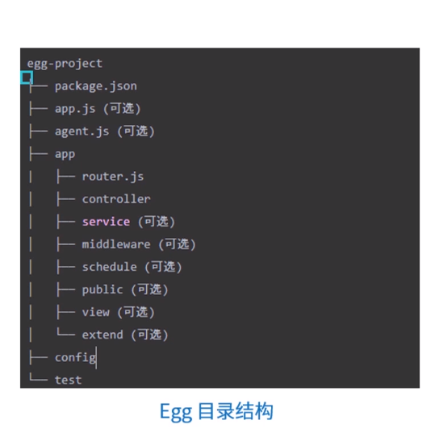
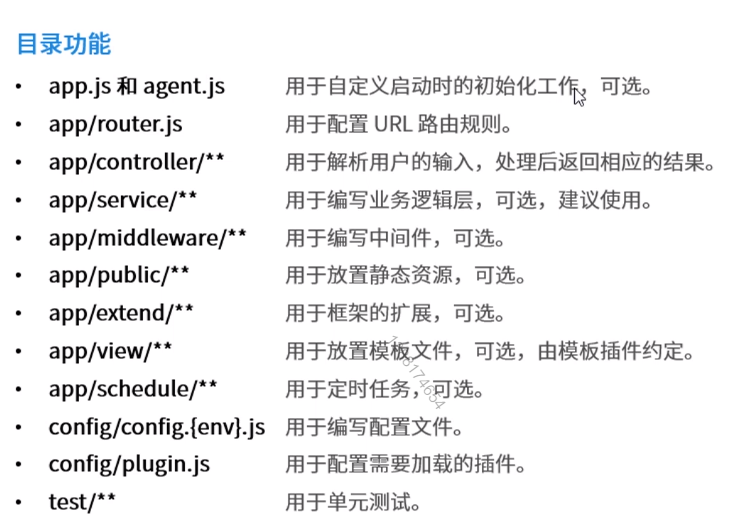

# 2.基础概念-Egg应用

回顾初始化项目

```
mkdir egg-demo & cd egg-demo
npm init egg --type=simple
```

## 内置对象

### 继承自 Koa 的内置对象

* Application
* Context
* Request
* Response

* Application
	* 全局应用对象，在一个应用下边，只会实例化一个
	* 允许在它上面挂载一些全局的方法和对象
	* 在编写应用时几乎在任何一个地方都能获取到 Applcation 对象
	
* Context
	* 最常见的获取方式是在 MiddleWare , Controller 以及 Service 中。
	* Controller 中 获取 Context。
	* Service 中 获取 Context
	* Middleware 中 获取 Context

* Request 和 Response
	* Request 是一个请求级别的对象， Response 是一个请求级别的对象
	* 与 Koa 一样，Egg 会在 Context 上代理一部分 Request 和 Response 上的方法和属性
	* ctx.request.query 和 ctx.query 是等价的，ctx.response.body= 和 ctx.body= 是等价的
	* 获取请求对象 body 应该使用 ctx.request.body , 而不是使用 ctx.body 

> 请求级别的对象: 每一次请求都会创建这个对象 <br>
> ctx.body 请求的是 ctx.response.body  <br>
> 等价的别名可以在koa的官网上查到

> get 请求 不推荐写 body

### Egg 自身扩展

* Controller
* Service
* Helper
* Config
* Logger


介绍
* Egg 提供一个 Controller 基类， 并推荐 所有的 Controller 继承于该基类实现  (相当于C)
* Egg 提供一个 Service 基类，  并推荐 所有的 Service 继承于该基类 实现  (相当于M)
* 这两个基类都有如下属性
	* ctx	当前请求上下文实例
	* app	当前的 Applcation 实例
	* config	应用的配置项
	* service	应用所有的 Service
	* controller	应用所有的 Controller
	* logger	为当前实例封装的 logger 对象

MVC
M Model 数据
V View 视图
C Controller 控制层


* Helper
 * Helper 用来提供一些实用的 utility 函数。
 * 我们可以将一些常用的动作抽离出来在 help.js 里面成为一个独立的函数
 * 在 Context 的实例上获取到当前请求的 Helper 实例
 * Helper 实例还可以在模型中获取到

> 只能通过 ctx.help 来访问

* Config
 * Egg 推荐应用开发遵循配置和代码分离的原则
 * 配置文件支持各个不同的运行环境使用不同的配置
 * 所有框架、插件和应用级别的配置都可以通过 Config 对象获取到

* Logger 
	* logger 对象的四个方法
		1. logger.debug()
		2. logger.info()
		3. logger.warn()
		4. logger.error()

	* 在框架中提供了多个 Logger 对象
		1. App CoreLogger 
			框架和插件需要通过它来打印应用级别的日志
		2. ContextLogger
			与请求相关， 在前面带上一些当前请求相关的信息
		3. ContextCoreLogger 
			一般只有插件和框架会通过它来记录请求日志
		4. Controller Logger 和 Service Logger 
			其本质是一个ContextLogger

> 每个 logger 都是一个实例

## 运行环境

### 运行环境指定和获取

* 通过config/env文件指定， 该文件的内容就是运行环境

> 直接在 config 文件夹 下面 建一个 env 文件 ， 无后缀名， 内容 prod...

```
// config/env
prod
```

* 通过 'EGG_SERVER_ENV' 环境变量指定运行环境更加方便，比如在生产环境启动应用

```
EGG_SERVER_ENV=prod 
npm start
```

* 框架提供了变量 app.config.env 来表示应用当前的运行环境

> 一个 Web 应用本身应该是无状态的，并拥有根据运行环境设置自身的能力

* EGG_SERVER_ENV
	* 很多 Node.js 应用会使用 NODE_ENV 来区分运行环境
	* npm 也会使用这个变量， 在应用部署的时候一般不会安装开发依赖
	* Egg 支持自定义环境来适应自己的开发流程
	* 在 Koa 中我们通过 app.env 来进行环境判断， 在 Egg 中， 配置统一都放置在 app.congfig上

> NODE_ENV 只有测试和生产环境

NODE_ENV | EGG_SERVER_ENV | 注解
------ | ------ | ------
  无  | local | 本地开发环境
test | unittest | 单元测试
production | prod | 生产环境

> sit 集成测试

```
// 通过 创建文件夹来制定环境
1. 在 config 文件夹下新建一个 env 文件
2. 在 env 文件中 写上指定的环境， 可以是 自定义指定的环境
```

```
// 通过 'EGG_SERVER_ENV' 环境变量指定运行环境
1. 在 cmd 中 设置临时环境变量  
   set EGG_SERVER_ENV=prod     // 设置
   set  // 查询当前的环境变量
```

TODO 怎么打印的 当前环境


## 目录结构



app
* router.js	写路由的
* controller	控制器的文件夹
* service(可选)  服务的文件夹
* middlerware(可选)  中间件的文件夹
* schedule(可选)  定时启动任务的文件夹
* public(可选)  静态资源的文件夹
* view(可选)  模板的文件夹
* extend(可选)  专门用于扩展框架的文件夹

config 配置文件

test 单元测试



> 框架内置了 koa-static 或者是 express-static 

