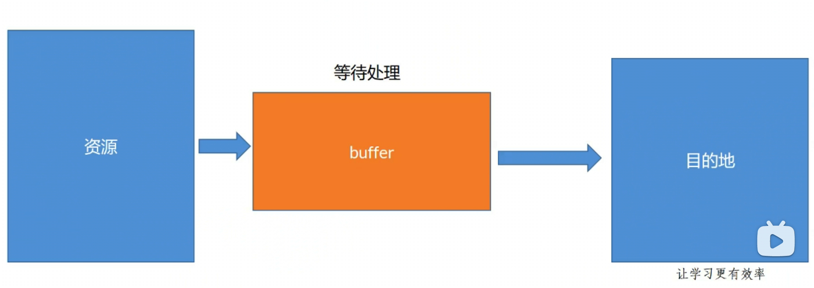
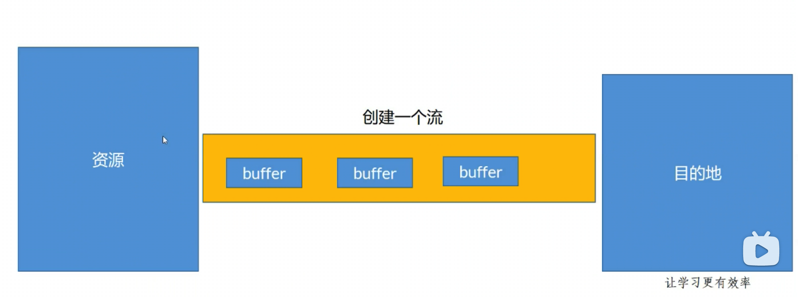

# 3.buffer和流

当以 buffer 传输时：buffer 可以理解为一个固定长度的字符串数组，存在于 v8 内存外，储存文件的二进制内容



读文件不指定字符集默认是 buffer

## 3.1.buffer api

### 3.1.1.创建

不推荐 使用 new Buffer

```js
Buffer.alloc(10, '1')
```

参数:  10 是 buffer 长度， 1 填充的内容

ps： 十位将都是 1

```js
const bf = Buffer.from('sdasfdfasdf'); // 可以是数组，字符串，json
console.log('bf', bf.toString) // sdasfdfasdf
```

### 3.1.2.buffer 识别

```js
Buffer.isBuffer('111')
```

### 3.1.3.buffer 实例操作

```js
const bf = Buffer.from('sdasfdfasdf');
bf.length;
bf.indexOf;
bf.toString();
bf.slice();
```

## 3.2.流

当以流传输： 可以看成是一个管道

ps: 文件很大的时候选择用 流



可读流，可写流，读写流，转化流

### 3.2.1.可读流

```js
const fs = require('fs');
// 可读流
const rstream = fs.createReadStream('./test/1.txt', {
  highWaterMark: 1 // 控制每次读多少
});
// 可写流 没有文件会创建文件
const wstream = fs.createWriteStream('./test/3.txt');
// 监听 data 才开始读取
rstream.on('data', (buf) => {
  console.log(buf);
  wstream.write(buf);
})
rstream.on('error', (buf) => {
  console.log(buf);
})
rstream.on('end', (res) => {
  console.log('读end res = ' + res);
  wstream.close();
})
wstream.on('finish', (res) => {
  console.log('写入end res = ' + res);
})

// 可读流导入到可写流
rstream.pipe(wstream);
```
