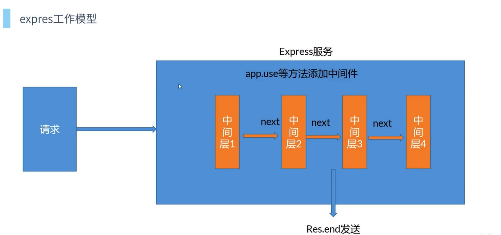

# 5.node框架express和koa.md



## 5.1.express

### 5.1.1开启express服务

```js
// 应用规则：
// express 中 use 的第一个参数是匹配路径 不传相当于"/"
// 中间件匹配机制是惰性匹配，即匹配路径为/a的中间件，访问/aa时同样会被执行（这也意味着不传匹配路径时即所有请求都会应用此中间件）

const express = require('express');
const router = require('./router/index.js');

const app = express();

// 只对 /b 有效，不写对所有 路径有效
// app.use('/b', (req, res, next) => {

// })

app.use((req, res, next) => {
  // console.log('1');
  // header 方法可以设置多个，参数可以是一个对象， setHeader 只能设置一个
  // res.header === res.set
  res.header('Access-Control-Allow-Origin', '*');
  res.header('Access-Control-Allow-Methods', 'POST, GET, PUT, DELETE, OPTIONS');
  res.header('Access-Control-Allow-Headers', 'Origin, X-Requested-With, Content-Type, Accept');
  // res.header('Content-Type', 'application/json');
  next();
})

// 设置静态目录
app.use(express.static(__dirname + '/static' ));
/**
 * 解析post请求获取参数设置的中间件
 */
// urlencoded 针对 content-type 是 application/x-www-form-urlencoded 的解析 表单提交的参数
app.use(express.urlencoded());
// json 针对 content-type 是 application/json 的解析
app.use(express.json());
// epxress.raw() application/octet-stream 解析流形式
// epxress.text() text/plain 

app.use((req, res, next) => {
  // console.log('2');
  next();
})

app.use('/', router); // / 是前缀
// app.use('/mode', router); // /mode 是前缀 请求的接口就是 /mode/api1

app.listen(5000, () => {
  console.log('express running');
})
```


### 5.1.2.中间件

*路由都属于中间件*

**应用规则：**

* express 中 use 的第一个参数是匹配路径 不传相当于"/"
* 中间件匹配机制是惰性匹配，即匹配路径为/a的中间件，访问/aa时同样会被执行（这也意味着不传匹配路径时即所有请求都会应用此中间件）
* 可以传入多个函数（多个处理规则）

```js
const express = require('express');
// 文件上传得到获取文件
const multer = require('multer');

var storage = multer.diskStorage({
  destination: function (req, file, cb) {
    cb(null, 'upload/')
  },
  filename: function (req, file, cb) {
    console.log('file', file);
    cb(null, Date.now() + '.jpg') //Appending .jpg
  }
})

const uploader = multer({
  // dest: 'upload/',
  // single: 'file',
  storage,
})

const router = express.Router();

// all 也是所有请求， * 匹配所有路径
router.all('*', (req, res, next) => {
  // console.log('3');
  next();
})

// /api1 也相当于中间件，但是只对 /api1 生效
router.get('/api1', (req, res) => {
  console.log(req.query);
  // res.end('11111');
  // res.sendFile()
  res.json({
    a: [1,2,3]
  })
})

router.post('/api2', (req, res) => {
  console.log(req.body);
  // res.end('11111');
  // res.sendFile()
  res.json({
    a: [1,2,3]
  })
})

router.post('/upload', uploader.single('file'), (req, res) => {
  console.log(req.body);
  // res.end('11111');
  // res.sendFile()
  res.json({
    msg: '文件已经接收'
  });
})
// router.get('/', (req, res) => {
//   res.sendFile(__dirname + '/index.html')
// })

module.exports = router;
```

### 5.1.3.设置跨域

```js
app.use((req, res, next) => {
  // console.log('1');
  // header 方法可以设置多个，参数可以是一个对象， setHeader 只能设置一个
  // res.header === res.set
  res.header('Access-Control-Allow-Origin', '*');
  res.header('Access-Control-Allow-Methods', 'POST, GET, PUT, DELETE, OPTIONS');
  res.header('Access-Control-Allow-Headers', 'Origin, X-Requested-With, Content-Type, Accept');
  // res.header('Content-Type', 'application/json');
  next();
})
```

### 5.1.4.设置静态目录

```js
app.use(express.static(__dirname + '/static' ));
```

### 5.1.5.设置post请求参数解析

```js
// urlencoded 针对 content-type 是 application/x-www-form-urlencoded 的解析 表单提交的参数
app.use(express.urlencoded());
// json 针对 content-type 是 application/json 的解析
app.use(express.json());
// epxress.raw() application/octet-stream 解析流形式
// epxress.text() text/plain 
```

### 5.1.6.接收文件

```js

// 文件上传得到获取文件
const multer = require('multer');

var storage = multer.diskStorage({
  destination: function (req, file, cb) {
    cb(null, 'upload/')
  },
  filename: function (req, file, cb) {
    console.log('file', file);
    cb(null, Date.now() + '.jpg') //Appending .jpg
  }
})

const uploader = multer({
  // dest: 'upload/',
  // single: 'file',
  storage,
})

router.post('/upload', uploader.single('file'), (req, res) => {
  console.log(req.body);
  // res.end('11111');
  // res.sendFile()
  res.json({
    msg: '文件已经接收'
  });
})
```

## 5.2.koa

特点：

* 更轻量，更自由，去掉了很多集成的模块
* 中间件工作方式有一点差异

```js
const Koa = require('koa');
const { koaBody } = require('koa-body');
const router = require('./router/index.js')

const app = new Koa();

app.use(koaBody({
  multer: true,
  // json: true,
  // text: true,
  // urlencoded: true,
}))

app.use((ctx, next) => {
  console.log(1);
  // ctx.body = 'hello1';
  ctx.set({
    // 'Access-Control-Allow-Origin': 'http://127.0.0.1:5173',
    'Access-Control-Allow-Methods': 'POST, GET, PUT, DELETE, OPTIONS',
    // 'Access-Control-Allow-Headers': 'Origin, X-Requested-With, Content-Type, Accept',
    // 'Content-Type': 'application/json',
    // 'Access-Control-Allow-Credentials': true,

    'Access-Control-Allow-Origin': '*',
    // 'Access-Control-Allow-Methods': 'GET,PUT,POST,DELETE',
    'Access-Control-Allow-Headers': 'Content-Type',
  })
  next()
})


app.use((ctx, next) => {
  // console.log(2);
  console.log('url', ctx.url);
  console.log('query', ctx.query);
  console.log('ctx.method', ctx.method);
  if (ctx.method === 'OPTIONS') {
    console.log(ctx.request.body);
    ctx.response.status = 200;
  } else {
    next()
  }
  // ctx.body = 'hello2';
})
app.use(router.routes())

// app.use((ctx, next) => {
//   // console.log(3);
//   ctx.body = 'hello3';
//   next()
// })

app.listen(5000, () => {
  console.log('koa running');
})
```

```js
const koarouter = require('koa-router');

const router = new koarouter();

router.get('/api1', (ctx, next) => {
  console.log('api1----', ctx.request.query);
  ctx.body = {
    a: 123,
    b: 3,
  }
})

router.post('/api2', (ctx, next) => {
  console.log('api2----', ctx.request.body);
  // ctx.body = 'hello';
  ctx.body = {
    a: 123,
    b: 3,
  }
})

module.exports = router;
```
