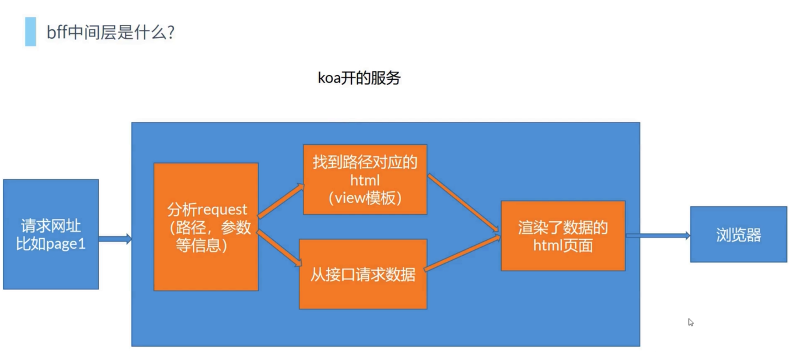

# 6.koa实战BFF中间层

## 6.1.bff中间层是什么



## 6.2.模板引擎

6.2.1.ejs

代码见 git 上工程 koabff 文件夹

6.2.2.Pug(jade)


## 6.3.pm2

node 进程管理工具

自动重启

```
pm2 start index.js --watch
pm2 list
pm2 stop id // list 上会展示 id
pm2 restart id
pm2 delete id
pm2 start app.js -i 4 // 开启四个进程

```
