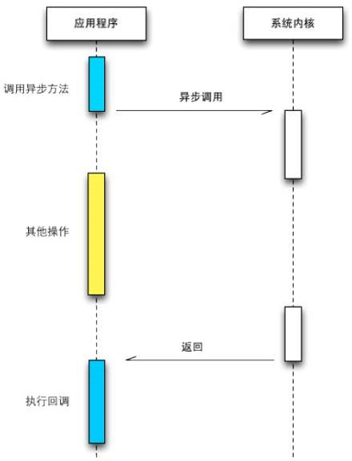
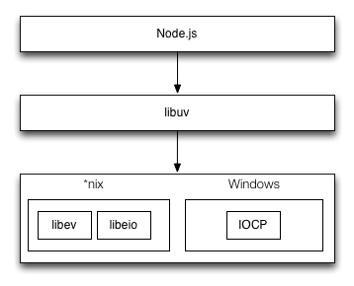

# 10.异步编程的优势与难点

## 事件驱动

### 事件机制

在前端编程中，事件的应用十分广泛，DOM 上的各种事件。在 Ajax 大规模应用之后，异步请求更得到广泛的认同，而 Ajax 亦是基于事件机制的。 <br>
Node.js 能够在众多的后端 JavaScript 技术之中脱颖而出，正是因其基于事件的特点而受到欢迎。比如说拿 Rhino 来做比较，文件读取等操作，均是同步操作进行的。Node.js加上V8引擎助力，能在短短两年内达到可观运行效率，并迅速流行。

### 事件驱动模型

Node.js中大部分的模块，都继承自Event模块。Event(events.EventEmitter)模块是一个简单的事件监听器模式的实现。具有`addListener/on`、`once`、`removeListener`、`removeAllListener`、`emit`等基本的事件监听模式的方法实现。

从另一个角度来看，事件监听器模式也是一种事件钩子（hook）的机制，利用事件钩子导出内部数据或状态给外部调用者。

### 事件机制的实现

从另一个角度来看，事件监听器模式也是一种事件钩子（hook）的机制，利用事件钩子导出内部数据或状态给外部调用者。如果不通过事件钩子的形式，对象运行期间的中间值、内部状态，我们是无法获取到的。这种通过事件钩子的方式，可以使编程者不用关注组件时如何启动和执行的，只需要关注在需要的事件点上即可。

```js
var options = {
  host: 'www.google.com',
  port: 80,
  path: '/upload',
  method: 'POST',
};

var req = http.request(options, function(res){
  console.log('STATUS: ' + res.statusCode);
  console.log('HEADERS: ' + JSON.stringify(res.headers));
  res.setEncoding('utf8');
  res.on('data',function(chunk){
    console.log('Body: ' + chunk);
  });
});

req.on('error',function(e){
  console.log('problem with request: ' + e.message);
});

req.write('data\n');
req.write('data\n');
req.end();

```

##  异步I/O原理

### 异步I/O

* 在操作系统中，程序运行的空间分为内核空间和用户空间。我们常常提到的异步IO，实质上是指用户空间中的程序不用依赖内核空间中的I/O操作完成，即可进行后续任务。

* 异步IO的效果就是 getFileFromNet的调用不依赖于getFile调用的结束。

```js
getFIle('file_path');
getFileFromNet('url');
```

> 如果两个任务的执行时间分别为m和n。采用同步方式的程序要完成这两个任务时间总花销为 m+n；但是如果采用异步方式的程序，在这两种I/O可以并行的情况下（比如网络I/O与文件I/O），时间开销会减小为max(m, n)。

### 异步I/O的必要性

* 实现I/O并行

1. 多线程单进程 <br>
2. 单线程多进程

* 异步I/O的必要性

* 现在的大型web应用中，一个事务往往需要跨越网络几次才能完成最终处理。如果网络速度不够理想，m和n的值将会变大。 <br>
* 这种场景下的异步I/O将会体现其优势，m+n+....与max(m, n, ....)之间地优劣一目了然

> Node.js天然地支持这种异步I/O，这时众多云计算厂商对其青睐地根本原因

### 阻塞与非阻塞&异步与同步

* I/O的阻塞与非阻塞

阻塞模式的I/O会造成应用程序等待，知道I/O完成。同时操作系统也支持将I/O操作设置为非阻塞模式，这时应用程序调用将可以在没有拿到真正数据时就立即返回，为此应用程序需要多次调用才能确认I/O操作是否完全完成。

	**阻塞与非阻塞是内核空间的特点**

* I/O的异步与同步

I/O的异步与同步出现在**应用程序**中，如果做阻塞I/O调用，应用程序等待调用的完成过程就是一种同步状态。相反，I/O为非阻塞模式时，应用程序则是异步的。

> 当进行非阻塞I/O调用时，要读取完整的数据，应用程序需要进行多次轮询，才能确保读取数据完成，以进行下一步操作。

> 我们听到Node.js时，常常会看到异步、非阻塞、回调、事件这些词混合在一起。其中异步和非阻塞听起来似乎时同一回事。从实际效果的角度来说，异步和非阻塞都达到了我们并行I/O的目的。但是从计算机内核I/O而言，异步/同步与阻塞/非阻塞实际上时两回事。

异步 I/O 是 基于 非阻塞的。

### 理想的异步I/O

* 应用程序发起异步调用，不需要进行轮询，进而处理下一个任务，在I/O完成后通过信号或者回调将数据传递给应用程序。

* libev的作者在linux中重新实现了一个异步I/O的库：libeio。libeio是指依然是采用线程池与非阻塞I/O模拟出来的异步I/O。

* Window平台有一种独有的内核异步I/O方案：IOCP。IOCP的思路是调用异步方法，然后等待I/O完成通知。IOCP内部依旧通过线程实现，而这些线程由系统内核接手管理。



### Node.js中的异步I/O

由于Windows和Linux平台的差异，Node.js提供的libuv来作为抽象封装层，使得平台兼容性的判断都由这一层来完成，保证了上层的Node.js与下层的libeio/libev及IOCP之间各自独立。Node.js编译期间会判断平台条件，选择性编译unix目录或win目录下的源文件到目标程序中。



## 事件循环

### 高并发策略

* 一般来说，高并发解决方案就是提供多线程模型，服务器为每个客户端请求分配一个线程，使用同步I/O，系统通过线程切换来弥补同步I/O调用的时间开销。

* 大多数网站的服务器都不会做太多的计算，他们接收到请求后，把请求交给其它服务来处理，然后等着结果返回，最后再把结果发回给客户端。

* Node.js采用了单线程模型来处理，它不会为每个接入请求分配一个线程，而是用一个主线程处理所有的请求，然后对I/O操作进行异步处理，避开创建、销毁线程以及在线程间切换的开销和复杂性。

### Node.js运行原理

* 应用层：即avaScript交互层，常见的就是Node.js的模块，如http、fs等  <br>
* V8引擎层：即利用V8引擎来解析JavaScript语法，进而和下层的 API 交互  <br>
* NodeAPI层：为上层模块提供系统调用，和操作系统进行交互  <br>
* LIBUV层：是跨平台的底层封装，实现了事件循环、文件操作等

Node.js在主线程里维护了一个事件队列，当接收到请求后，就将该请求作为一个事件放入该队列，然后继续接收其它请求。当主线程空闲时（没有请求接入），就开始循环事件队列，检查队列中是否有需要处理的事件，这时分为两种情况：如果是非I/O任务，就亲自处理，并通过回调函数返回给上层调用；如果是I/O任务，就从线程池中拿出一个线程来处理这个事件，并指定回调函数，然后继续循环队列中其它事件。

当线程中的I/O任务完成后，并执行指定的回调函数，并把这个完成的事件放到事件队列的尾部，等待事件循环，当主线程再次循环到事件时，直接处理并返回给上层调用。这个过程就叫 事件循环（Event Loop）：

### 事件循环实现原理

* 事件队列

定义一个先进先出（FIFO）的数据结构，我们用js数组来描述：

利用数组来模拟队列结构，数组的第一个元素是队列的头部，最后一个元素是队列的尾部，push()就是在队列的尾部插入一个元素，shift()是从队列的头部弹出一个元素。

```js
/**
* 定义事件队列
* 入队    push()
* 出队		shift()
* 空列队：	length = 0
**/

globaleEventQueue: [];

```

Node.js实现异步的核心就是事件，它把每个任务都当成事件来处理，然后通过Even Loop 模拟异步的效果。

### 事件循环实现原理

* 接口请求入口

每一个请求都会被拦截，并进入处理函数

把用户请求包装成事件，放到队列里，然后继续接收其它请求。

```js
/**
* 接收用户请求
* 每个请求都会进入该函数
* 传递参数 request 和 response
**/
processHttpRequest: function(request, response){
  // 定义一个事件对象
  var event = createEvent({
    params: request.params, // 传递请求参数
    result: null, // 存放请求结果
    callback: function(){} // 指定回调函数
  });
  
  // 在队列尾部添加事件
  globalEventQueue.push(event);
}
```

Node.js实现异步的核心就是事件，它把每个任务都当成事件来处理，然后通过Even Loop 模拟异步的效果。

### 事件循环实现原理

* Event Loop

当主线程处于空闲时就开始循环事件队列，所以，还需要一个函数来循环事件队列

主线程不停检测事件队列，对于I/O任务，交给线程池处理，非I/O任务，主线程处理并返回。

```js
/**
* 事件循环主题，主线程择机执行
* 循环遍历事件队列，处理非I/O任务
* 处理IO任务
* 执行回调，返回给上层
**/
eventLoop: function(){
  while(this.globalEventQueue.length > 0){
    var event = this.globalEventQueue.shift();
    
    if(isIOTask(event)){
      var thread = getThreadFromThreadPool();
      thread.handleIOTask(event);
    }else{
      var result = handleEvent(event);
      event.callback.call(null,result);
    }
  }
}
```

Node.js实现异步的核心就是事件，它把每个任务都当成事件来处理，然后通过Even Loop 模拟异步的效果。

### 事件循环实现原理	

* 处理I/O任务

线程池接到任务后，直接处理IO操作，比如读取数据库、处理PHP程序。

当I/O任务完成后，就执行回调，把请求结果存入事件中，并将该事件重新放入队列中，等待循环，最后释放当前线程，当主线程再次循环到该事件，就直接处理。

```js
/**
* 处理IO任务
* 处理完后将事件添加到队列的尾部
* 释放进程
**/
handleIOTask: function(event){
var curThread = this;
  
var optDatabase = function(params, callback){
    var result = readDataFromDB(params);
    callback.call(null,result);
  }
  
optDatabase(event.params,function(result){
    event.result = result;
    event.isIOTask = false;
    this.globalEventQueue.push(event);
    releaseThread(curThread);
  });  
}
```

Node.js只用了一个主线程来接收请求，但是接受请求后并没有直接处理，而是放到事件队列中，然后又去接收其它请求了，空闲的时候再通过Event Loop来处理这些事件，从而实现了异步效果，当然对于IO类任务还需要依赖于系统层面的线程池来处理。

Node.js本身是一个多线程平台，而它对JavaScript层面的任务处理是单线程的。

### 业务场景

* 不适用场景

	* 当碰到cpu密集型任务，这时Node.js会自己亲自处理，一个个的计算。<br>
	* Node.js本身只有一个Event Loop, 当Node.js被cpu密集型任务占用，导致其它任务被阻塞，系统却还有cpu内核处于闲置状态，就造成了资源浪费。<br>
	* Node.js并不适合cpu密集型任务。

* 适用场景

	* RESTful API - 请求和响应只需要少量文本，并不需要大量逻辑处理，因此可以并发处理数万条连接。 <br>
  * 聊天服务 --  轻量级、高流量，没有复杂的计算逻辑。


