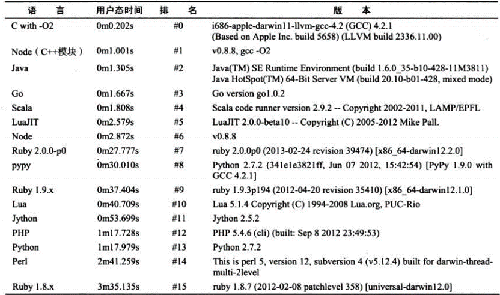

# 11.ES6+异步编程解决方案

## 异步编程优势

### 异步编程的优势

Node带来的最大特性莫过于基于事件驱动的非阻塞I/O模型，这是它的灵魂所在。非阻塞I/O可以使CPU与I/O并不互相依赖等待，让资源得到更好的利用。对于网络应用而言，并行带来的想象空间更大，延展而开的是分布式和云。并行使得各个单点之间能够更有效地组织起来，这也是Node在云计算厂商中广受青睐地原因。



## 异步编程难点

### 异常处理

* 过去处理异常

```js
try {
  JSON.parse(json);
} catch (e) {
  // TODO
}
```

* 这对于异步编程而言并不一定适用

* 只能捕获档次事件循环内的异常，对`callback`执行时抛出的异常将无能为力。

```js
try {
  async(callback);
} catch (e) {
  // TODO
}
```

### 异常处理	

* Node在处理异常形成了一种约定，将异常作为回调函数的第一个参数传回     <br>
* 必须执行调用者传入的回调函数     <br>
* 正确传递异常供调用者判断     <br>
* 另一个容易犯的错误是对用户传递的回调函数进行异常捕获

```js
try {
  req.body = JSON.parse(buf, options.reviver);
  callback();
} catch (err) {
	err.body = buf;
  err.status = 400;
  callback(err);
}
```

### 函数嵌套过深

* 这或许时Node被人吐槽最多地地方   <br>
* 对于Node而言，事务中存在多个异步调用地场景比比皆是   <br>
* 在网页渲染地过程中，通常需要数据、模板、资源文件，这三者互相之间并不依赖，但是最终渲染结果三者缺一不可

```js
fs.readdir(path.join(__dirname, '..'), function (err, files) {
  files.forEach(function (filename, index) {
    fs.readFile(filename, 'utf8', function (err, file) {
      // TODO
    });
  });
});
```

### 其它难点

* 多线程编程

对于服务器而言，如果服务器是多核CPU，单个Node进程实质上是没有充分利用多核CPU的。随着现今业务的复杂度，对于多核CPU利用的要求也越来越高。Node借鉴了前端浏览器Web Workers模式，child_process是其基础API，cluster模块是更深层次的应用。


* 异步转同步

Node提供给了绝大部分的异步API和少量的同步API，偶尔出现的同步需求将会因为没有同步API让开发者无所适从。

对于异步调用，通过良好的流程控制，还是能够将逻辑梳理称顺序式的形式。

## 异步编程解决方案

### 异步编程

* 解决方案

	* 事件发布/订阅模式   <br>

		```js
		fs.readFile(__dirname + files[0], 'utf8', (err, data) => {
			let result = [];
			if (err) console.log('Error: ' + err);
			result.push(data);
			fs.readFile(__dirname + files[1], 'utf8', (err, data) => {
					if (err) console.log('Error: ' + err);
					result.push(data);
					fs.readFile(__dirname + files[2], 'utf8', (err, data) => {
							if (err) console.log("Error: " + err);
							result.push(data);
							console.log(result);
					});
			});
		});
		```	

		```js
		// m.js
		const fs = require('fs');
		module.exports = function (filename, cb) {
			fs.readFile(__dirname + filename, 'utf8', (err, data) => {
				cb(err, data);
			});
		}
		```

		```js
		// 事件发布/订阅模式
		/**
		* emitter.on() // 订阅
		* mitter.emit()  // 发布
		* 使用 较少
		*/
		const fn = require('./m');
		const events = require('events');
		let files = ['/dev.json', '/test.json', '/prod.json'];

		const emitter = new events.EventEmitter();

		// function done
		var done = after(files.length, (res) => {
				console.log(res);
		})

		emitter.on('done', done);

		// 官方认为 ， 绑定的事件过多可能会造成 内存的 泄露
		emitter.setMaxListeners(0);  // 默认是 10 个， 设置为 0 解除限制。

		function after(times, cb) {
				let count = 0, result = [];
				return function (data) {
						result.push(data);
						count++;
						if (count === times) {
								cb(result);
						}
				}
		}


		files.forEach((filename) => {
				fn(filename, (err, data) => {
						// if(err) emitter.
						emitter.emit('done', data);
				});
		})

		// fn(filename, (err, data) => {
		//     // if(err) emitter.
		//     emitter.emit('done', data);
		// });
		// fn(filename, (err, data) => {
		//     // if(err) emitter.
		//     emitter.emit('done', data);
		// });
		// fn(filename, (err, data) => {
		//     // if(err) emitter.

		//     emitter.emit('done', data);
		// });
		```

	* Async 流程控制  

		```js
		const fn = require('./m');
		const async = require('async');

		let files = ['/dev.json', 'est.json', '/prod.json'];

		async.waterfall([
				(cb) => {
						fn(files[0], (err, data) => {
								cb(err, data);
						});
				},
				(data1, cb) => {
						fn(files[1], (err, data) => {
								cb(err, data1, data)
						});
				},
				(data1, data2, cb) => {
						fn(files[2], (err, data) => {
								cb(err, data1, data2, data);
						});
				}
		], (err, data1, data2, data3) => {
				if (err) console.log(err);
				let result = [data1, data2, data3];
				console.log(result);
		});
		```

	* Promise模式

	```js
	const fn = require('./m');
	let files = ['/dev.json', '/test.json', '/prod.json'];


	function toPromiseStyle(fn) {
			return (...args) => {
					return new Promise((resolve, reject) => {
							fn(...args, (err, data) => {
									if (err) reject(err);
									resolve(data);
							});
					});
			}
	}
	let op = toPromiseStyle(fn);
	// console.log(op.toString());

	let result = [];
	op(files[0])
			.then((data) => {
					result.push(data);
					return op(files[1]);
			})
			.then((data) => {
					result.push(data);
					return op(files[2]);
			})
			.then((data) => {
					result.push(data);
					console.log(relust);
			}).catch((err) => {
					console.log(err);
					console.log(result);
			});
	```

	* genger TODO ??
	
	```js
	function* getResult() {
    let res;
    try {
        res = yield op(files[0]);
        res = yield op(files[1]);
        res = yield op(files[2]);
        return res;
    } catch (error) {
        return console.log(error);
    }
	}
	```

	* async/await

	```js
	async function getResult1() {
    let res;
    try {
        res = await op(files[0]);
        res = await op(files[1]);
        res = await op(files[2]);
        return res;
    } catch (error) {
        return console.log(error);
    }
	}
	```

