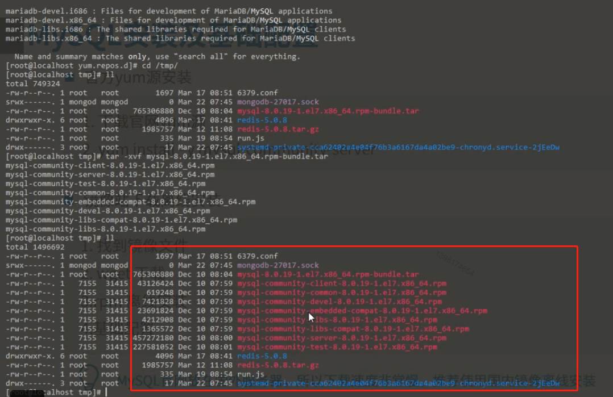

# 7.MySQL入门与应用

MySQL 是目前最流行的关系型数据库管理系统之一，在web应用方面，MySQL是最好的关系型数据库管理软件之一。

关系型数据库是将数据保存在不同的表中，使用SQL语言作为访问数据库的标准语言。MySQL采用了双授权政策，分为社区版和商业版，由于体积小、速度快、总体拥有成本低，一些中小型网站都选择MySQL作为网站数据库。


## MySQL安装与配置

### 官方yum源安装

1. 下载官网yum源
2. yum install –y mysql-community-server

mysql官网:  https://dev.mysql.com/downloads/   <br>
https://dev.mysql.com/downloads/   => Mysql Yum Repository => Red Hat Enterprise Linux 7 / Oracle Linux 7


使用清华大学开源软件镜像站  <br>
https://mirror.tuna.tsinghua.edu.cn/help/mysql/

```
// 具体安装步骤

1.新建 /etc/yum.repos.d/mysql-community.repo => 看镜像站提示配置源文件
2.yum search mysql-community-server
3.yum install –y mysql-community-server

// 这里下载是因为 配置 文件中相对路径的文件找不到
4.wget http://repo.mysql.com/RPM-GPG-KEY-mysql -O /etc/pki/rpm-gpg/RPM-GPG-KEY-mysql
5.yum install –y mysql-community-server
```

> 解决 Retrieving key from file:///etc/pki/rpm-gpg/RPM-GPG-KEY-mysql 的问题 https://blog.csdn.net/lcyaiym/article/details/77282336

### 镜像站下载离线安装
1. 找到镜像文件 <br>
2. wget 下载  <br>
3. rpm 离线安装  <br>
4. 基础配置  <br>


http://mirrors.163.com/mysql/Downloads/MySQL-8.0/  => 查找 bundle => mysql-8.0.17-1.el6.x86_64.rpm-bundle.tar  


yum list installed | grep openssl <br>
yum list installed | grep liaio <br>
yum list installed | grep perl <br>
setenforce=0

```
// 永久更改 sentenforce=0 的配置文件
vim /etc/selinux/config

// 文件设置
// SELINUX=enforcing 改成
SELINUX=disabled
// 改完之后需要重启服务
```
rpm -ivh mysql-community-common-8.0.19-1.el7.x86_64.rpm <br>
rpm -ivh mysql-community-libs-8.0.19-1.e17.x86_64.rpm <br>
rpm -ivh mysql-community-client-8.0.19-1.e17.x86_64.rpm <br>
rpm -ivh mysql-community-server-8.0.19-1.e17.x86_64.rpm <br>


> MySQL官网放在国外服务器，所以下载速度非常慢，推荐使用国内镜像离线安装

### 使用 mysql

```
mysql -uroot -p   // 登录 mysql
// 登录 mysql 需要密码
grep password /var/log/mysqld.log  // 得到密码  sb:-tN_uj9rJ
mysql -uroot -psb:-tN_uj9rJ  或者 mysql -uroot -p 回车之后输入密码 
show databases;
// 此时会提示先重置密码
alter user user() identified by '123abcA.';
mysql -uroot -p123abcA.   // 进入客户端

select Host,user from mysql.user where user='root';   // 想要远程登录测试一下，看到 localhost 	root，表示只不能远程登陆
update mysql.user set Host='%' where user='root';   // TODO 还可改成 什么 安全性更高？？？

// 之后远程登录
mysql -h192.168.2.186	-uroot -p
// 输入密码后可能还登不进去，需要采用 mysql -uroot -p 重新进入客户端
flush privileges;
mysql -h192.168.2.186	-uroot -p
```

用 navicat 连接 mysql
```
1. 点击连接
2. 正常输入
3. 点击确定之后可能会连不上去，此时可能的原因的是端口，或者是密码的校验规则
	修改密码的校验规则   // **此时都在 MySQL 的客户端里**
	1. 卸载文件
		select * from mysql.component;   //查找文件
		uninstall component 'file//component_vaildate_password';   // 这个本地路径是通过上面的 查找文件的命令找出来的 
	2. alter user 'root'@'%' identified with mysql_native_password by 'root';  // 此时 mysql 密码修改成 root
```

> 在 mysql 中 写完命令之后需要 加  ; (分号) 结尾

### 配置文件

* 位置 <br>
/etc/my.cnf

* 配置文件里面的内容
```
// 数据目录
datadir=/var/lib/mysql
// socket 文件目录
socket=/var/lib/mysql/mysql.sock
// error_log 日志路径
log-error=/var/log/mysqld.log
// 进程号保存文件
pid-file=/var/run/mysqld/mysqld.pid
```


## MySQL基本概念

### 结构化查询语言

结构化查询语言（Structured Query Language）简称：SQL,是一种特殊目的的编程语言，是数据库查询与程序设计语言，用于存取数据以及查询、更新和管理关系型数据库，同时也是数据库脚本文件的扩展名。


### SQL语言分类

1. 数据查询（DQL）<br>
数据检索语句，用以从表中获取数据，select是DQL用的最多的关键字，其它还包括 where 、order by 、group by 、having 

2. 数据操作（DML） <br>
关键字：insert 、updata、delete，分别用于插入、修改以及删除表中的行。

3. 事务处理（TPL）<br>
确保被DML语句影响的表的所有行为得以更新。TPL语句包含begin transaction、commit、rollback。


4. 数据控制（DCL） <br>
通过grant或者revoke获得许可，确定单个用户和用户组对数据库对象的访问。

5. 数据定义（DDL） <br>
关键字：create和drop。在数据库中创建新表或者删除表，以及为表加入索引等。

6. 指针控制（CCL） <br>
declare cursor（声明游标）、fetch into（进入）和update where current（更新当前位置）用于对一个或者多个表单独行的操作。

### 命令行连接

mysql [options] [database]

1. -u，-user=username				<br>
	用户名，默认root
2. -h，-host=hostname				<br>
	远程主机，默认为localhost
3. -p，-password[=password]		<br>
	密码，默认为空，一般不建议明文
4. -P，-port=3306					<br>
	监听端口，默认为3306/tcp
5. -D，-database=database			<br>
	连接到服务器后指明默认数据库
6. -e，-execute='sql statement'		<br>
	连接到服务器后执行命令后直接返回

### 连接数据库的几种方式
```
mysql --host=192.168.31.115 --user=root --password=root;

mysql -h192.168.31.115 -uroot -proot -P3306 -Dmysql

mysql -h192.168.31.115 -uroot -proot -P3306 -Dmysql -e 'show databases;'  // 执行完会直接退出
```

```
// 查询当前正在使用的数据库名称
select database();

// 查找命令
help;

// 设置默认数据库的名称
\u database 名称

// 退出
\q

// 结束标记
\g 

// 格式化当前数据   select * from mysql.user\G
\G

// 获取当前数据库状态的信息
\S

// 可以执行 shell 命令      \! echo 'hello';   \! ps -ef | grep mysql
\! 

// 查看 MySQL 的语法文档
help contents;  // 查到之后 help data types;

select user();

// 选择数据库
use mysql;

// 显示当前数据库
select mysql;  

// 显示支持的引擎
show engines;

// mysql 数据支持的 chartset
show chartset;
```

### 数据类型 - 字符型

* 定长字符

1. char			不区分大小写 <br>
	```
	id char(10)  // 定义十位， 存进的数据不够十位，就空格补齐
	```
2. binary			二进制数据流，区分大小写

* 变长字符

1. varchar				不区分大小写 （如果定义的是 255 字符，存入数据不够 255 字符，则不会补齐） <br>
2. varbinary			二进制数据流，可用于存储图片、音乐、短视频

> 可以在 node 中 下载 mysql 

### 数据类型 - 字符型

* 对象存储

1. text、tinytext、smalltext、mediumtext、longtext <br>
2. blob、tinyblob、smallblob、mediumblob、longblob

* 内置类型

1. enum		单选字符串，适合存储表单界面中的“单选值” <br>
2. set			多选字符串，适合存储表单界面中的“多选值”

### 数据类型-数值型

* 精确数值

1. tinyint、smallint、mediumint、int/integer、bigint <br>
2. decimal(定点数)  // 128 位

> 对于钱来说 小数 采用 decimal

* 近似值

1. float、double、 

> 能用 double 别用 float

### 数据类型 - 日期时间

* date(YYYY-MM-DD)              <br>
* time(HH:mm:ss)             <br>
* year(YYYY)             <br>
* datetime(YYYY-MM-DD HH:mm:ss)    // 本地时间 ， 默认事件 null   ， 八个字节 ， 直接插入，   <br>
* timestamp(时间戳)       // 和时区有关 默认 当前系统时间 ， 四个字节 ，转换成 utc（世界） 时间，1970 - 2038年    <br>


## 数据库操作

### 数据库管理

<!-- TODO node 里面管理数据库的？？？ -->

* 创建数据库    <br>
* 修改数据库    <br>
* 删除数据库    <br>
* 查看/切换数据库    <br>

```
# 创建
	create {database|schema} [if not exists] db_name [create_specification]; 
	database 和 shema 都一样，一般使用 schema 
	数据库已经存的话会报错中断，加上 if not exists 会有好一些 
	db_name 数据库名称 
	create_specification 创建数据库的附加条件，比如说设置默认字符编码，设置默认的排序方式。设置默认字符串，就会默认设置排序方式，一般只是用来设置字符编码

	create database if not exits study chartset utf8;
	create schema study1;
	show create database study;

# 修改
alter {database | schema} [db_name] alter_specification; // 没什么太大的意义

alter database study chartset utf8mb4;

> 修改数据库的名字 就是 新建一个数据库，将源数据导进去，没有直接提供修改名字的指令

show databases;   // 显示所有表名
所有表信息都放在 information_achema
use  information_achema;
show tables;

# 删除
drop {database | schema} [if exists] db_name;

drop database if exists study1;

# 查看
show {database | schema} [like 'pattern' | where expr];
use db_name;

show database like 's%';    // 查看以 s 开头的数据库有哪些。

```

### 表管理

* 创建表 <br>
* 查看表 <br>
* 删除表 <br>

```
# 创建
create [temporary] table [if not exists] tbl_name (create_definition); [table_options] [partition_options];
// temporary		创建临时表，放在内存中，mysql 关闭，自动删除临时表，释放空间
// create_definition		创建时候的一些定义
// table_options		table 的属性
// partition_options		附加的属性

例子：
create table if not exits courses(
	// 字段： id  数值类型： int(11) unsigned: 无符号型  not null：不允许为空 auto_increment：自动增长  primary key： 主键  comment：注释
	id int(11) unsigned not null auto_increment primary key comment '自增id',
	student varchar(255) defalut null comment '学生',
	class varchar(255) defalut null comment '科目',
	score int(3) default 0 comment '成绩'
 ) engine InnDB charset utf8 comment '学生成绩表';
 // engine InnDB: 默认引擎    charset utf8  设置字符集

# 快速创建表
就是复制表的结构
create table select   // 查一张表的结构把表复制
create table course1 select * from courses where 1=0;    // 1=0 是为只复制表的结构而不数据数据  

create table course2 engine InnoDB charset utf8 comment '学生成绩表' select * from courses where 1=0;    

show create table course1\G  //复制的表 对比 手动创建的表的 mysql 语句
复制的表会丢失 主键，自增，外部属性

# 快速复制表  // 这种方式更好
create table courses3 like courses;

# 查看
{explain | desc | describe } tbl_name;
show create table tbl_name;  // 查看创建表的语句

desc 查看结构
show create   查看 mysql 语句

# 删除 // 可以同时删除多张表
drop [temporary] table [if exists] tbl_name [, tbl_name...];
```

* 修改表
```
# 修改表名
alter table tab_name rename  [to | as] new_table_name;

	alter table `courses` rename `grade`;  // 修改表名 

# 修改字段名
alter table tbl_name rename column old_col_name to new_colname;

	alter table  `grade` rename column `class` to `course`;  // 无法改变位置

# 修改索引名
alter table tbl_name rename {index | key} old_index_name  to new_index_name;  // 可以改变位置

# 加入新字段（最后、最前、指定字段后）
alter table tbl_name add [column] col_name col_definition [first | after col_name];

	alter table `grade` add `description` text defalut null comment '备注';  // 默认插入到最后
	alter table `grade` add `description` text defalut null comment '备注' first;  // 默认插入到最前面
	alter table `grade` add `description` text defalut null comment '备注' after `id`;  // 默认插入到 指定位置

# 删除字段
alter table tbl_name drop [column] col_name;

	// 删除表 drop  删除数据 delete
	alter table `grades` drop `description`;

# 修改字段属性
alter table tbl_name modify [column] col_name col_definition [first|after col_name];

	alter table `grade` modify `score` int(10) after `student`; // 修改字段属性并改变位置
	alter table `grade` modify `score` `score` int(3) after `course`; // 修改字段属性，字段名，改变位置
	// modify 专门修改字段属性
	// change  既能修改字段名，又能修改字段属性

alter table tbl_name change [column] old_col_name new_col_name col_defination [first | ater col_name]
```

### 数据操作

* 插入数据 <br>
* 修改数据 <br>
* 删除数据 <br>

```
# 插入
insert into tbl_name values(value1,value2....);
insert into tbl_name(col1,col2...) values(value1,value2...);
insert into tbl_name values(valu2,value2...),(value1,value2...)...;
insert into tbl_name(col1,col2,....) values(value1,value2...),(value1,value2...)...;

	// 插入一条完整数据, 可以插入多条
	insert into `grades` values(1, 'A', 'Math', 90);
	// 插入指定字段, 可以插入多条
	insert into `grades`(`student`, `course`, `score`) values('A', 'Chinese', 80);
	insert into `grades`(`student`, `course`, `score`) values('A', 'Chinese', 80), ('A', 'English', 30), ('B', 'History', 90), ('B', 'Math', 90);


# 修改
update tbl_name set col1 = value1,col2 = value2... [where where_condition] [order by...] [limit row_count];

	update 	`grades` set `student` = '张三' where id = 12; 

# 删除
delete from tbl_name [where condition];
truncate tbl_name;

tranuncate 原理
	先新建一张和之前一样的表名字一样，直接把表删除（drop table）  // drop 比 delete from 效率高

	// 删除所有数据 rm -ef
	delete from `grades`;
	// 删除某一条数据
	delete from `grades` where id=1;
	// 清空表
	// 先复制一张表
	crete table grades2 select * from grades;
	truncate grades2;
```

### 数据操作 – 查询

* 简单查询		

  select * from tbl_name;
	
	select * from grades;

	select student, score from grades;

	select distinct course from grades;  // distinct 去重

	// 查找的时候做简单运算
	select student, score - 60 as `jige` from grades;

	// 字符串连接
	select concat(student, ' 同学 ', course , ' 成绩为 ', score, '分') as `通报` from grades

* 条件查询
		
	where

	* 单条件

		select * from grades where student='A';
	
	* 多条件	

		and/or (&&/||)

			select * from grades where student='A' || student='B';

	* 其它条件

		between...and/not/is null/is not null/in/not in/like/not like

* 排序	
	
	order by

	select * from grades order by `score` desc;  // 按照成绩倒序排序
	select * from grades order by `student` asc， `score`	desc; // 按照人名正序，按照成绩倒序 

* 限制查询数量	

	limit

		// 查找 索引 1 到 4 的数据   
		select * from grades limit 1,4;   // 第一位不写 默认魏 0

* 统计函数	

	count/avg/sum/max/min  总数/平均/求和/最大/最小

		<!-- count  -->
		insert into grades values(); // 插入了一条空值

		select count(*) from grades; // 空值也会被计数 <br>
		select count(student) from grades; // 空值不会被计数

		select avg(score), sum(score) from grades where course='Math'; <br>
		select max(score), min(score) from grades where course='Math';

* 分组查询		

	需要配合统计函数来使用，要不然没有意义
	
	group by

	select student, count(student) from grades group by student; <br>
	select course, avg(score) from grades group by course;


## 用户管理

	// 查找创建命令
	help create user;

### 创建用户 

	create user

* 第一种方式

	```
	create user if not exits 'aaa';
	<!-- select Host, User from mysql.user where user='aaa'\G; -->
	// 查找用户相关信息
	select * from mysql.user where user='aaa'\G;
	```

* 第二种方式  // 这种方式可能已经废弃了
	```
	insert into mysql.user(Host, User, authentication_string, ssl_cipher, X509_issuer,x509_subject) values('localhost', 'bbb', 'bbb', '', '', '');
	```

	> 用这两种方式创建完之后使用 mysql -uaaa -paaa; mysql -ubbb -pbbb; 是登陆不进去的，因为密码加密的方式有问题。还需要修改密码。 

	```
	// 修改密码
	alter user 'aaa'@'%' indentified with mysql_native_password by 'aaa';
	set password for 'bbb'@'%'='bbb';
	```

	> 需要将检查密码的文件删除掉， 否则还是不能密码设置为 aaa

	> % 匹配的是 Host 字段，需要和 select * from mysql.user where user='aaa'\G; 查找的结果一致。

* 第三种方式

	```
	// 这种方式 8.0 的版本也不支持了
	grant all privileges on *.* to 'ccc'@'%';
	```

### 修改密码

* 第一种

```
alter user 'aaa'@'%' indentified with mysql_native_password by 'aaa';
```

* 第二种

```
set password for 'bbb'@'%'='bbb';
```

### 删除用户

```
// 刷新权限
flush privileges;
```

* 第一种

> 这种方式并不好

```
delete from mysql.user where user='bbb';
```

* 第二种

<!-- > 8.0 已经废弃了。 -->

```
drop user 'bbb';
```

### 权限

 * 查看所有权限

 ```
 // 查看所有权限 
 show privileges
 ```

 * 把表的权限 给用户

 ```
	grant select on study.* to 'aaa'@'%';

	show databases;
	use study;
	show tables;  // 查看所有表名称
	select * from grades;
 ```

 ```
 // 给所有权限	
 help grant; // 查看命名

 grant all on *.* to 'aaa'@'%';

 flush 	privileges;
 select * from mysql.user where user='aaa'\G; // 除了 Grant_priv 是 N

 show grants; // 查看当前用户的权限；
 
 show grants for 'aaa'\G;
 ```

 ```
 // 赋予某个权力
 grant 	system_user on *.* to 'root'@'%';
 ```

 * 回收权限

 ```
	revoke all on *.* from 'aaa'@'%';
 ```


mariaDB


