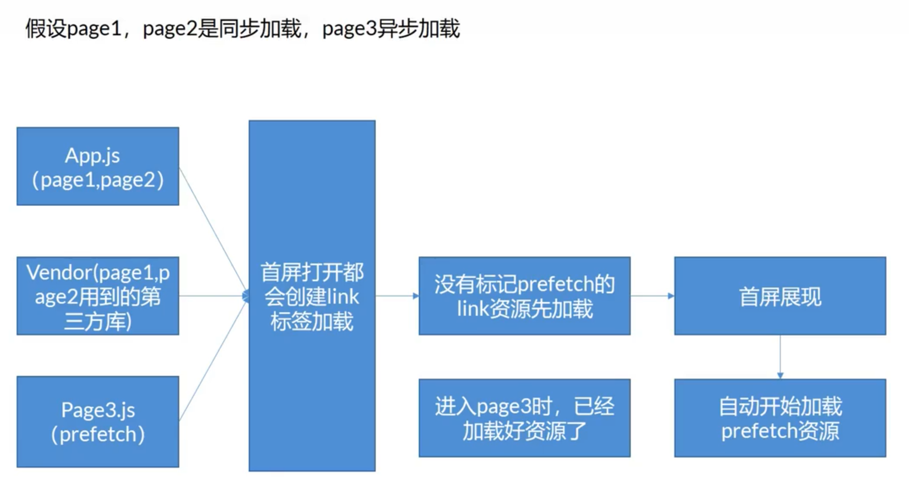
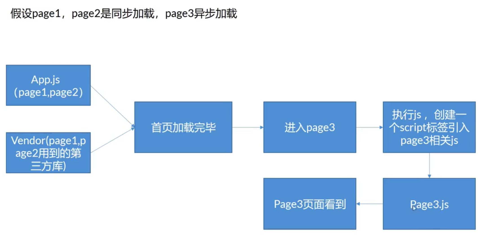
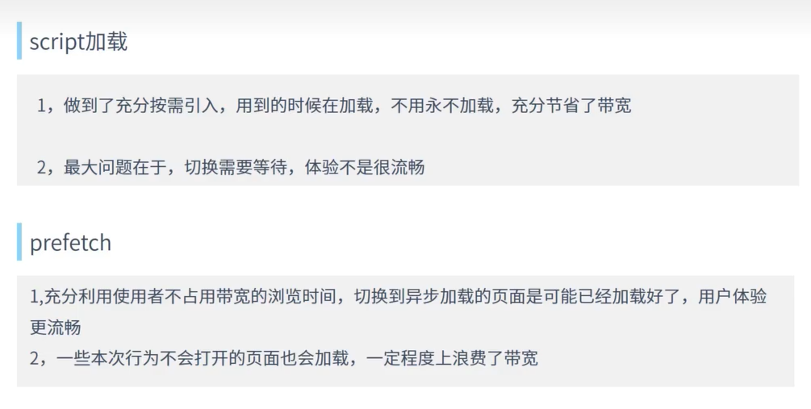
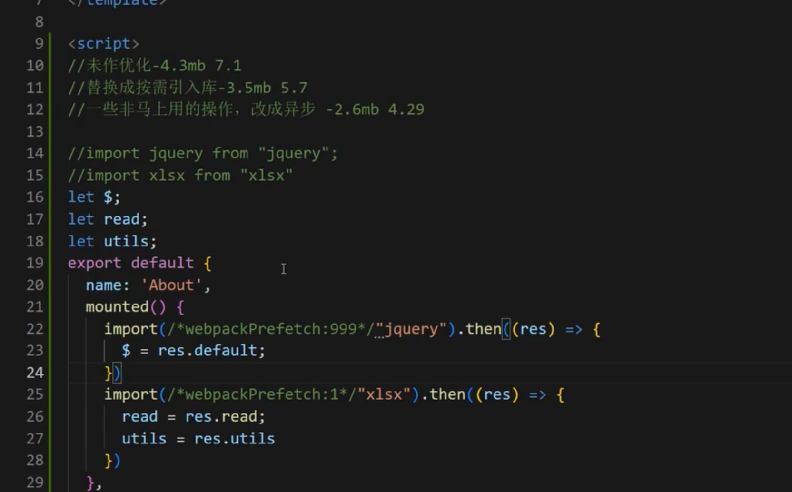

# 1.从资源加载优化角度加速项目

首屏速度影响最大的是什么

首屏速度是用户体验的最关键的一环，而首屏速度最大的决定性因素就是资源的加载速度

资源的加载速度 = 大小 + 网速

* 资源的大小影响方面

1. 压缩
2. 一部分代码做异步加载，需要的时候加载
3. 写代码尽量精简

## 1.1.加载方式

### 1.1.1.link - prefetch加载



```html
<link rel="preload" href="/myblog/assets/css/0.styles.40e1e284.css" as="style">
<link rel="preload" href="/myblog/assets/js/app.0bf3aa46.js" as="script">
```

### 1.1.2.script加载



### 1.1.3.两种加载方式对比



## 1.2.优化经验

1.使用按需引入的方式

2.在组件mounted阶段再引入库，获取用到这个功能再引入

