# Look 直播

## 应用技术

react16 react-router4 rxjs6  <br>
koa2 pm2  <br>
webpack4

## 目标

* react 组件化开发
* 掌握 react ssr 同构工程架构
* SPA 应用的状态管理
* 应用 rxjs 处理复杂的异步场景

## 工程架构

### SPA & SSR

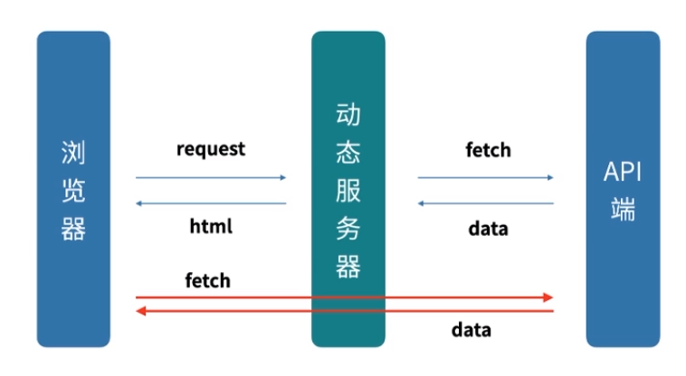

CSR???

* 问题 
    * 两端代码复用
    * 两端的渲染保持一致
    * 两端的fallback设计
    * node 端降级方案

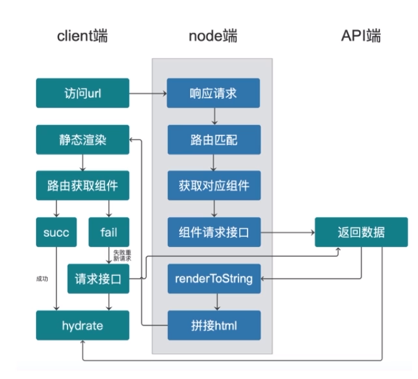

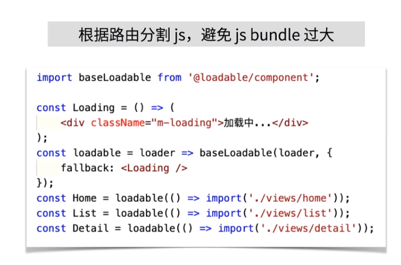

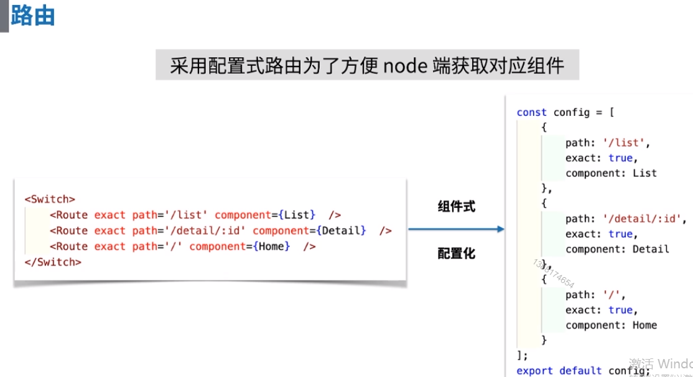

* 获取组件
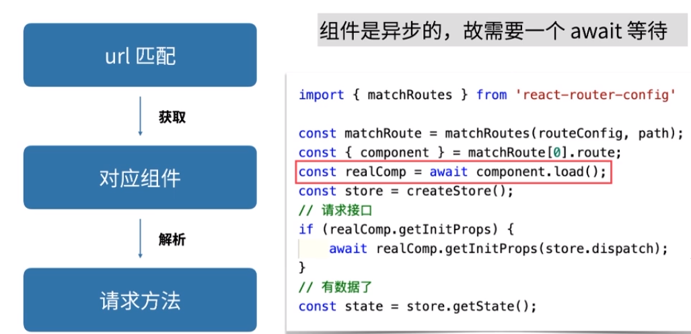
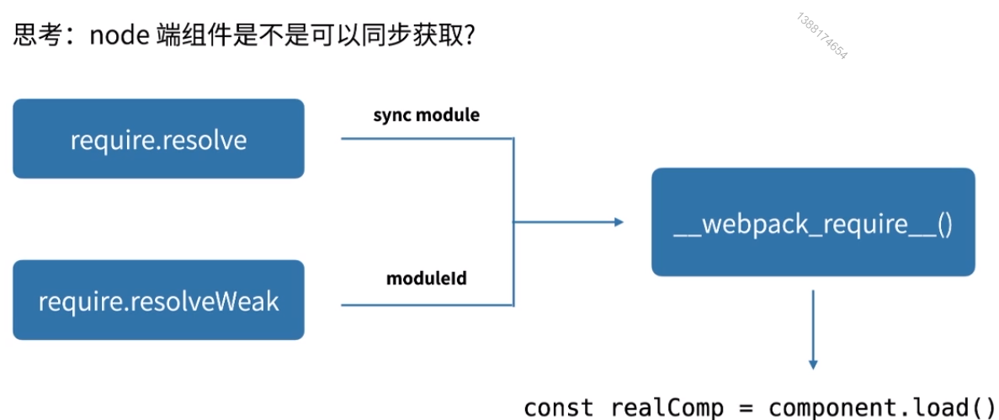

> await 支持和promise衔接

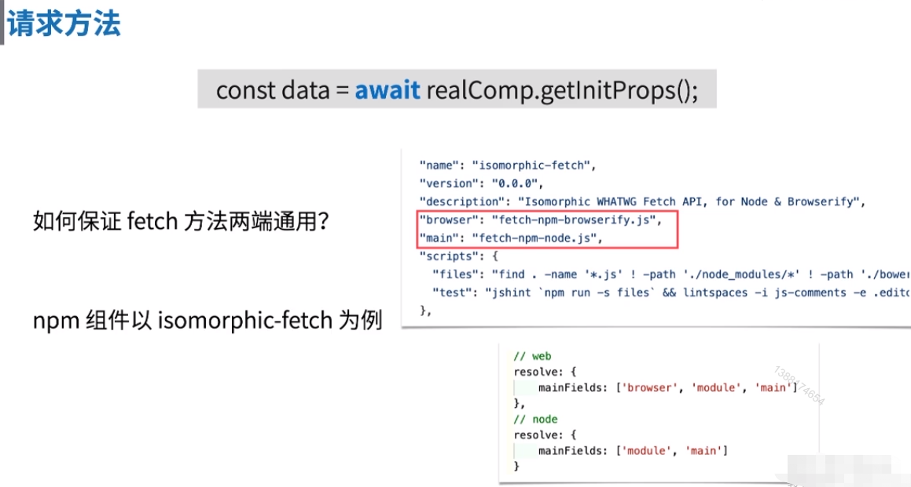

### 两端数据保持一致

```
<script>
 window.CURRENT_STATE = <%-state%>;
</script>

import { createStore } from 'redux';
...
const store = createStore(rootReducer, window.CURRENT_STATE);
```

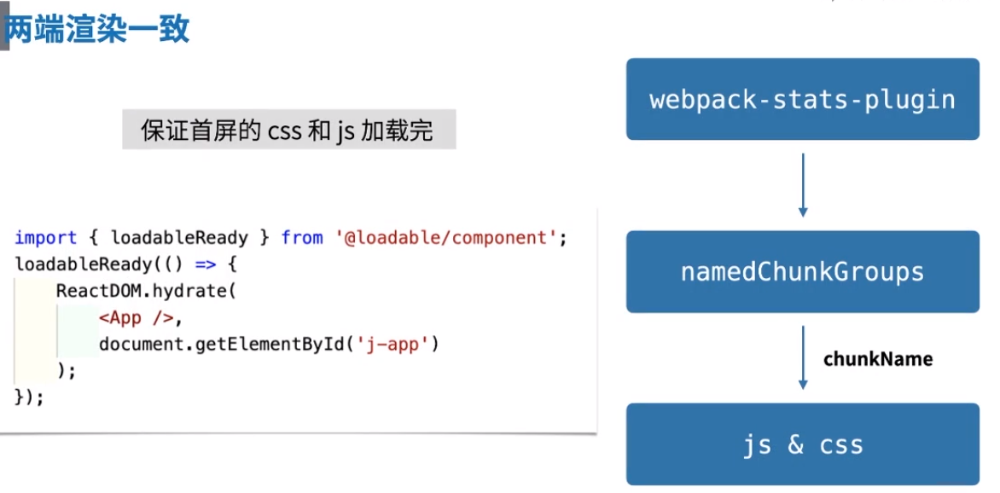

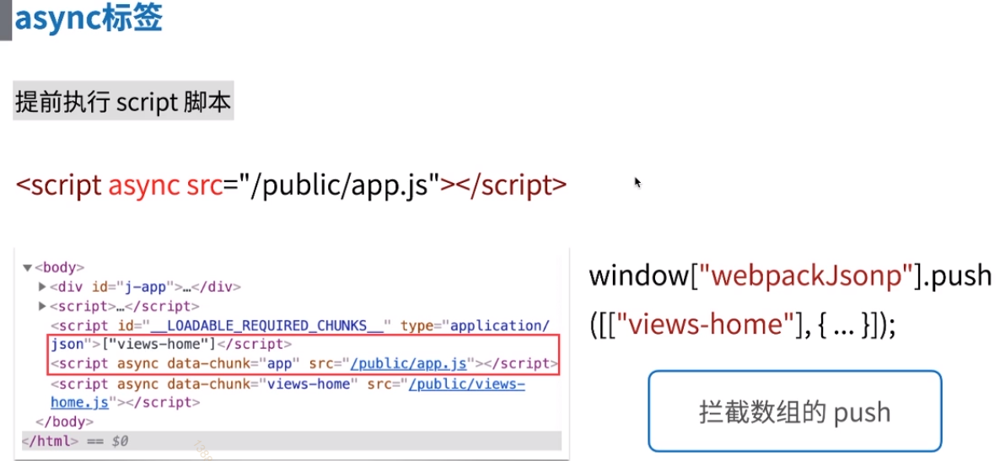

### SEO
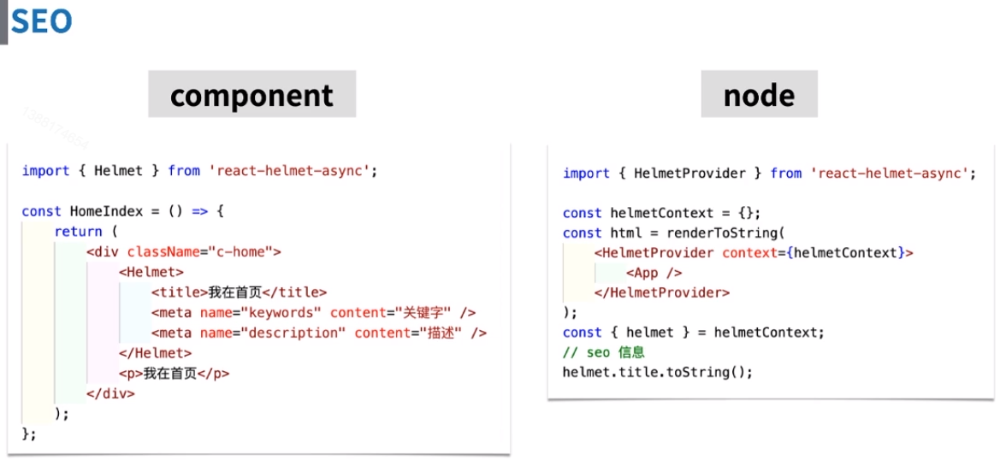

### webpack

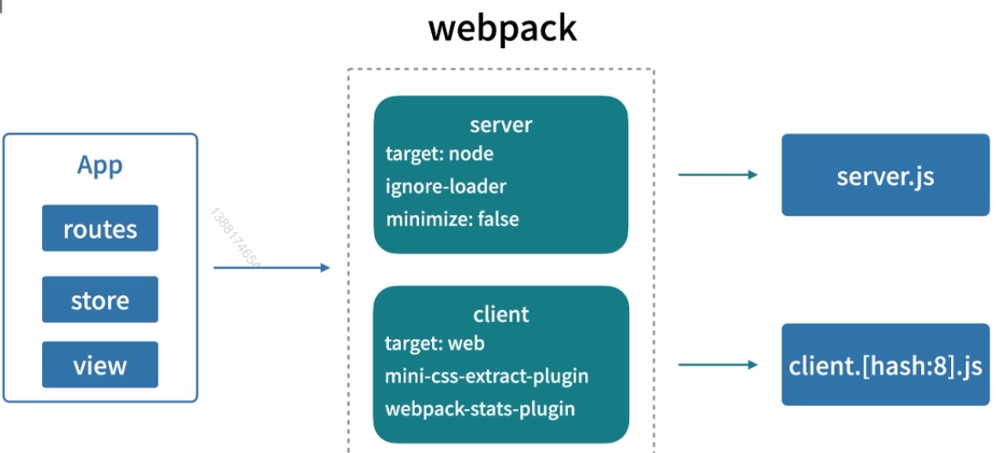

* 好用的插件和loader

    * server

        ignore-loader  忽略不能再服务端运行的loader ， 比如： css , 图片
    
    * client 

        mini-css-extract-plugin  css分块

        webpack-dev-middleware   热更新  // 需要适配
        webpack-hot-middleware   热更新  // 需要适配

### 缓存

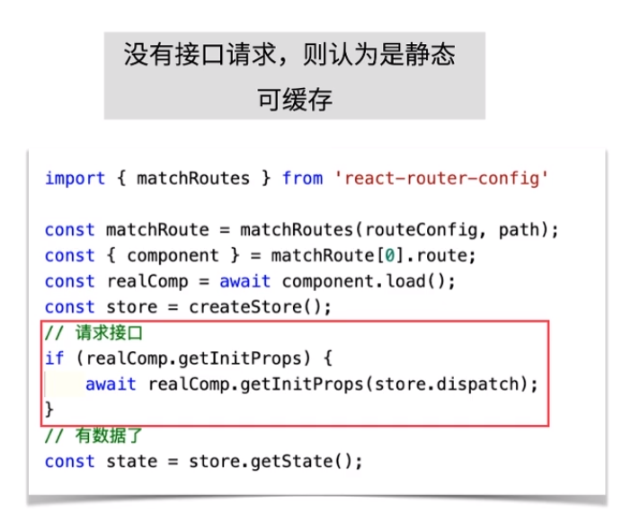

* 新建 map 存储上次的html
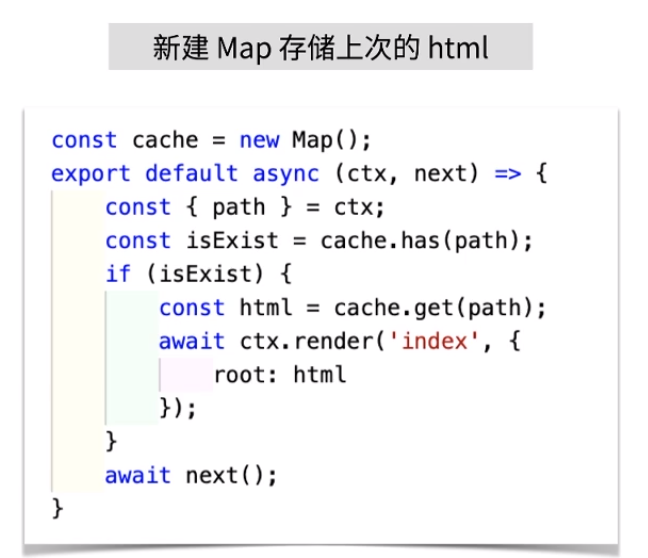

### 降级

当服务器内存占用过高时， 变成静态服务器

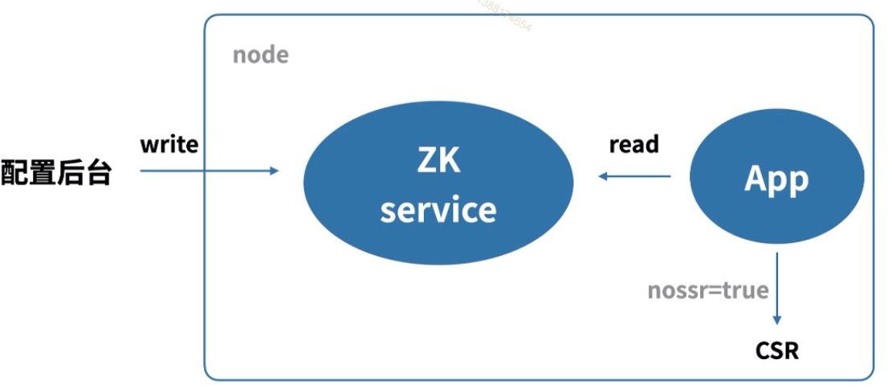


## 状态管理

### redux

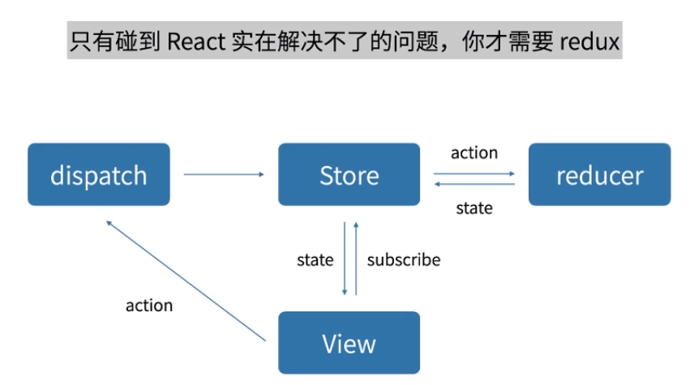

> 以 redux-chunk 为例，就是让 dispatch 支持 function

* redux 改进

## 异步任务