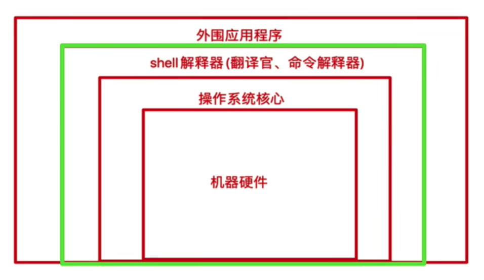
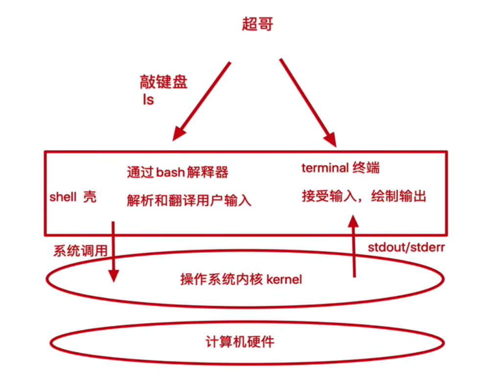
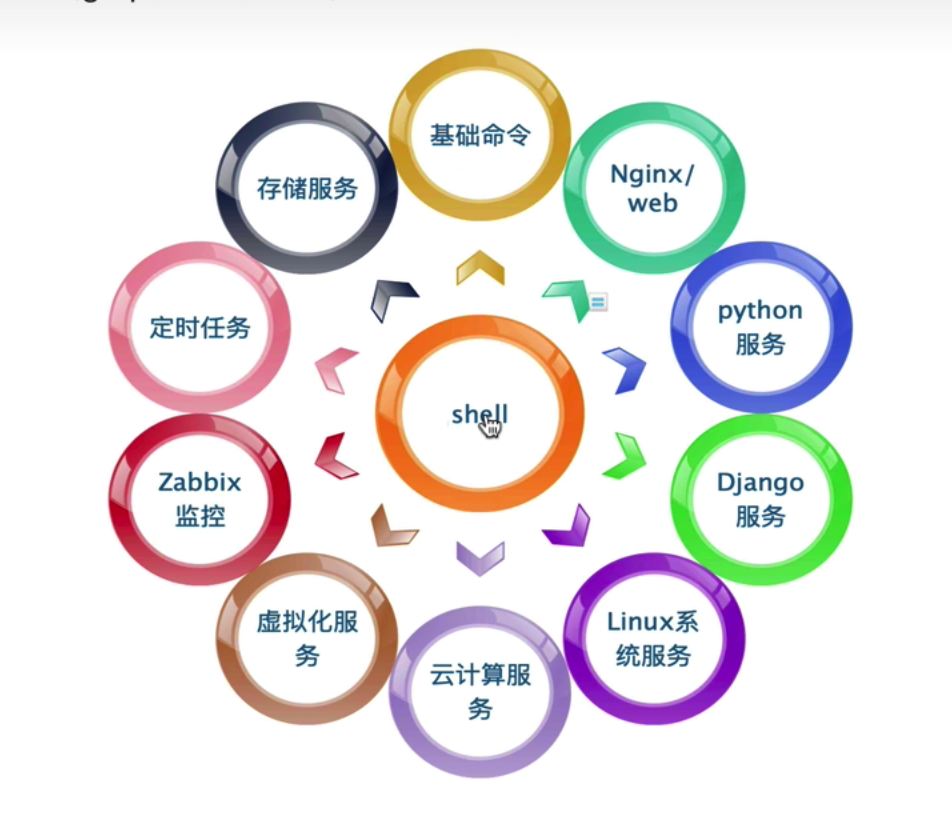

# 1.使用linux背后shell概念

## 1.1.shell的作用

1. 解释执行用户输入的命令或程序等。
2. 用户输入一条命令，shell就解释一条
3. 键盘输入命令，linux给与响应的方式，称之为交互式



shell是一块包裹着核心的壳，处于操作系统的最外层，与用户直接对话，把用户的输入解释给操作系统，然后操作系统的输入结果，输入到屏幕给与用户看到结果

从我们登录 linux ， 输入账号到进入 linux 交互式界面，所有的操作，都是交给 shell 解释并执行



我们想要获取计算机的数据，不可能每次都编写程序，编译后在运行，得到想要的数据，例如你想要找到一个文件，可以先写一点c语言代码，然后调用系统函数， 通过 gcc 编译后，运行程序才能找到文件

因此有大牛开发出了 shell 解释器，能够让我们方便使用 Linux，例如只要敲下 ls -lh 这样的字符串，shell 解释器就会针对这句话解释，解释成 ls -l -h 然后执行，通过终端输出结果，无论是图形化或是命令行界面

```
// 查找命令位置
which vim  // /usr/bin/vim
which ls  // /bin/ls
```

## 1.2.什么是 shell 脚本

当命令或者程序程序语句写在文件中，我们执行文件，读取其中代码，这个程序文件就称之为 shell 脚本

在 shell 脚本里定义多条 Linux 命令以及循环控制语句，然后将这些 linux 命令一次性解释完毕，执行脚本文件称之为，非交互式方式

* window 中存在 *.bat 批处理脚本
* linux 中常用 *.sh 脚本文件

### 1.2.1.shell脚本规则

在 linux 系统中，shell脚本或者称之为 bash shell 程 通常都是 vim 编辑，由 linux 命令、bash shell 指令、逻辑控制语句和注释信息组成

### 1.2.2.shebang

```
// root@VM-0-4-centos
// 是一个软件接 指向 bash
ls -l /bin/sh //  lrwxrwxrwx 1 root root 4 Aug  7  2020 /bin/sh -> bash
```

在计算机程序中，shebang 指的是出现在文本文件的第一行前两个字符 #！

在 Unix 系统中，程序会分析 shebang 后面的内容，作为解释器的指令，例如

* 以 #!/bin/sh 开头的文件，程序在执行的时候会调用 /bin/sh, 也就是 bash解释器
* 以 #!/bin/bash 开头的文件， bash解释器
* 以 #!/usr/bin/python 开头的文件，指定 phthon 解释器去执行
* 以 #!/usr/bin/env 解释器名称， 是一种在不同平台上都能正确找到解释器的方法

**这样做的好处是，系统会自动在 PATH 环境变量中查找你指定的程序（本例中的bash）。相比第一种写法，你应该尽量用这种写法，因为程序的路径是不确定的。这样写还有一个好处，操作系统的PATH变量有可能被配置为指向程序的另一个版本。比如，安装完新版本的bash，我们可能将其路径添加到PATH中，来“隐藏”老版本。如果直接用#!/bin/bash，那么系统会选择老版本的bash来执行脚本，如果用#!/usr/bin/env bash，则会使用新版本。**

### 1.2.3.注意事项

* 如果脚本未指定 shebang ，脚本执行的时候，默认用当前 shell 去解释脚本，即 $SHELL 
* 如果 shebang 指定了可执行的解释器，如/bin/bash /usr/bin/python，脚本在执行时，文件名会作为参数传递给解释器
* 如果＃！指定的解释程序没有可执行权限，则会报错" bad interpreter : Permission denied"。
* 如果＃！指定的解释程序不是一个可执行文件，那么指定的解释程序会被忽略，转而交给当前的 SHELL 去执行这个脚本。
* 如果＃！指定的解释程序不存在，那么会报错" bad interpreter : No such file or directory"。
* #！之后的解释程序，需要写其绝对路径（如：#!/bin/bash )，它是不会自动到 SPATH 中寻找解释器的。
* 如果你使用 "bash test.sh" 这样的命令来执行脚本，那么＃！这一行将会被忽略掉，解释器当然是用命令行中显式指定的 bash。

> 命令行的语句都会去 PATH 里找

## 1.3.sh脚本运行方法

1. ./test.sh

需要加权限, 添加完权限就可以用 ./test.sh 执行
```
// linux
chmod +x ./test.sh
chmod +x /usr/local/bin/abc
// mac
sudo chmod +x ./test.sh
sudo chmod +x /usr/local/bin/abc
```

2. /bin/bash ./test.sh
3. /bin/sh ./test.sh
4. sh ./test.sh  bash ./test.sh
5. source ./test.sh 或者  . ./test.sh // source 等于 .

## 1.4.shell和运维

shell 脚本语言很适合处理纯文本类型数据，且 Linux 的哲学思想就是一切皆文本，如日志，配置文件，文本，网页文件，大多数都是纯文本类型，因此 shell 可以方便进行文本处理，好比 linux 三剑客(grep, sed, awk)



## 1.5.脚本语言

shell 脚本语言属于一种弱类型语言，无需声明变量类型，直接定义使用

强类型语言，必须先定义变量类型，确定是字符串或者数字等，之后再赋予相同类型的值

centos7系统中支持shell情况，有如下类型，只需要关心 bash， sh

```
[root@VM-0-4-centos ~]# cat /etc/shells
/bin/sh
/bin/bash
/usr/bin/sh
/usr/bin/bash
/bin/tcsh
/bin/csh
```

默认的 sh 解释器

```
[root@VM-0-4-centos ~]# ll /usr/bin/sh
lrwxrwxrwx 1 root root 4 Aug  7  2020 /usr/bin/sh -> bash
```

Linux 默认 shell

```
[root@VM-0-4-centos ~]# echo $SHELL
/bin/bash
```

