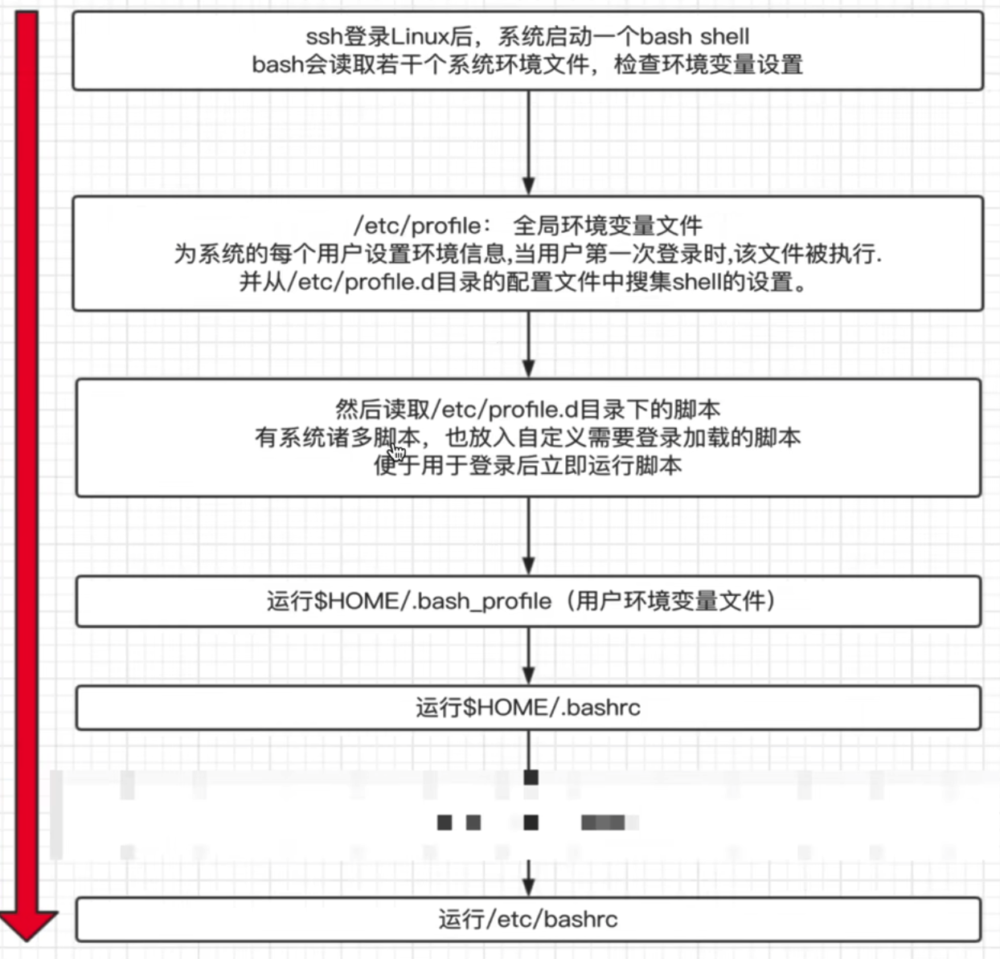

# 4.环境变量设置

## 4.1.环境变量设置

环境变量一般指的是用export 内置命令导出的变量，用于定义shell的运行环境，保证 shell 命令的正确执行

shell 通过环境变量确定登录的用户名、PATH路径、文件系统等各种应用

环境变量可以再命令行中临时创建，但是用户退出shell终端，变量即丢失，如要永久生效，需要修改环境变量配置文件

* 用户个人配置文件 ~/.bash_profile ~/.bashrc 远程登录用户特有文件
* 全局配置文件 /etc/profile /etc/bashrc, 且系统建议最好创建在 /etc/profile.d/, 而非直接修改主文件，修改全局配置文件，影响所有登录系统的用户

## 4.2.检查系统环境的命令

* set 输出所有变量，包括全局变量、局部变量
  set |wc -l 显示出命令条数å
* env 只显示全局变量
* declare 输出所有变量, 如同 set
* export 显示和设置环境变量值
  export |grep PATH

## 4.3.撤销环境变量

* unset 变量名，删除变量或函数

## 4.4.设置只读变量

* readonly  只有当前 shell 结束， 只读变量失效

## 4.5.过滤出，格式化所有的linux环境变量名称

export |awk -F '[ :=]' '{print $3}'

```
MacBook-Pro-7:~ j$ export |awk -F '[ :=]' '{print $3}'
Apple_PubSub_Socket_Render
HOME
LANG
LOGNAME
NVM_BIN
NVM_CD_FLAGS
NVM_DIR
NVM_INC
OLDPWD
PATH
PWD
SECURITYSESSIONID
SHELL
SHLVL
SSH_AUTH_SOCK
TERM
TERM_PROGRAM
TERM_PROGRAM_VERSION
TERM_SESSION_ID
TMPDIR
USER
XPC_FLAGS
XPC_SERVICE_NAME
__CF_USER_TEXT_ENCODING
```

## 4.6.bash多命令执行

```
ls /data/;cd /tmp;cd /home;cd /data
```

## 4.7.环境变量初始化与加载顺序




