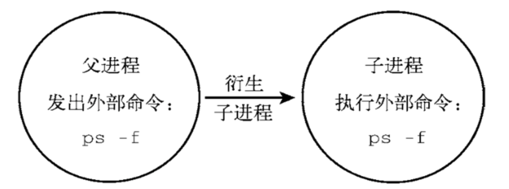

# 8.linux的内外置命令

## 8.1.linux的内外置命令

内置命令： 在系统启动时就加载入内存，常驻内存，执行效率更高，但是占用资源。

外置命令： 系统需要从硬盘中读取程序文件，再读入内存加载

### 8.1.1.外置命令

自己单独下载的文件系统命令，处于 bash shell 之外的程序

```
/bin
/usr/bin
/sbin
/usr/sbin
```

* 特点
一定会开启子进程执行

```
[root@VM-0-4-centos ~]# ps -f --forest
UID        PID  PPID  C STIME TTY          TIME CMD
root     14871 14833  0 10:08 pts/0    00:00:00 -bash
root     15974 14871  0 10:12 pts/0    00:00:00  \_ ps -f --forest
root     13373 13082  0  2022 pts/0    00:00:00 /bin/bash
root     13751 13373  0  2022 pts/0    00:00:00  \_ mysql -uroot -px xxxx
```



### 8.1.2.内置命令

* 特点
内置命令不会产生子进程去执行。内置命令和 shell 是一体的，是 shell 的一部分，系统启动后就执行在内存中了

* 验证 type

```
[root@VM-0-4-centos ~]# type cd
cd 是 shell 内嵌

# 查看 linux 的内置 shell 命令
[root@VM-0-4-centos ~]# compgen -b
```
