一、grep基本介绍
全拼:Global search REgular expression and Print out the line.

作用:文本搜索工具，根据用户指定的“模式（过滤条件)”对目标文本逐行进行匹配检查，打印匹配到的行.

模式:由正则表达式的元字符及文本字符所编写出的过滤条件﹔

grep命令是Linux系统中最重要的命令之一，功能是从文本文件或管道数据流中筛选匹配的行和数据，如果再配合正则表达式，功能十分强大，是Linux运维人员必备的命令

grep命令里的匹配模式就是你想要找的东西，可以是普通的文字符号，也可以是正则表达式

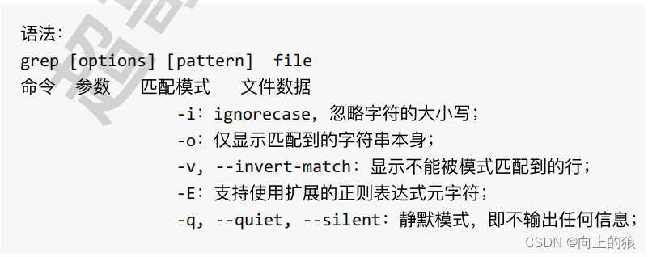

二、正则表达式grep实践
首先先看一下这个测试文件的内容吧

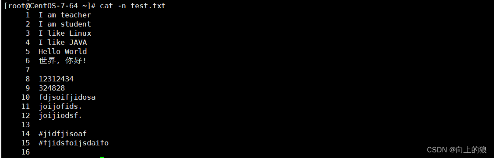

2.1、输出以 I 开头的行(不区分大小写)

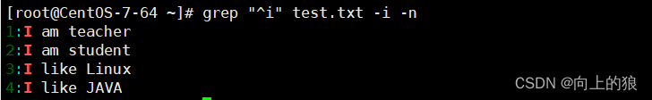

> 注: 这里的-i代表不区分大小写, -n代表显示匹配行和行号

2.2、输出以.结尾的行

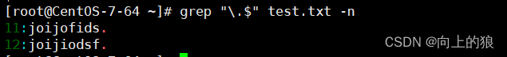

> 注: 因为.在这里有着特殊含义, 所以要用\转义一下, 如果不加转义字符的话, grep就会把它当做正则表达式来处理(.代表的含义是匹配任意一个字符)

2.3、$符号
注意在Linux平台下, 所有文件的结尾都有一个$符
可以利用cat -A 查看文件

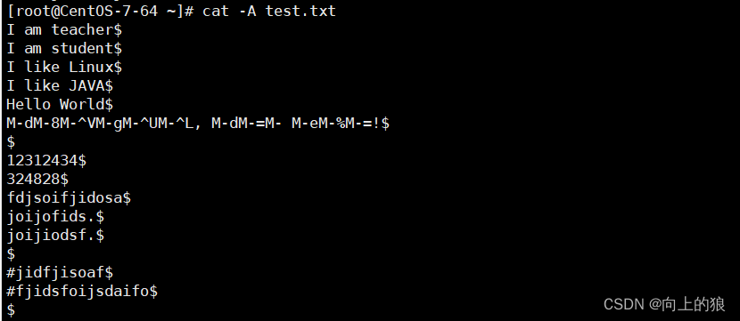

2.4、^$(代表空行的意思)组合符
找出文件的空行, 以及行号

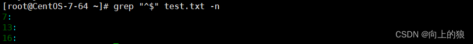

2.5、.点符号
"."点表示任意一个字符, 有且只有一个, 不包含空行

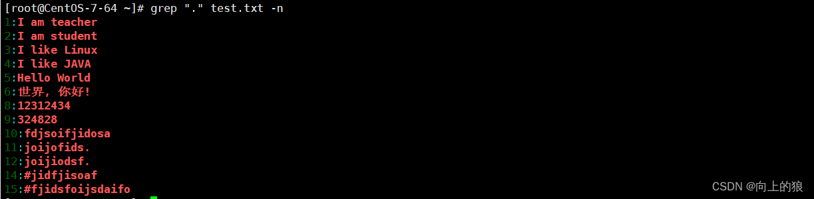

2.6、*符号
"*"表示找出前一个字符0次或一次以上

找出文件中i出现0次或多次的行和行号

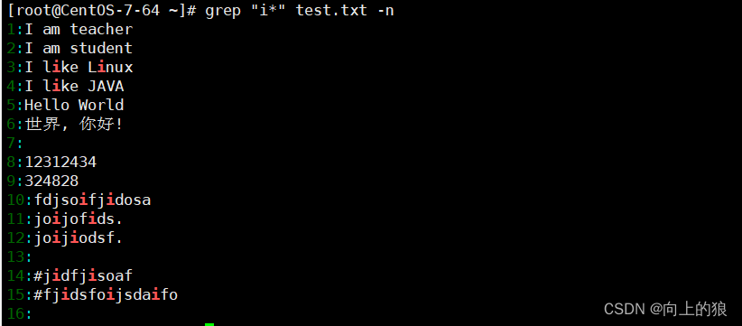

2.7、.*组合符
".*"表示所有内容, 包括空行9

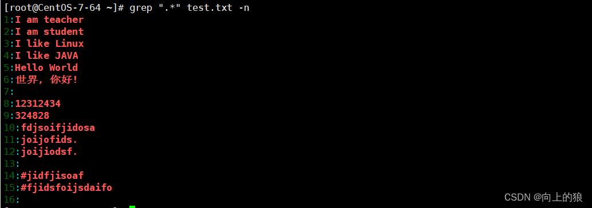

2.8、^.*t符 (含义: 以任意内容开头, 直到t结束)

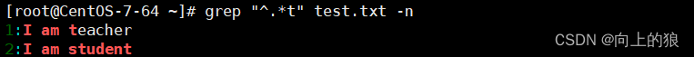

2.9、[abc]中括号
中括号表达式,[abc]表示匹配中括号中任意一个字符, a或b或c,常见的形式如下;

[a-z]匹配所有小写单个字母[A-Z]匹配所有单个大写字母
[a-zA-Z]匹配所有的单个大小写字母
[0-9]匹配所有单个数字
[a-zA-ZO-9]匹配所有数字和字母
匹配abc字符中的任意一个,得到它的行数和行号 

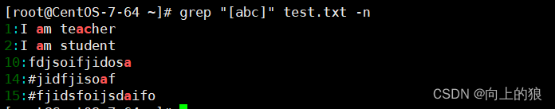

2.10、grep的参数-o
使用"-o"选项, 可以值显示被匹配到的关键字, 而不是讲整行的内容都输出.

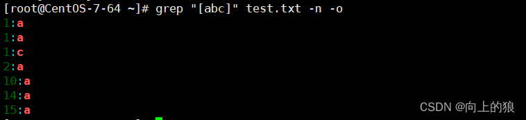

显示出文章中有多少行有a

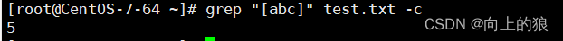

"-c"只统计匹配的行数

2.11、[^abc]中括号中去反
[^abc]或[^a-c]这样的命令, "^"符号在中括号中第一位表示排除, 就是排除字符a,b,c

> 注: 出现再中括号里的尖角号表示取反

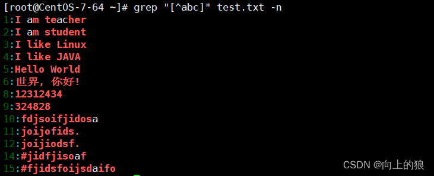

原文链接：https://blog.csdn.net/m0_50370837/article/details/125068528