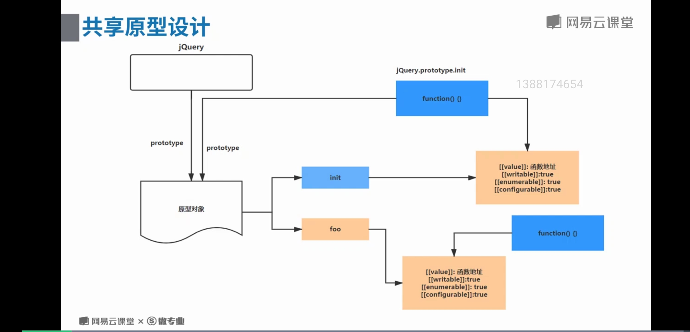

# jquery整体架构-核心功能函数揭秘

## 内容详情
* jQuery无new构造实例
* 共享原型设计
* extend 源码解析

## jQuery无new构造实例

> $ 就是jquery的别名 <br>
> $() 就是在创建jquery的实例对象

## 共享原型设计



```javascript
(function (root) {
	var jQuery = function () {
		return new jQuery.prototype.init();
	}
	jQuery.fn = jQuery.prototype = {
		init: function () {

		}
	};
	jQuery.prototype.init.prototype = jQuery.prototype;
	// jQuery.prototype.constructor = jQuery;
	
	root.$ = root.jQuery = jQuery;
}) (root)

```

## extend

* 用法：任意对象扩展
```javascript
// 给jQuery 扩展属性或方法，只传一个参数
var obj = $.exntend({}, {name: 'zs'});
// 给jquery原型（实例对象）上扩展方法或属性
$.fn.extend({name: 'zs'});
```

* 写法
```javascript
var jQuery = function () {

}
jQuery.fn = jQuery.prototype;
jQuery.extend = jQuery.fn.extend = function () {
	var target = arguments[0], i = 1, args = arguments, deep = false;
	var copy, isPlantArray, clone, src;

	if (typeof target === 'boolean') {
		deep = target;
		target = args[1];
		i++;
	}

	if(typeof target !== 'object') {
		target = {};
	} 

	if (args.length === 1) {
		target = this;
		i--;
	}

	for (; i < args.length; i++) {
		for (key in args[i]) {
			src = args[i][key];
			console.log('src', src);
			if (deep && (isPlantArray = jQuery.isArray(src) || jQuery.isObject(src))) {
				if (isPlantArray) {
					isPlantArray = false;
					clone = target[key] && jQuery.isArray(target[key]) ? target[key] : [];
				} else {
					clone = target[key] && jQuery.isObject(target[key]) ? target[key] : {};
				}
				target[key] = jQuery.extend(deep, clone, src);
			} else {
				target[key] = src;
			}
		}
	}

	return target;
}
jQuery.extend({
	isArray: function (data) {
		return toString.call(data) === '[object Array]'
	},
	isObject: function (data) {
		return toString.call(data) === '[object Object]'
	}
})
```