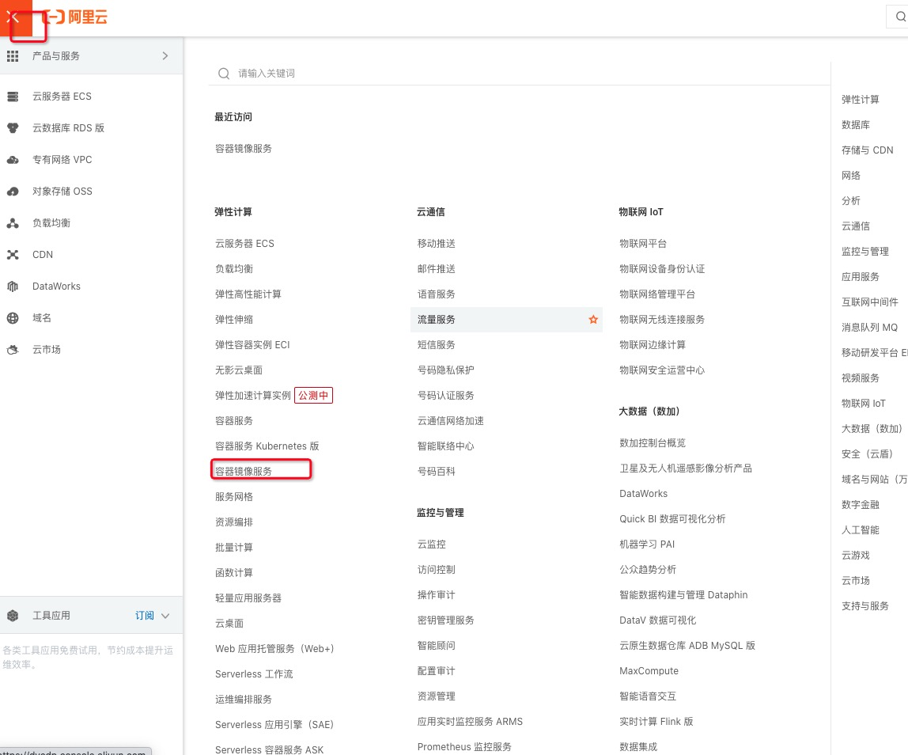
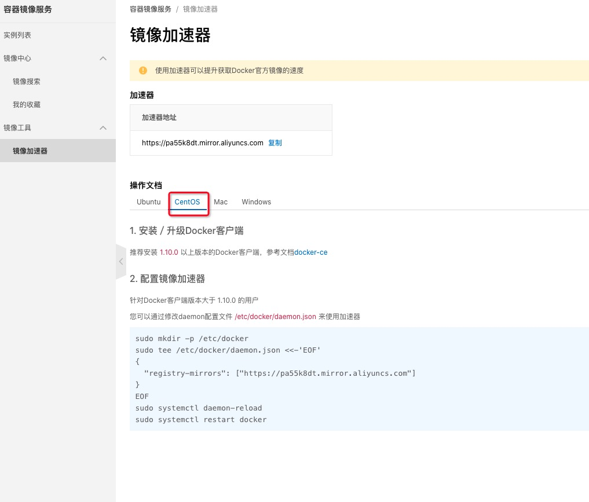
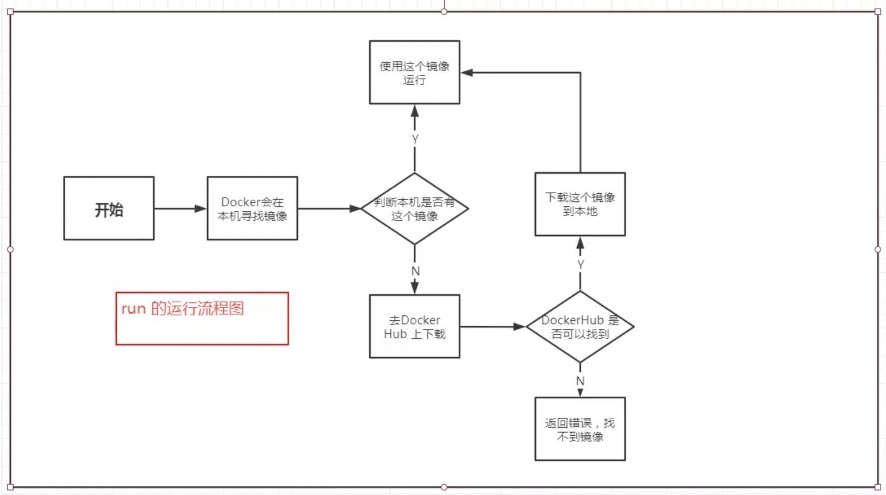
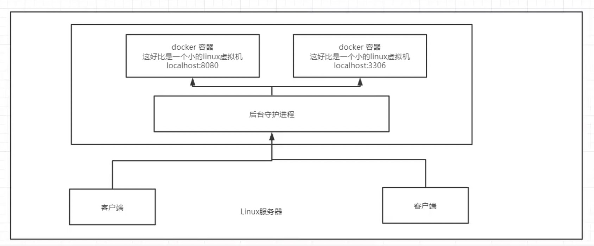
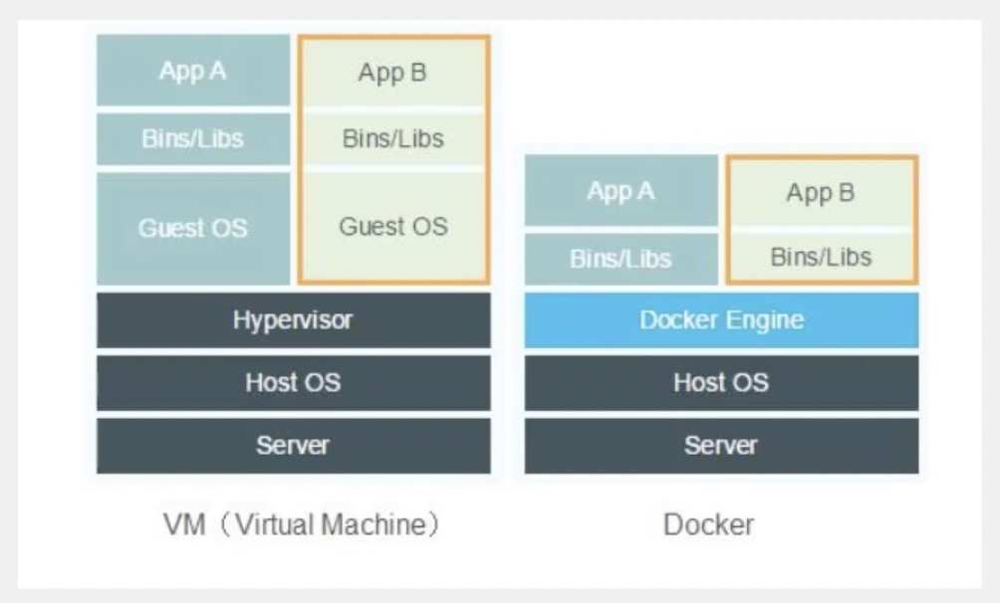
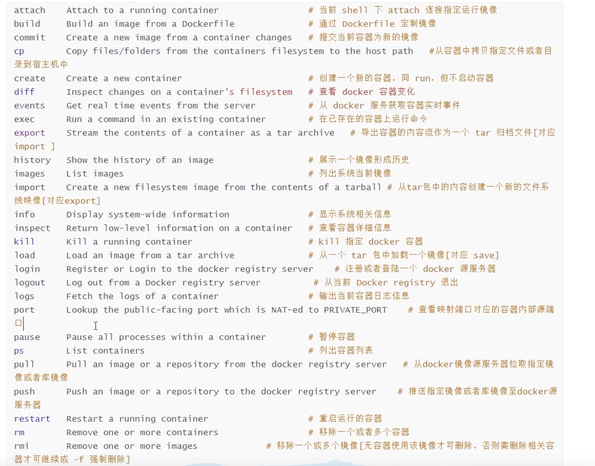
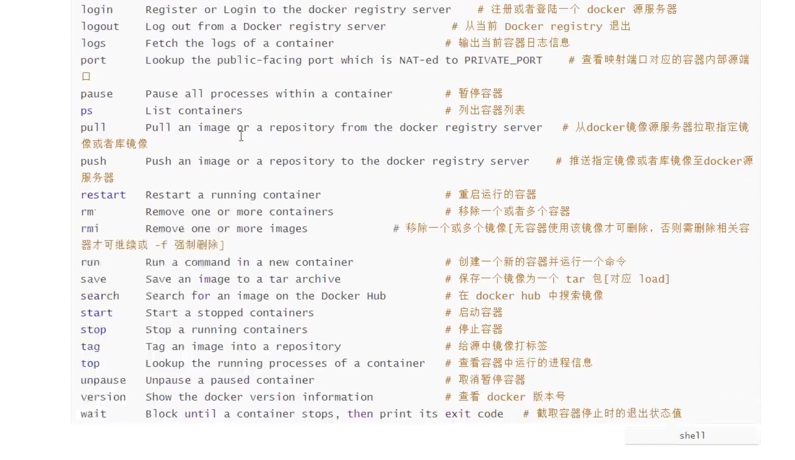

# 2.Docker基础

## Dokcer概念

Docker 是基于 GO 语音开发的

官网： https://www.docker.com/

文档： https://www.docs.docker.com/  Docker的文档是超级详细的

仓库地址：https://hub.docker.com/

## Docker作用

1. 更快速的交付和部署

打包镜像，发布测试，一键部署

2. 更快捷的升级和扩容

使用了docker之后，我们部署和应用就和搭积木一样

3. 更简单的系统运维

4. 更高效的计算资源利用

> Docker 是内核级别的虚拟化，可以在一个物理机上运行很多的容器实例。服务器的性能可以充分使用

### 比较虚拟机技术不同

* 传统虚拟机， 虚拟出一条硬件，运行一个完整的操作系统，然后在这个系统上安装和运行软件
* 容器内的应用，直接应用在宿主机的内容，容器是没有自己的内核的，也没有虚拟我们的硬件，所以就轻便了
* 每个容器互相间隔，每个容器内都有属于自己的文件系统，互不影响

## Docker中的名次概念

### Docker 基础组成

#### 客户端

docker build 

docker pull

docker run 


#### 服务器 

#### 仓库

### 名次概念

#### 镜像(image)

镜像就好比是一个模版，可以通过这个模版来创建容器服务，tomcat镜像 ===> run ===> tomcat01(提供服务器)，通过这个镜像可以创建多个容器（最终服务运行或项目运行就是在一个容器中的）。

#### 容器(container)

Docker 可以利用容器技术，独立运行一个或者一组应用，通过镜像来创建的。

启动，停止，删除，基本命令。

目前就可以把这个容器看成简易的linux系统。

#### 仓库(repository)

仓库就是存放镜像的地方。

仓库分为共有仓库，和私有仓库

Docker Hub（默认都是国外的）

阿里云...都有容器服务器（配置镜像加速）

## 安装 Docker

文档： https://docs.docker.com/engine/install/centos/

### 环境准备

* 需要一点linux的基础
* CenOS 7
* 使用 Xshell连接远程服务器进行操作

### 环境查看

### 帮助文档

https://docs.docker.com/engine/install/centos/

```
# 1. 卸载旧版本
yum remove docker \
                docker-client \
                docker-client-latest \
                docker-common \
                docker-latest \
                docker-latest-logrotate \
                docker-logrotate \
                docker-engine

# 2. 需要的安装包
yum install -y yum-utils

# 3. 设置仓库的镜像
yum-config-manager \
  --add-repo \
  https://download.docker.com/linux/centos/docker-ce.repo // 文档默认是国外的，很慢， 要配置国内的

yum-config-manager \
  --add-repo \
  http://mirrors.aliyun.com/docker-ce/linux/centos/docker-ce.repo // 推荐使用 阿里云的


# 更新yum软件包索引
yum makecache fast

# 4. 安装 docker docker-ce 社区版， docker-ee 企业版
yum install docker-ce docker-ce-cli containerd.io

# 5. 启动 docker
systemctl start docker

# 6. 使用 docker version 是否安装

# 7. docker run hello-world

# 8. 查看一下下载的 hello-world 镜像
docker images
```

### 了解 卸载 docker
```
# 1. 卸载依赖
yum remove docker-ce docker-ce-cli containerd.io

# 2. 删除资源
rm -rf /var/lib/docker

# /var/lib/docker docker的默认工作路径
```

搜索 docker 阿里云镜像地址

## 配置阿里云镜像加速

1. 登陆阿里云找到容器服务



2. 找到镜像加速地址



3. 配置使用

https://cr.console.aliyun.com/cn-hangzhou/instances/mirrors

```
sudo mkdir -p /etc/docker

sudo tee /etc/docker/daemon.json <<-'EOF'
{
  "registry-mirrors": ["https://pa55k8dt.mirror.aliyuncs.com"]
}
EOF

sudo systemctl daemon-reload

sudo systemctl restart docker
```

## 回顾 helloword 流程

docker run hello-world => docker会在本级寻找镜像 => 判断本机是否有这个镜像
=> 有 => 使用这个镜像运行
=> 否 => 去 DockerHub 上下载 => DockerHub是否可以找到 => 找不到返回错误，找到下载这个镜像到本地使用这个镜像运行



## 底层原理

### Docker 是怎么工作的

Docker 是一个 Client-Sever 结构的系统， Docker 的守护进程运行在主机上，通过 socket 从客户端访问。

DockerSever 接收到 Docker-Client 的指令， 就会执行这个命令



## Docker 为什么比虚拟机快

1. Docker 有着比虚拟机更少的抽象层
2. Docker 利用宿主机的内核，vm需要是 Guest OS.



所以说，新建一个容器的时候，docker 不需要向虚拟机一样重新加载一个操作系统内核，避免引导操作。虚拟机是加载 Guest OS，分钟级别的， 而 docker 是利用宿主机的操作系统，省略了复杂的过程，秒级。


> 之后学过所有的命令，再回头看这段理论，就会很清晰。

## Docker 常用命令

### 帮助命令

* docker version  显示docker的版本信息
* docker info     显示 docker 的系统信息，包括镜像和容器的数量
* docker 命令 --help  万能命令  docker --help 帮助命令

### 帮助文档的地址

https://docs.docker.com/reference/

### 镜像命令

* 1. docker images 查看所有本地主机上的镜像

```
[root@VM-0-4-centos ~]# docker images
REPOSITORY    TAG       IMAGE ID       CREATED        SIZE
hello-world   latest    d1165f221234   2 months ago   13.3kB
```

 * 1.1 解释

 REPOSITORY 镜像的仓库源

 TAG        镜像的标签

 IMAGE ID   镜像的id

 CREATED    镜像的创建时间

 SIZE       镜像的大小

 * 1.2 可选项

 ```
  Options:
  -a, --all             Show all images (default hides intermediate images) 列出所有的镜像
      --digests         Show digests
  -f, --filter filter   Filter output based on conditions provided
      --format string   Pretty-print images using a Go template
      --no-trunc        Don't truncate output
  -q, --quiet           Only show image IDs   只显示镜像的 id
 ```

* 2. docker search   搜索镜像

```
docker search mysql
NAME                              DESCRIPTION                                     STARS     OFFICIAL   AUTOMATED
mysql                             MySQL is a widely used, open-source relation…   10886     [OK]       
mariadb                           MariaDB Server is a high performing open sou…   4104      [OK]       
mysql/mysql-server                Optimized MySQL Server Docker images. Create…   809                  [OK]
centos/mysql-57-centos7           MySQL 5.7 SQL database server                   87     
```

* 2.1 可选项， 通过搜索来过滤

docker search mysql --filter=STARS=3000   搜索出来的镜像就是 STARS 大于 3000 的镜像

```
[root@VM-0-4-centos ~]# docker search mysql --filter=STARS=3000
NAME      DESCRIPTION                                     STARS     OFFICIAL   AUTOMATED
mysql     MySQL is a widely used, open-source relation…   10886     [OK]       
mariadb   MariaDB Server is a high performing open sou…   4104      [OK]
```

* 3. docker pull 下载镜像

docker pull 镜像名[:tag]

```
# 下载镜像 
[root@VM-0-4-centos ~]# docker pull mysql
Using default tag: latest       # 如果不写版本，默认就是 latest， 最新的
latest: Pulling from library/mysql
69692152171a: Pull complete     # 分层下载， docker image 的核心，联合文件系统
1651b0be3df3: Pull complete 
951da7386bc8: Pull complete 
0f86c95aa242: Pull complete 
37ba2d8bd4fe: Pull complete 
6d278bb05e94: Pull complete 
497efbd93a3e: Pull complete 
f7fddf10c2c2: Pull complete 
16415d159dfb: Pull complete 
0e530ffc6b73: Pull complete 
b0a4a1a77178: Pull complete 
cd90f92aa9ef: Pull complete 
Digest: sha256:d50098d7fcb25b1fcb24e2d3247cae3fc55815d64fec640dc395840f8fa80969     # 签名 
Status: Downloaded newer image for mysql:latest
docker.io/library/mysql:latest          # 真实地址
```

* 3.1 等价
docker pull mysql === docker pull docker.io/library/mysql:latest 

* 3.2 docker pull mysql:5.7

> 版本官方文档得有

```
[root@VM-0-4-centos ~]# docker pull mysql:5.7
5.7: Pulling from library/mysql
69692152171a: Already exists 
1651b0be3df3: Already exists 
951da7386bc8: Already exists 
0f86c95aa242: Already exists 
37ba2d8bd4fe: Already exists 
6d278bb05e94: Already exists 
497efbd93a3e: Already exists 
a023ae82eef5: Pull complete 
e76c35f20ee7: Pull complete 
e887524d2ef9: Pull complete 
ccb65627e1c3: Pull complete 
Digest: sha256:a682e3c78fc5bd941e9db080b4796c75f69a28a8cad65677c23f7a9f18ba21fa
Status: Downloaded newer image for mysql:5.7
docker.io/library/mysql:5.7
```

* 4. docker rmi  删除镜像

* 4.1 docker rmi -f 镜像id

docker rmi -f c0cdc95609f1     删除指定的镜像

docker rmi -f 镜像id 镜像id 镜像id    删除多个镜像

* 4.2 docker rmi -f $(docker images -aq)  删除全部镜像

## 容器命令

> 有了镜像才能创建容器，linux ， 下载一个 centos 镜像来测试学习


* 1. 创建容器

docker pull centos

* 2. 新建容器并启动

docker run --help

```
docker run [可选参数] image

# 参数说明
--name="Name"  容器名字  tomcat01
-d   后台方式运行 ja  
-it  使用交互方式进行，进入容器查看内容
-p   指定容器的端口    小
    -p   ip:主机端口:容器端口
    -p   主机端口:容器端口  （常用） 
    -p   容器端口
    容器端口
-P   随机指定端口      大

# 测试， 启动并进入容器
[root@VM-0-4-centos ~]# docker run -it centos /bin/bash
[root@79286024b996 /]# 

# 查看容器内的 centos ， 基础版本， 很多命令都是不完善的
[root@79286024b996 /]# ls
bin  etc   lib	  lost+found  mnt  proc  run   srv  tmp  var
dev  home  lib64  media       opt  root  sbin  sys  usr
```

* 3. 从容器退到主机  

exit

* 4. 容器不停止退出

ctrl + P + Q 

* 5. 列出所有运行的容器

docker ps

* 6. 删除容器

docker rm 容器id    删除指定容器, 不能删除正在运行的容器

docker rm -f 容器id    强制删除容器

docker rm -f $(docker ps -aq)   删除所有容器

docker ps -a -q|xargs docker rm    删除所有容器

* 7. 启动和停止容器操作

* 7.1 docker start 容器id      启动容器

docker start CONTAINER_ID

* 7.2 docker restart 容器id   重启容器

* 7.3 docker stop 容器id      停止当前正在运行的容器
  
* 7.4 docker kill 容器id     强制停止当前容器   

## 常用的其他命令

* 1. 后台启动容器

docker run -d 镜像名

```
# 启动
[root@VM-0-4-centos ~]# docker run -d centos
242e7fd17b50481516e195d91eeb74f6053ce57615d84aa4b416c8d12edc5b37

# 问题： 
docker ps 发现centos停止了

# 常见的坑
容器使用后台运行，就必须要有一个前台的进程，docker 发现没有应用，就会自动停止

# nginx 容器启动后，发现自己没有提供服务，就会立刻停止 ，就是没有程序了
```

* 2. 查看日志

docker logs

```
docker run -it centos /bin/bash
ctrl + p + q

docker logs -tf --tail 10 6c05ff85b129   6c05ff85b129 是 CONTAINER_ID
```

```
docker logs -f -t --tail 10 6c05ff85b129  没有日志

# 自己编写一段 shell 脚本
docker run -d centos /bin/bash -c "while true;do echo 1;sleep 1;done"

# [root@VM-0-4-centos ~]# docker ps
CONTAINER ID   IMAGE     COMMAND                  CREATED         STATUS         PORTS     NAMES
ff1efccb099f   centos    "/bin/bash -c 'while…"   4 seconds ago   Up 3 seconds             friendly_sinoussi

# 显示日志
-tf     #显示日志  -f 带上时间戳
--tail    # 显示条数

[root@VM-0-4-centos ~]# docker logs -tf --tail 10 ff1efccb099f
2021-05-20T12:41:24.132331109Z 1
2021-05-20T12:41:25.134264766Z 1
2021-05-20T12:41:26.136215077Z 1
2021-05-20T12:41:27.138141416Z 1
2021-05-20T12:41:28.140077091Z 1
2021-05-20T12:41:29.141998628Z 1
2021-05-20T12:41:30.144141848Z 1
```

## 查看容器进程信息 ps

docker top 容器id

```
[root@VM-0-4-centos ~]# docker top ff1efccb099f
UID                 PID                 PPID                C                   STIME               TTY                 TIME                CMD
root                25511               25492               0                   20:41               ?                   00:00:00            /bin/bash -c while true;do echo 1;sleep 1;done
root                28177               25511               0                   20:54               ?                   00:00:00            /usr/bin/coreutils --coreutils-prog-shebang=sleep /usr/bin/sleep 1
```

## 查看镜像元数据

docker inspect  容器id


```
[root@VM-0-4-centos ~]# docker inspect ff1efccb099f
[
    {
        "Id": "ff1efccb099f11de49cd9f00b61c6909e7f28da5412b472d9290b4c9cf91e8b9",
        "Created": "2021-05-20T12:41:07.762528629Z",
        "Path": "/bin/bash",
        "Args": [
            "-c",
            "while true;do echo 1;sleep 1;done"
        ],
        "State": {
            "Status": "running",
            "Running": true,
            "Paused": false,
            "Restarting": false,
            "OOMKilled": false,
            "Dead": false,
            "Pid": 25511,
            "ExitCode": 0,
            "Error": "",
            "StartedAt": "2021-05-20T12:41:08.102408984Z",
            "FinishedAt": "0001-01-01T00:00:00Z"
        },
        "Image": "sha256:300e315adb2f96afe5f0b2780b87f28ae95231fe3bdd1e16b9ba606307728f55",
        "ResolvConfPath": "/var/lib/docker/containers/ff1efccb099f11de49cd9f00b61c6909e7f28da5412b472d9290b4c9cf91e8b9/resolv.conf",
        "HostnamePath": "/var/lib/docker/containers/ff1efccb099f11de49cd9f00b61c6909e7f28da5412b472d9290b4c9cf91e8b9/hostname",
        "HostsPath": "/var/lib/docker/containers/ff1efccb099f11de49cd9f00b61c6909e7f28da5412b472d9290b4c9cf91e8b9/hosts",
        "LogPath": "/var/lib/docker/containers/ff1efccb099f11de49cd9f00b61c6909e7f28da5412b472d9290b4c9cf91e8b9/ff1efccb099f11de49cd9f00b61c6909e7f28da5412b472d9290b4c9cf91e8b9-json.log",
        "Name": "/friendly_sinoussi",
        "RestartCount": 0,
        "Driver": "overlay2",
        "Platform": "linux",
        "MountLabel": "",
        "ProcessLabel": "",
        "AppArmorProfile": "",
        "ExecIDs": null,
        "HostConfig": {
            "Binds": null,
            "ContainerIDFile": "",
            "LogConfig": {
                "Type": "json-file",
                "Config": {}
            },
            "NetworkMode": "default",
            "PortBindings": {},
            "RestartPolicy": {
                "Name": "no",
                "MaximumRetryCount": 0
            },
            "AutoRemove": false,
            "VolumeDriver": "",
            "VolumesFrom": null,
            "CapAdd": null,
            "CapDrop": null,
            "CgroupnsMode": "host",
            "Dns": [],
            "DnsOptions": [],
            "DnsSearch": [],
            "ExtraHosts": null,
            "GroupAdd": null,
            "IpcMode": "private",
            "Cgroup": "",
            "Links": null,
            "OomScoreAdj": 0,
            "PidMode": "",
            "Privileged": false,
            "PublishAllPorts": false,
            "ReadonlyRootfs": false,
            "SecurityOpt": null,
            "UTSMode": "",
            "UsernsMode": "",
            "ShmSize": 67108864,
            "Runtime": "runc",
            "ConsoleSize": [
                0,
                0
            ],
            "Isolation": "",
            "CpuShares": 0,
            "Memory": 0,
            "NanoCpus": 0,
            "CgroupParent": "",
            "BlkioWeight": 0,
            "BlkioWeightDevice": [],
            "BlkioDeviceReadBps": null,
            "BlkioDeviceWriteBps": null,
            "BlkioDeviceReadIOps": null,
            "BlkioDeviceWriteIOps": null,
            "CpuPeriod": 0,
            "CpuQuota": 0,
            "CpuRealtimePeriod": 0,
            "CpuRealtimeRuntime": 0,
            "CpusetCpus": "",
            "CpusetMems": "",
            "Devices": [],
            "DeviceCgroupRules": null,
            "DeviceRequests": null,
            "KernelMemory": 0,
            "KernelMemoryTCP": 0,
            "MemoryReservation": 0,
            "MemorySwap": 0,
            "MemorySwappiness": null,
            "OomKillDisable": false,
            "PidsLimit": null,
            "Ulimits": null,
            "CpuCount": 0,
            "CpuPercent": 0,
            "IOMaximumIOps": 0,
            "IOMaximumBandwidth": 0,
            "MaskedPaths": [
                "/proc/asound",
                "/proc/acpi",
                "/proc/kcore",
                "/proc/keys",
                "/proc/latency_stats",
                "/proc/timer_list",
                "/proc/timer_stats",
                "/proc/sched_debug",
                "/proc/scsi",
                "/sys/firmware"
            ],
            "ReadonlyPaths": [
                "/proc/bus",
                "/proc/fs",
                "/proc/irq",
                "/proc/sys",
                "/proc/sysrq-trigger"
            ]
        },
        "GraphDriver": {
            "Data": {
                "LowerDir": "/var/lib/docker/overlay2/265e4e5982f95505a01cd3502c3991994703718e9b21362fcd2fc766eed6a937-init/diff:/var/lib/docker/overlay2/bcfaf25d511d8afdca79e7813cc52c0eb33e26a6fe4161cb249d0b2597fe783b/diff",
                "MergedDir": "/var/lib/docker/overlay2/265e4e5982f95505a01cd3502c3991994703718e9b21362fcd2fc766eed6a937/merged",
                "UpperDir": "/var/lib/docker/overlay2/265e4e5982f95505a01cd3502c3991994703718e9b21362fcd2fc766eed6a937/diff",
                "WorkDir": "/var/lib/docker/overlay2/265e4e5982f95505a01cd3502c3991994703718e9b21362fcd2fc766eed6a937/work"
            },
            "Name": "overlay2"
        },
        "Mounts": [],
        "Config": {
            "Hostname": "ff1efccb099f",
            "Domainname": "",
            "User": "",
            "AttachStdin": false,
            "AttachStdout": false,
            "AttachStderr": false,
            "Tty": false,
            "OpenStdin": false,
            "StdinOnce": false,
            "Env": [
                "PATH=/usr/local/sbin:/usr/local/bin:/usr/sbin:/usr/bin:/sbin:/bin"
            ],
            "Cmd": [
                "/bin/bash",
                "-c",
                "while true;do echo 1;sleep 1;done"
            ],
            "Image": "centos",
            "Volumes": null,
            "WorkingDir": "",
            "Entrypoint": null,
            "OnBuild": null,
            "Labels": {
                "org.label-schema.build-date": "20201204",
                "org.label-schema.license": "GPLv2",
                "org.label-schema.name": "CentOS Base Image",
                "org.label-schema.schema-version": "1.0",
                "org.label-schema.vendor": "CentOS"
            }
        },
        "NetworkSettings": {
            "Bridge": "",
            "SandboxID": "2f0438d50ff0ef4d7e2af695ef18eeb8bc5bfe0ad011f85d769255db45c5dee0",
            "HairpinMode": false,
            "LinkLocalIPv6Address": "",
            "LinkLocalIPv6PrefixLen": 0,
            "Ports": {},
            "SandboxKey": "/var/run/docker/netns/2f0438d50ff0",
            "SecondaryIPAddresses": null,
            "SecondaryIPv6Addresses": null,
            "EndpointID": "b6aa356a38b1baee48ac8ecb3800b48f361b310aef71cd7306cae1501222391d",
            "Gateway": "172.18.0.1",
            "GlobalIPv6Address": "",
            "GlobalIPv6PrefixLen": 0,
            "IPAddress": "172.18.0.2",
            "IPPrefixLen": 16,
            "IPv6Gateway": "",
            "MacAddress": "02:42:ac:12:00:02",
            "Networks": {
                "bridge": {
                    "IPAMConfig": null,
                    "Links": null,
                    "Aliases": null,
                    "NetworkID": "9d496db23b8596a0de65a51ea34116151b7946b4751f8453d48feab9b7d0b3d0",
                    "EndpointID": "b6aa356a38b1baee48ac8ecb3800b48f361b310aef71cd7306cae1501222391d",
                    "Gateway": "172.18.0.1",
                    "IPAddress": "172.18.0.2",
                    "IPPrefixLen": 16,
                    "IPv6Gateway": "",
                    "GlobalIPv6Address": "",
                    "GlobalIPv6PrefixLen": 0,
                    "MacAddress": "02:42:ac:12:00:02",
                    "DriverOpts": null
                }
            }
        }
    }
]
```


## 进入当前正在运行的容器

> 我们通常容器都是使用后台方式运行的，需要进入容器修改一些配置

* 1. 命令1

docker exec -it 容器id  bashShell

* 测试
```
[root@VM-0-4-centos ~]# docker ps
CONTAINER ID   IMAGE     COMMAND                  CREATED          STATUS          PORTS     NAMES
ff1efccb099f   centos    "/bin/bash -c 'while…"   29 minutes ago   Up 29 minutes             friendly_sinoussi
[root@VM-0-4-centos ~]# docker exec -it ff1efccb099f /bin/bash
[root@ff1efccb099f /]# ls
bin  dev  etc  home  lib  lib64  lost+found  media  mnt  opt  proc  root  run  sbin  srv  sys  tmp  usr  var
[root@ff1efccb099f /]# ps -ef
UID        PID  PPID  C STIME TTY          TIME CMD
root         1     0  0 12:41 ?        00:00:00 /bin/bash -c while true;do echo 1;sleep 1;done
root      1949     0  0 13:13 pts/0    00:00:00 /bin/bash
root      1989     1  0 13:13 ?        00:00:00 /usr/bin/coreutils --coreutils-prog-shebang=sleep /usr/bin/sleep 1
root      1990  1949  0 13:13 pts/0    00:00:00 ps -ef
```

* 2. 命令2

docker attach 容器id


* 3. exec 和 attach 区别

docker exec   进入一个容器后开启一个新的终端， 可以在里面操作

docker attach    进入容器正在执行的终端，不会启动新的进程

* 4. 从容器内拷贝文件到主机上

docker  cp  容器id:容器内路径   目的主机路径


> 只要容器在，数据就在

* 测试

```
[root@VM-0-4-centos home]# docker ps -aq
96128ce250ef

# 进入容器内容
[root@VM-0-4-centos home]# docker attach 96128ce250ef
[root@96128ce250ef home]# ls

# 在容器内新建一个文件
[root@96128ce250ef home]# touch test.java 
[root@96128ce250ef home]# ls
test.java
[root@96128ce250ef home]# exit
exit
[root@VM-0-4-centos home]# ls

# 将这文件拷贝到主机上
[root@VM-0-4-centos home]# docker cp 96128ce250ef:/home/test.java /home
[root@VM-0-4-centos home]# ls
test.java
[root@VM-0-4-centos home]# 
```

> 现在拷贝是一个手动过程，后边会使用 -V 卷的技术，可以实现自动同步   /home  /home






