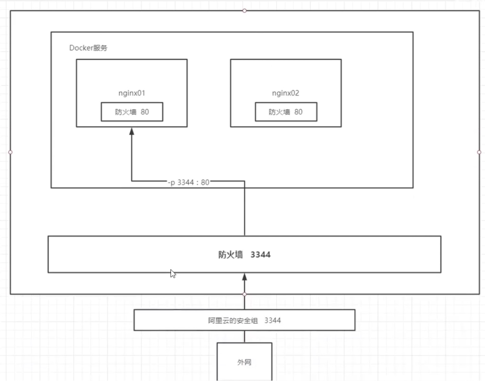
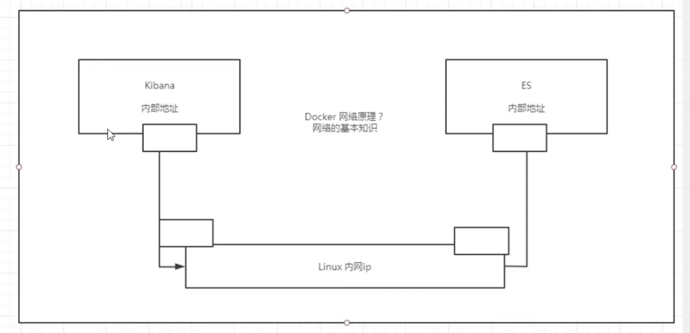

# 3.练习

## 1. 部署 nginx

1. 搜索镜像

建议去 dockerhub 搜索

2. 下载镜像

3. 运行镜像
 
docker run -d --name nginx01 -p 3344:80 nginx

-d 后台运行
--name  给容器起名字
-p  宿主机端口:容器内部端口

4. 本机自测

curl localhost:3344



5. 进入容器

[root@VM-0-4-centos ~]# docker exec -it nginx01 /bin/bash
root@76d489c2c054:/# 

6. 查找配置文件
root@76d489c2c054:/# whereis nginx
nginx: /usr/sbin/nginx /usr/lib/nginx /etc/nginx /usr/share/nginx

7. 进入配置文件
root@76d489c2c054:/# cd /etc/nginx
root@76d489c2c054:/etc/nginx# ls
conf.d  fastcgi_params  koi-utf  koi-win  mime.types  modules  nginx.conf  scgi_params  uwsgi_params  win-utf
root@76d489c2c054:/etc/nginx#  

**思考**
我们每次改动 nginx 配置文件都需要进入容器内部？十分的麻烦，我们要是可以在容器外部提供一个映射路径，达到在容器修改文件名，容器内部就可以自动修改？ -v 卷技术 

### 测试

```
# 搜索镜像
[root@VM-0-4-centos home]# docker search nginx
NAME                               DESCRIPTION                                     STARS     OFFICIAL   AUTOMATED
nginx                              Official build of Nginx.                        14892     [OK]       
jwilder/nginx-proxy                Automated Nginx reverse proxy for docker con…   2030                 [OK]
richarvey/nginx-php-fpm            Container running Nginx + PHP-FPM capable of…   814                  [OK]
...

# 下载镜像
[root@VM-0-4-centos home]# docker pull nginx
Using default tag: latest
latest: Pulling from library/nginx
69692152171a: Pull complete 
49f7d34d62c1: Pull complete 
5f97dc5d71ab: Pull complete 
cfcd0711b93a: Pull complete 
be6172d7651b: Pull complete 
de9813870342: Pull complete 
Digest: sha256:df13abe416e37eb3db4722840dd479b00ba193ac6606e7902331dcea50f4f1f2
Status: Downloaded newer image for nginx:latest
docker.io/library/nginx:latest
[root@VM-0-4-centos home]# 

# 运行镜像
[root@VM-0-4-centos ~]# docker run -d --name nginx01 -p 3344:80 nginx
76d489c2c054705183e647ddc58a304bc2585516cebd39c784cdf00727f89439

# 本机自测
[root@VM-0-4-centos ~]# curl localhost:3344
<!DOCTYPE html>
<html>
<head>
<title>Welcome to nginx!</title>
<style>
    body {
        width: 35em;
        margin: 0 auto;
        font-family: Tahoma, Verdana, Arial, sans-serif;
    }
</style>
</head>
<body>
<h1>Welcome to nginx!</h1>
<p>If you see this page, the nginx web server is successfully installed and
working. Further configuration is required.</p>

<p>For online documentation and support please refer to
<a href="http://nginx.org/">nginx.org</a>.<br/>
Commercial support is available at
<a href="http://nginx.com/">nginx.com</a>.</p>

<p><em>Thank you for using nginx.</em></p>
</body>
</html>
[root@VM-0-4-centos ~]# 
```

http:1.11.111.111:3344  ip + 端口

## 2. 部署 tomcat

### 官方的使用

docker run -it --rm tomcat:9.0

我们之前的启动都是后台，停止了容器之后，容器还是可以查到。
docker run -it --rm , 一般用来测试，用完删除

### 运行 tomcat

docker run -d -p 3355:8080 --name tomcat01  tomcat 

### 测试访问

http:1.11.111.111:3355

此时显示 404 ， 现在来看是正常的

### 进入容器

```
[root@VM-0-4-centos ~]# docker exec -it tomcat02 /bin/bash
root@e1b18aa33c8b:/usr/local/tomcat# ls
BUILDING.txt  CONTRIBUTING.md  LICENSE  NOTICE  README.md  RELEASE-NOTES  RUNNING.txt  bin  conf  lib  logs  native-jni-lib  temp  webapps  webapps.dist  work
```


* 1. 发现问题
  * Linux 命令少了
  * 没有 webapps

阿里云镜像的原因，默认是最小的镜像，所以不必要的都剔除掉。保证最小可运行环境

可以将 webapps.dist 下的文件复制到 webapps 中, 暂时实现看到网页的效果

```
root@e1b18aa33c8b:/usr/local/tomcat# cd webapps.dist/
root@e1b18aa33c8b:/usr/local/tomcat/webapps.dist# ls
ROOT  docs  examples  host-manager  manager
root@e1b18aa33c8b:/usr/local/tomcat/webapps.dist# cd ../
root@e1b18aa33c8b:/usr/local/tomcat# cp -r webapps.dist/* webapps
```

### 问题思考

我们以后要部署容器，如果每次都要进入容器是不是很麻烦？要是可以在容器外部提供一个映射路径，达到在容器里修改文件名, webapps, 我们在外部放置项目，可以自动同步到内部就好了 

## 部署 es + kibana

es 暴露的端口很多，十分消耗内存，数据一般需要放置到安全目录，挂载。

### 下载启动

```
# 下载启动
<!-- docker run -d --name elasticsearch --net somenetwork -p 9200:9200 -p 9300:9300 -e "discovery.type=single-node" elasticsearch:7.6.2 -->

docker run -d --name elasticsearch -p 9200:9200 -p 9300:9300 -e "discovery.type=single-node" elasticsearch:7.6.2
```

--net somenetwork ?? 网络配置，这暂时不用

### 测试连接

es 是成功的

```
[root@VM-0-4-centos ~]# curl localhost:9200
{
  "name" : "660fbe3dad7a",
  "cluster_name" : "docker-cluster",
  "cluster_uuid" : "_qnzzqYRSsKqjA4-X8fLHw",
  "version" : {
    "number" : "7.6.2",
    "build_flavor" : "default",
    "build_type" : "docker",
    "build_hash" : "ef48eb35cf30adf4db14086e8aabd07ef6fb113f",
    "build_date" : "2020-03-26T06:34:37.794943Z",
    "build_snapshot" : false,
    "lucene_version" : "8.4.0",
    "minimum_wire_compatibility_version" : "6.8.0",
    "minimum_index_compatibility_version" : "6.0.0-beta1"
  },
  "tagline" : "You Know, for Search"
}
```

#### 启动命令之后遇到的问题

使用docker 出现Error response from daemon: Conflict. The container name “***” is already in use
解决方法：
（1）给容器换一个名字, 比如说 docker run -it --name=mycentos2 centos:7 /bin/bash, 可以解决问题.
（2）将原来的容器删除

查询当前容器：docker container ls -all

删除当前容器：docker container rm mycentos (提示: 这一步要确定删除容器没问题的情况下, 才可以做)

### 查看状态

```
[root@VM-0-4-centos ~]# docker stats
CONTAINER ID   NAME            CPU %     MEM USAGE / LIMIT     MEM %     NET I/O           BLOCK I/O       PIDS
660fbe3dad7a   elasticsearch   0.18%     1.241GiB / 1.795GiB   69.13%    1.88kB / 1.76kB   256MB / 729kB   44
```

### 问题

启动之后 linux 就卡了

docker stats  查看 cpu 的状态

### 解决

增加内存的限制， 修改配置文件 -e 配置修改

```
docker run -d --name elasticsearch02 -p 9200:9200 -p 9300:9300 -e "discovery.type=single-node" -e ES_JAVA_OPTS="-Xms64m -Xmx512m" elasticsearch:7.6.2
```

* 测试结果

docker stats

```
CONTAINER ID   NAME              CPU %     MEM USAGE / LIMIT     MEM %     NET I/O           BLOCK I/O       PIDS
8d4a7b0a60b1   elasticsearch02   25.45%    395.3MiB / 1.795GiB   21.51%    2.07kB / 1.89kB   105MB / 729kB   44
^C
```

## 使用 kibana 连接 es ？ 思考网络怎样才能连接过去




