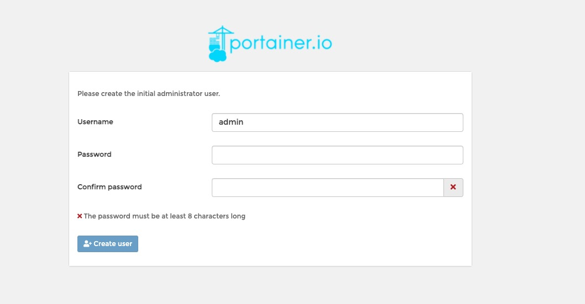
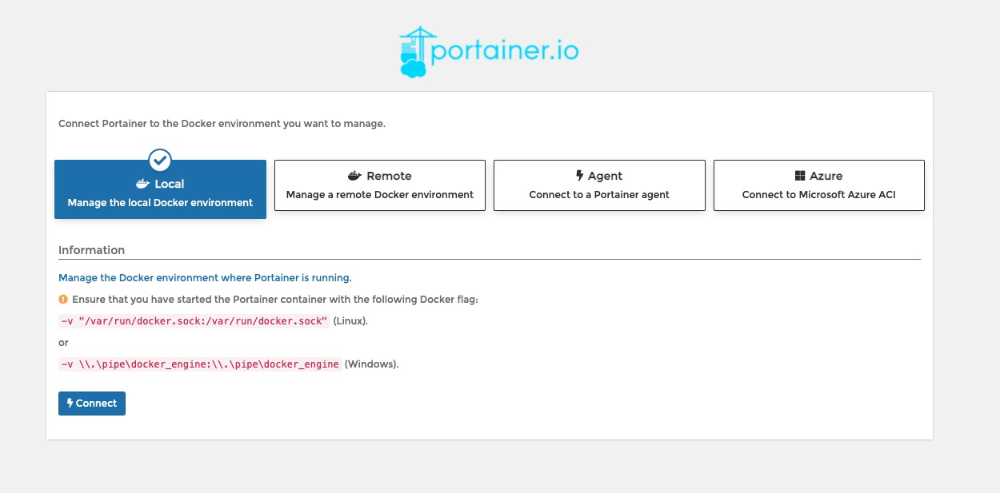
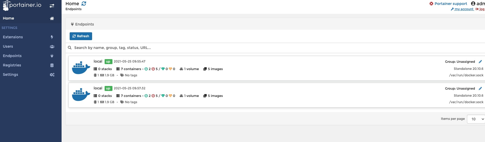

# 4.Portainer可视化面板安装

先用这个， 可视化面板平时不会使用，自己操作玩玩即可

> Rancher (CL/CD再用)

## 什么是 protainer

Docker 图形界面管理工具，提供一个后台面板供我们操作

```
<!-- docker run -d -p 8088:9000 \ --restart=always -v /var/run/docker.sock:/var/run/docker.sock -v portainer_data:/data smallchao/portainer -->


docker run -d -p 8088:9000 --restart=always -v /var/run/docker.sock:/var/run/docker.sock --privileged=true portainer/portainer
```

## 访问测试

http://1.116.142.138:8088/

### 界面

* 登陆界面



* 选择界面

先选择第一个 local



* 首页

 


