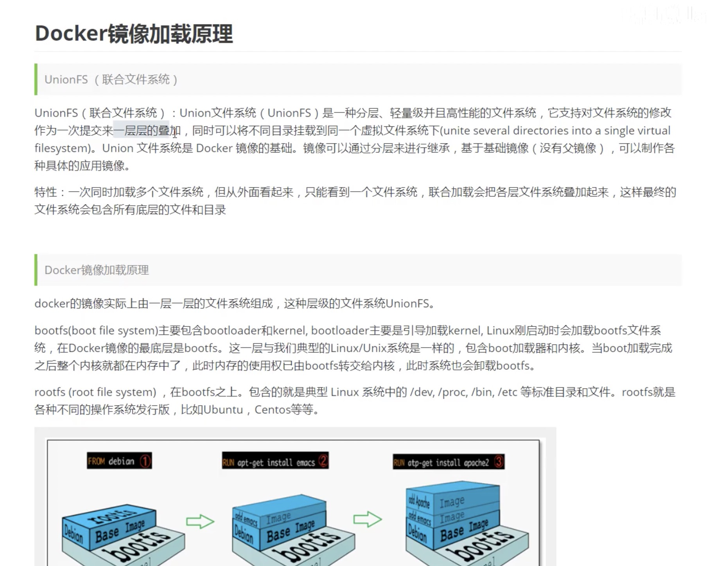
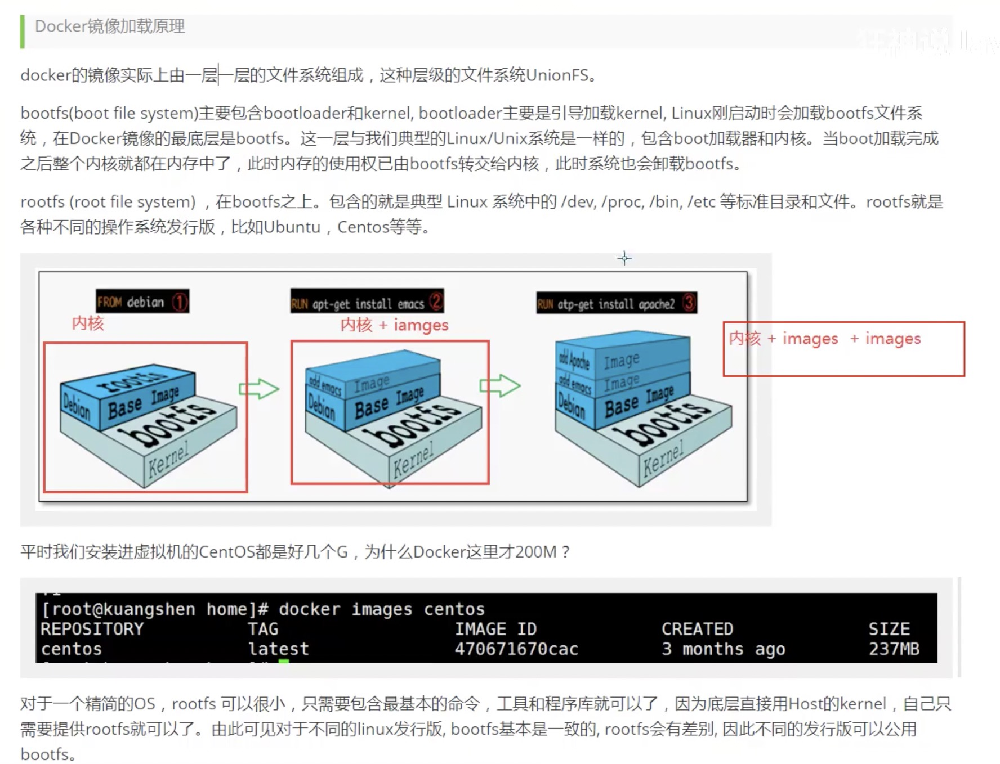
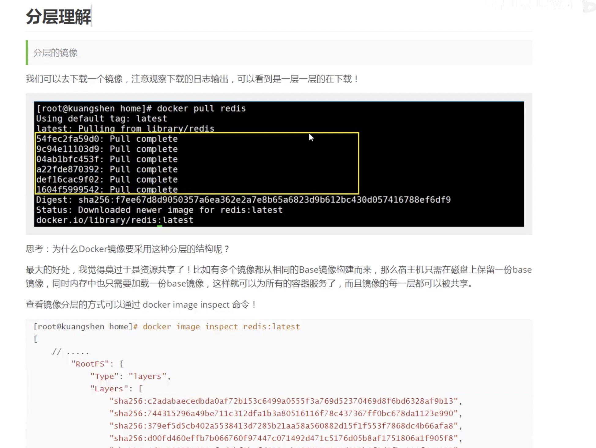
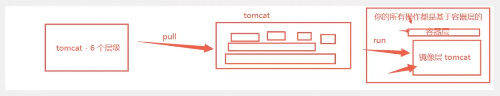

# 5.docker镜像讲解

## 镜像是什么

镜像是一个轻量级，可执行的独立软件包，用来打包软件运行环境和基于运行环境开发的软件，它包含运行某个软件所需的所有内容，包括代码，运行时，库，环境变量和配置文件

所有的应用，直接打包 docker 镜像，就可以直接跑起来

### 如何得到镜像

* 从远程仓库下载
* 朋友拷贝
* 自己制作一个镜像 DockerFile

## docker 镜像原理



### docker 镜像加载原理



### 分层理解




TODO 需要重新看一遍

## 特点

Docker 的镜像都是只读的，当容器启动时，一个可写层被加载到镜像顶部，这一层就是通常所说的容器层，容器之下都叫镜像层



## commit 镜像

docker commit   提交容器成为一个新的副本

docker commit -m='提交描述信息' -a='作者' 容器id 目标镜像名:[TAG]

### 实战测试

启动默认的tomcat， 发现这个默认的tomcat是没有webapps应用的，是镜像的原因，官方的镜像默认 webapps 是没有文件的，可以自己拷贝进去

```
docker run -it -p 8080:8080 tomcat

docker exec -it e6debf8740bf /bin/bash

cp -r webapps.dist/* webapps

# 将我们操作过的一个容器通过commit提交为一个镜像！我们以后就使用我们修改过的镜像即可， 这就是我们自己的一个修改的镜像
docker commit -a="bkyyou" -m="add webapps应用" e6debf8740bf tomcat02:1.0
```

> 如果你想要保存当前容器的状态，就可以通过 commit 来提交，获得一个镜像，就好比 vm 的快照。
