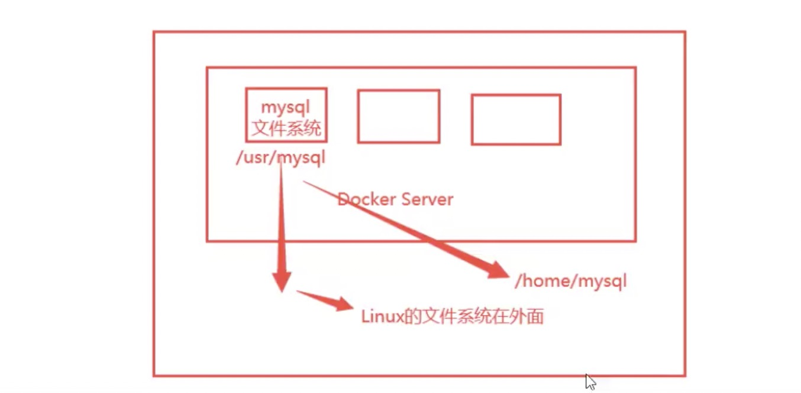
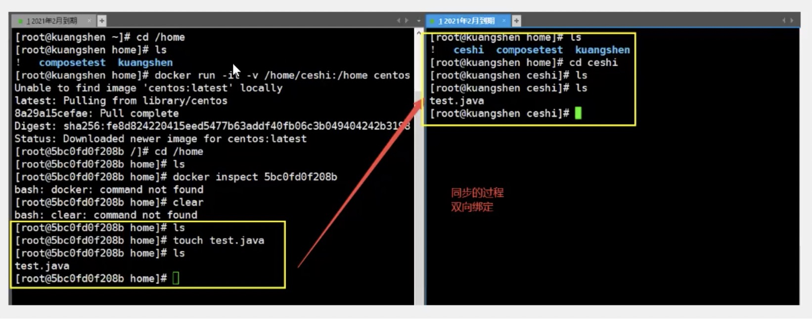
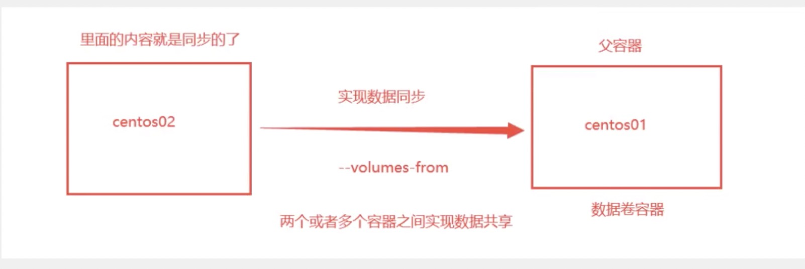

# 6.容器数据卷

> 之前都是入门，容器数据卷，Dockerfile，Docker网络才是精髓

## docker 的理念回顾

将应用和环境打包成一个镜像

数据如果在一个容器中，如果删除容器，数据就会丢失！ 需求：数据可以持久化

mysql 容器删了数据没了！需求：mysql数据可以存在本地

容器之间可以有一个数据共享的技术！docker 容器产生的数据同步到本地。这就是卷技术，目录的挂载，将我们的容器目录挂载到 linux 上



总结： 容器的持久化和同步操作，容器间也是可以数据共享的

## 使用数据卷

* 1. 方式一：使用命令挂载

```
# 端口映射
docker run -it -p 主机端口:容器内端口

# 目录映射
docker run -it -v 主机目录:容器内目录
```

* 1.1 测试

```
docker run -it -v /home/ceshi:/home centos /bin/bash
```

docker inspect 容器id 来查询启动之后的详细信息





* 反向操作也是可行的， 再测试

1. 停止容器
2. 宿主机上修改文件
3. 启动容器
  docker start 容器id
  这个停止的容器id    docker ps -a
4. 容器的数据依旧是同步的

```
"test.java" 1L, 19C written
[root@VM-0-4-centos ceshi]# ll
total 4
-rw-r--r-- 1 root root 19 May 27 19:26 test.java
[root@VM-0-4-centos ceshi]# ls
test.java
[root@VM-0-4-centos ceshi]# docker ps
CONTAINER ID   IMAGE                 COMMAND                  CREATED        STATUS        PORTS                                                                                  NAMES
e6debf8740bf   tomcat                "catalina.sh run"        34 hours ago   Up 34 hours   0.0.0.0:8080->8080/tcp, :::8080->8080/tcp                                              hopeful_kowalevski
07bf8d7bfbf7   portainer/portainer   "/portainer"             2 days ago     Up 2 days     0.0.0.0:8088->9000/tcp, :::8088->9000/tcp                                              epic_keldysh
8d4a7b0a60b1   elasticsearch:7.6.2   "/usr/local/bin/dock…"   2 days ago     Up 2 days     0.0.0.0:9200->9200/tcp, :::9200->9200/tcp, 0.0.0.0:9300->9300/tcp, :::9300->9300/tcp   elasticsearch02
[root@VM-0-4-centos ceshi]# 
[root@VM-0-4-centos ceshi]# 
[root@VM-0-4-centos ceshi]# 
[root@VM-0-4-centos ceshi]# 
[root@VM-0-4-centos ceshi]# 
[root@VM-0-4-centos ceshi]# 
[root@VM-0-4-centos ceshi]# 
[root@VM-0-4-centos ceshi]# 
[root@VM-0-4-centos ceshi]# docker start 9875dc1a4506
9875dc1a4506
[root@VM-0-4-centos ceshi]# docker ps
CONTAINER ID   IMAGE                 COMMAND                  CREATED         STATUS         PORTS                                                                                  NAMES
9875dc1a4506   centos                "/bin/bash"              7 minutes ago   Up 2 seconds                                                                                          blissful_stonebraker
e6debf8740bf   tomcat                "catalina.sh run"        34 hours ago    Up 34 hours    0.0.0.0:8080->8080/tcp, :::8080->8080/tcp                                              hopeful_kowalevski
07bf8d7bfbf7   portainer/portainer   "/portainer"             2 days ago      Up 2 days      0.0.0.0:8088->9000/tcp, :::8088->9000/tcp                                              epic_keldysh
8d4a7b0a60b1   elasticsearch:7.6.2   "/usr/local/bin/dock…"   2 days ago      Up 2 days      0.0.0.0:9200->9200/tcp, :::9200->9200/tcp, 0.0.0.0:9300->9300/tcp, :::9300->9300/tcp   elasticsearch02
[root@VM-0-4-centos ceshi]# 
[root@VM-0-4-centos ceshi]# 
[root@VM-0-4-centos ceshi]# docker attach 9875dc1a4506
[root@9875dc1a4506 /]# cd home/
[root@9875dc1a4506 home]# ls
test.java
[root@9875dc1a4506 home]# cat test.java 
hello,linux update
[root@9875dc1a4506 home]# 
```


* 好处： 我们以后修改只需要在本地修改即可，容器内可以自动同步

## 实战： 安装 MySQL

思考： mysql 数据持久化的问题

mysql 默认是 3306 端口

```
# 获取镜像
[root@VM-0-4-centos ~]# docker pull mysql:5.7

# 运行容器，需要做数据挂载
# 安装启动 mysql ，需要配置密码，这是要注意的
docker run -d -p:3310:3306 -v /home/mysql/conf:/etc/mysql/conf.d -v /home/mysql/data:/var/lib/mysql -e MYSQL_ROOT_PASSWORD=123456 --name mysql01 mysql:5.7
# -d 后台运行
# -p 端口映射
# -v 卷挂载
# -e 环境配置
# --name 配置名字

# 启动成功之后，我们可以在本地使用 sqlyog 或者 navicat 连接测试一下
navicat 连接到服务器的3310 - 3310 和容器内的3306 映射

# 在本地创建一个数据库，查看一下我们映射的路径是否ok
```

```
docker ps -a
```

* 官方测试命令

$ docker run --name some-mysql -e MYSQL_ROOT_PASSWORD=my-secret-pw -d mysql:tag

### 彻底删除容器

```
docker rm -f mysql01
```

挂载到本地数据依旧没有丢失

### 具名挂载 和 匿名挂载

#### 匿名挂载

-P   表示随机映射端口

```
docker run -d -P --name nginx01 -v /etc/nginx nginx
```

* 查看所有的卷的情况

```
## 查看卷信息
docker volume ls

local     8257f65b5f07b993f8b7d69a83ad992c628f989edeb94631ae455041a0a49e62

# 这里发现，这就是匿名挂载，我们在 -v 只写了容器内的路径，没有容器外的路径
```

#### 具名挂载

```
# 启动 ngxin
docker run -d -P --name nginx02 -v juming-nginx:/etc/nginx  nginx
# juming-nginx 不是地址 加 / 表示地址

[root@VM-0-4-centos home]# docker run -d -P --name nginx02 -v juming-nginx:/etc/nginx  nginx
07714059169e645399de4c5a78b9c5d73c71ef8683c8a88f252466711965cb1d
[root@VM-0-4-centos home]# docker volume ls
DRIVER    VOLUME NAME
local     8257f65b5f07b993f8b7d69a83ad992c628f989edeb94631ae455041a0a49e62
local     2619117434c999a1344d582478c0ef4be77956d51e0af7e411a6699ed6bd9147
local     juming-nginx

# 通过 -v 卷名:容器内路径

# 查看卷信息
[root@VM-0-4-centos home]# docker volume inspect juming-nginx
[
    {
        "CreatedAt": "2021-05-27T20:47:45+08:00",
        "Driver": "local",
        "Labels": null,
        "Mountpoint": "/var/lib/docker/volumes/juming-nginx/_data",
        "Name": "juming-nginx",
        "Options": null,
        "Scope": "local"
    }
]
# 表示地址 "Mountpoint": "/var/lib/docker/volumes/juming-nginx/_data"
```

> /var/lib/docker/    docker 的工作目录

所有的 docker 容器内的卷，没有指定目录的情况下，都是在 ‘/var/lib/docker/volume/xxx/_data’ (xxx卷名)

我们通过具名挂载可以方便的找到我们的一个卷，大多数情况在使用 具名挂载

#### 如何确定是匿名挂载还是具名挂载，还是指定路径挂载

-v 容器内路径   匿名挂载

-v 卷名:容器内路径   具名挂载

-v /宿主机路径:容器内路径   指定路径挂载

#### 拓展

* 通过 -v 容器内路径:ro rw 改变读写权限

ro    readonly    只读 

rw    readwrite   可读可写

ro  只要看到 ro 就说明这个路径只能通过宿主机来操作，容器内部无法修改

> 一旦设置了容器权限，容器对我们挂载出来的内容就有限定了 

```s
docker run -d -P --name nginx02 -v juming-nginx:/etc/nginx:ro  nginx
docker run -d -P --name nginx02 -v juming-nginx:/etc/nginx:rw  nginx
```

## 数据卷容器

多个 mysql 同步数据

