# 7.Dockerfile

## 初识 dockerfile

Dockerfile 就是用来构建 docker 镜像的构建文件，命令脚本

通过这个脚本可以生成镜像，镜像是一层一层的，脚本一个个的命令，每一个命令都是一层


```s
# dockerfile1
# 创建一个dockefile文件，名字可以随意，建议 dockerfile
# 文件中的内容 指令（大写）  参数
FROM centos

VOLUME ["volume01", "volume02"]

CMD echo "----end----"
CMD /bin/bash
```

```s
# 启动的命令，生成新的镜像
docker build -f dockerfile1 -t kuangshen/centos:1.0 .
```

* 效果


* 启动dockerfile生成的镜像

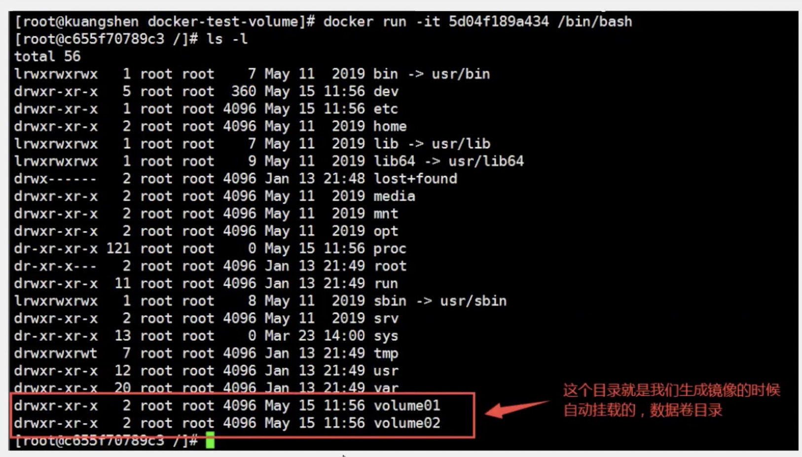

这个卷和外部一定有一个同步的目录， VOLUME ["volume01", "volume02"] 这是一个匿名挂载

* docker inspect 683cc14f1028

查看一下卷挂载的路径

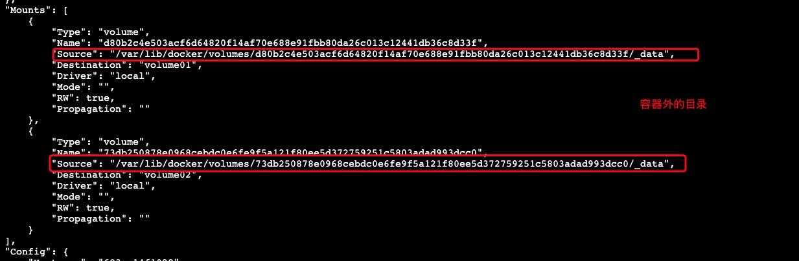

* 在 volume01 下新建 container.txt 文件

```
[root@VM-0-4-centos _data]# docker exec -it  683cc14f1028 /bin/bash
[root@683cc14f1028 /]# ls 
bin  dev  etc  home  lib  lib64  lost+found  media  mnt  opt  proc  root  run  sbin  srv  sys  tmp  usr  var  volume01  volume02
[root@683cc14f1028 /]# 
```

* 查看同步

```
[root@VM-0-4-centos docker-test-volume]# cd /var/lib/docker/volumes/d80b2c4e503acf6d64820f14af70e688e91fbb80da26c013c12441db36c8d33f/_data
[root@VM-0-4-centos _data]# ls
container.txt
```

> 这种方式我们未来使用的非常多，因为我们通常会构建自己的镜像，假设我们构建镜像的时候没有挂载卷，要手动镜像挂载，-v卷名：容器内路径

* 修改容器名字

docker rename 容器原来名 要改为的名字

docker rename wizardly_hoover myblog

```
docke run -it --name docker01 kuangshen/centos:1.0
```


## 构建步骤

1. 编写一个 dockerfile 文件
2. docker build 构建成一个镜像
3. docker run 运行镜像
4. docker pull 发布镜像(DockerHub, 阿里云镜像仓库)

官网做法

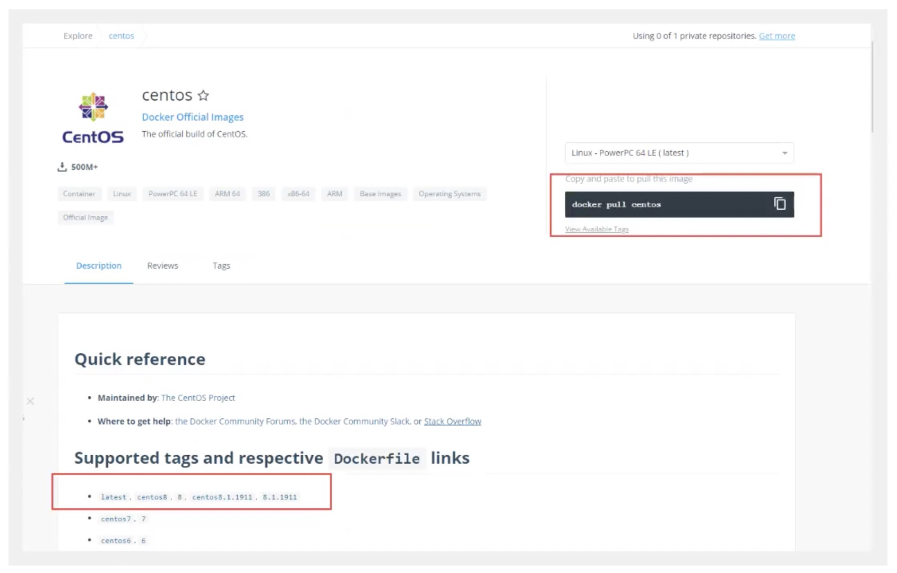

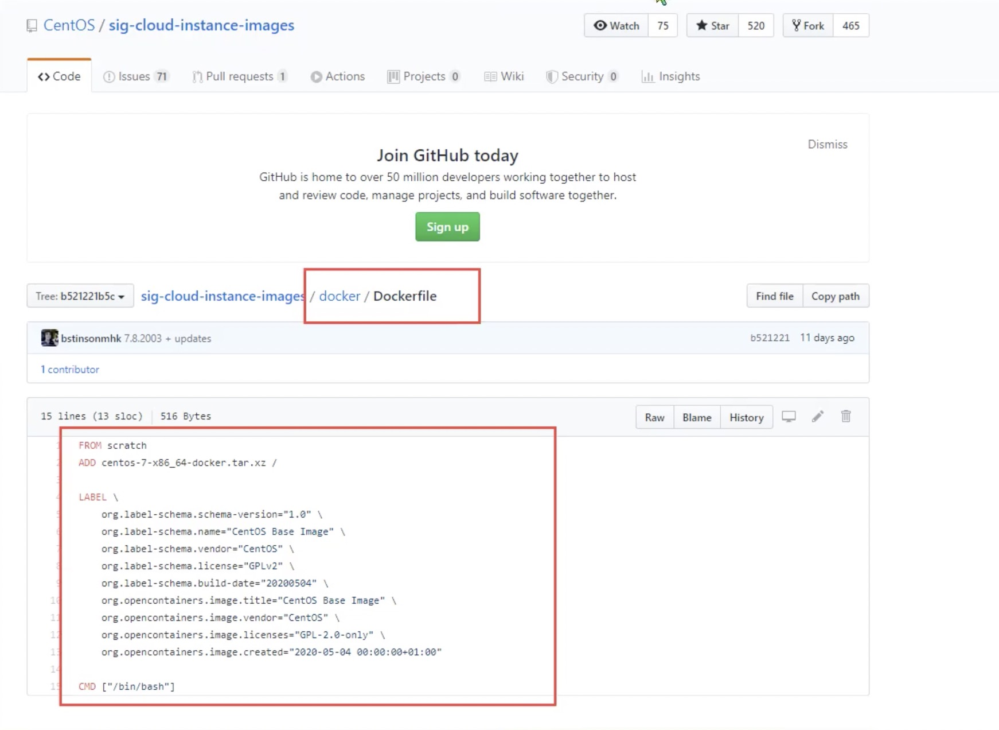

很多官方的镜像都是基础包，很多功能没有，我们通常都是自己搭镜像！

官方既然可以做镜像，那我们也可以

## DockerFile 构建过程

### 基础知识

1. 每个保留关键字（指令）都必须是大写字母
2. 执行从上到下顺序执行
3. #表示注释
4. 每一个指令都会创建一个新的镜像层，并提交

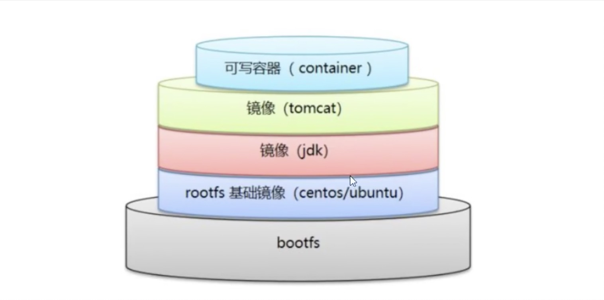

> dockerfile是面向开发的，我们以后要发布项目，做镜像，就需要编写 dockerfile 文件，这个文件十分简单！

> DockerFile: 构建文件，定义了一切的步骤，源代码

> DockerImages: 通过 DockerFile 构建生成镜像，最终发布和运行的产品(原来是 jar war)

> Docker 容器： 容器就是镜像运行起来提供服务的

## DockerFile 指令

```s
FROM    # 基础镜像，一切从这里开始构建
MAINTAINER     # 镜像是谁写的，姓名 + 邮箱
RUN     # 镜像构建的时候需要运行的命令
ADD     # 步骤： tomcat 镜像，这个 tomcat 压缩包！添加内容
WORKWORKDIR    # 镜像工作的目录
VULUME    # 挂载的目录
EXPOSE   # 暴露端口配置
RUN
CMD     # 指定这个容器启动的时候要运行的命令， 只有一个会生效，可被替代
ENTRYPOINT    # 指定这个容器启动的时候要运行的命令， 可以追加命令
ONBUILD    # 当构建一个被继承的 dockerfile 这个时候就会运行 ONBUILD 的指令。触发指令
COPY    # 类似 ADD， 将我们的文件拷贝到镜像中
ENV    # 构建的时候设置环境变量
```


## 实战测试

Docker Hub 中 99% 镜像都是从这个镜像过来的，FROM acratch， 然后配置需要的软件和配置来进行构建

/home/bkyyou/build

### 创建一个自己 centos

1. 编写 DockerFile 文件

```s
# 在 /home 下创建 mydockerfile 文件

# 进入并新建 dockerfile

vim mydockerfile  # 这应该是 创建并进入文件

[root@VM-0-4-centos dockerfile]# cat mydockerfile 
FROM centos
MAINTAINER bkyyou<596737739@qq.com>

ENV MYPATH /user/local
WORKDIR $MYPATH 

RUN yum -y install vim
RUN yum -y install net-tools

EXPOSE 80

CMD echo $MYPARG
CMD echo "---end---"
CMD /bin/bash
```

2. 通过文件构建镜像

```s
# 构建命令
docker build -f mydockerfile -t mycentos:0.1 .
# docker build -f 文件路径 -t 镜像名:[tag] .

# 输出结果
Successfully built 6046e39a4129
Successfully tagged mycentos:0.1
```

3. 测试运行

```s
docker run -it mycentos:0.1
```

### 对比

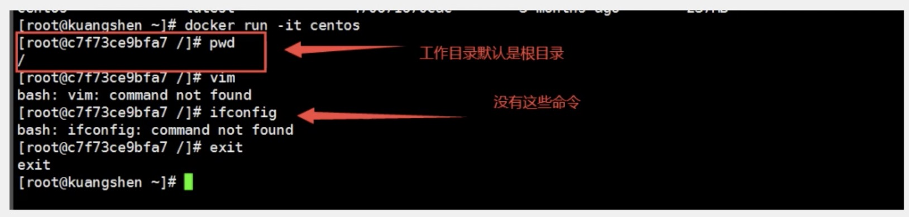

增加之后的

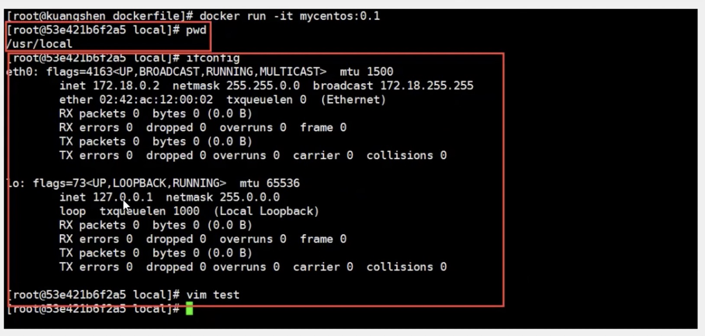

### 我们可以列出本地进行的变更历史

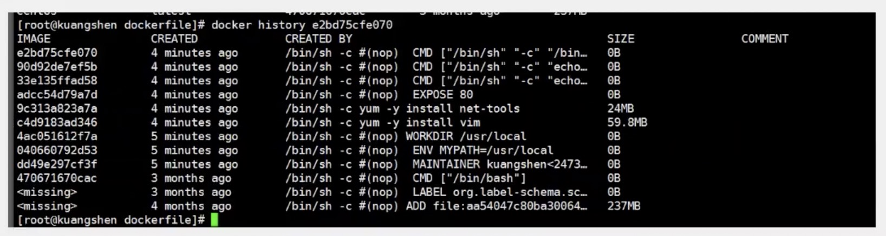

我们平时拿到一个镜像可以研究一下它是怎么做的？？？

## CMD 和 ENTRYPOINT 区别

```s
CMD     # 指定这个容器启动的时候要运行的命令， 只有一个会生效，可被替代
ENTRYPOINT    # 指定这个容器启动的时候要运行的命令， 可以追加命令
```


### 测试

1. 测试 cmd 命令

```s
# 创建
[root@VM-0-4-centos dockerfile]# cat dockerfile-cmd-test 
FROM centos
CMD ["ls", "-a"]

# 运行 DockerFile
[root@VM-0-4-centos dockerfile]# docker build -f dockerfile-cmd-test -t cmdtest .
Sending build context to Docker daemon  3.072kB
Step 1/2 : FROM centos
 ---> 300e315adb2f
Step 2/2 : CMD ["ls", "-a"]
 ---> Running in fcc953102731
Removing intermediate container fcc953102731
 ---> e9d62dd456d6
Successfully built e9d62dd456d6
Successfully tagged cmdtest:

# 运行 镜像
[root@VM-0-4-centos dockerfile]# docker run cmdtest
.
..
.dockerenv
bin
dev
...

## 启动镜像并追加命令
[root@VM-0-4-centos /]# docker run  cmdtest -l
docker: Error response from daemon: OCI runtime create failed: container_linux.go:367: starting container process caused: exec: "-l": executable file not found in $PATH: unknown.
[root@VM-0-4-centos /]# 

# 原因
cmd 的清理下 -l 替换了 CMD ['ls', '-a'] 命令， -l 不是命令所以报错

## 这样是可以启动的
[root@VM-0-4-centos /]# docker run  cmdtest ls -al
total 56
drwxr-xr-x   1 root root 4096 Jun  1 01:19 .
drwxr-xr-x   1 root root 4096 Jun  1 01:19 ..
```

2. 测试 ENTRYPOINT 

* 文件 docker-cmd-entrypoint
```s
FROM centos
ENTRYPOINAT ['ls', '-a']
```

```s
# 构建镜像
[root@VM-0-4-centos dockerfile]# docker build -f dockerfile-cmd-entrypoint -t entrypointtest .
Sending build context to Docker daemon  4.096kB
Step 1/2 : FROM centos
 ---> 300e315adb2f
Step 2/2 : ENTRYPOINT ["ls", "-a"]
 ---> Running in bf4ffd26ac23
Removing intermediate container bf4ffd26ac23
 ---> a66521477d0f
Successfully built a66521477d0f
Successfully tagged entrypointtest:latest

# 启动镜像
docker run a66521477d0f
.
..
.dockerenv
bin
...

# 追加命令启动
[root@VM-0-4-centos dockerfile]# docker run a66521477d0f -l
total 56
drwxr-xr-x   1 root root 4096 Jun  1 01:31 .
drwxr-xr-x   1 root root 4096 Jun  1 01:31 ..
-rwxr-xr-x   1 root root    0 Jun  1 01:31 .dockerenv
lrwxrwxrwx   1 root root    7 Nov  3  2020 bin -> usr/bin
drwxr-xr-x   5 root root  340 Jun  1 01:31 dev
drwxr-xr-x   1 root root 4096 Jun  1 01:31 etc
drwxr-xr-x   2 root root 4096 Nov  3  2020 home

```

DockerFile 许多命令都是十分相似，需要了解他们的区别

## 实战 tomcat镜像

> 这是自己构建了 一个 tomcat 镜像

1. 准备镜像文件 tomcat 压缩包， jdk 压缩包

  * tomcat 下准备的文件
  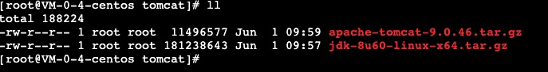

2. 编写 dockerfile 文件

官方命令 Dockerfile, build 会自动寻找这个文件， 就不需要 -f 指定了

```s
FROM centos
MAINTAINER bikeyou<596737739@qq.com>

COPY readme.txt /usr/local/readme.txt

ADD jdk-8u60-linux-x64.tar.gz /usr/local/
ADD apache-tomcat-9.0.46.tar.gz /usr/local/

RUN yum -y install vim

ENV MYPATH /usr/local
WORKDIR $MYPATH

ENV JAVA_HOME /usr/local/jdk1.8.0_60
ENV CLASSPATH $JAVA_HOME/lib/dt.jar:$JAVA_HOME/lib/tools.jar

ENV CATALINA_HOME /usr/local/apache-tomcat-9.0.46
ENV CATLINA_BASH /usr/local/apache-tomcat-9.0.46
ENV PATH $PATH:$JAVA_HOME/bin:$CATALINA_HOME/lib:$CATALINA_HOME/bin

EXPOSE 8080

CMD /usr/local/apache-tomcat-9.0.46/bin/startup.sh && tail -F /usr/local/apache-tomcat-9.0.46/bin/logs/catalina.out
```

```s
# $PATH 是啥 ???? TODO
$PATH:/usr/local/jdk1.8.0_60
/usr/local/sbin:/usr/local/bin:/usr/sbin:/usr/bin:/sbin:/bin:
```

3. 在 /home/bkyyou/build/tomcat 进行操作

```s
# 构建
docker build -t diytomcat .

# 展示
[root@VM-0-4-centos tomcat]# docker build -t diytomcat .
Sending build context to Docker daemon  192.7MB
Step 1/15 : FROM centos
 ---> 300e315adb2f
Step 2/15 : MAINTAINER bikeyou<596737739@qq.com>
 ---> Using cache
 ---> 002481b63eae
Step 3/15 : COPY readme.txt /usr/local/readme.txt
 ---> Using cache
 ---> c79dc7d74df8
Step 4/15 : ADD jdk-8u60-linux-x64.tar.gz /usr/local/
 ---> Using cache
 ---> 4ab16feb6f45
Step 5/15 : ADD apache-tomcat-9.0.46.tar.gz /usr/local/
 ---> Using cache
 ---> 9e1571ae1594
Step 6/15 : RUN yum -y install vim
 ---> Using cache
 ---> 09e675e49c6b
Step 7/15 : ENV MYPATH /usr/local
 ---> Running in 32851ceb2a8a
Removing intermediate container 32851ceb2a8a
 ---> 1de38bfe9c0d
Step 8/15 : WORKDIR $MYPATH
 ---> Running in 3a2fd007662d
Removing intermediate container 3a2fd007662d
 ---> 4c8bbc4a507a
Step 9/15 : ENV JAVA_HOME /usr/local/jdk1.8.0_60
 ---> Running in ec182ef7716c
Removing intermediate container ec182ef7716c
 ---> bed849281a9f
Step 10/15 : ENV CLASSPATH $JAVA_HOME/lib/dt.jar:$JAVA_HOME/lib/tools.jar
 ---> Running in 5d15b7c73306
Removing intermediate container 5d15b7c73306
 ---> 6003f805d9e8
Step 11/15 : ENV CATALINA_HOME /usr/local/apache-tomcat-9.0.46
 ---> Running in f1b5215e8b1c
Removing intermediate container f1b5215e8b1c
 ---> d5dfe8ce7681
Step 12/15 : ENV CATLINA_BASH /usr/local/apache-tomcat-9.0.46
 ---> Running in 7dde93d3ab7c
Removing intermediate container 7dde93d3ab7c
 ---> 74ec5f084eea
Step 13/15 : ENV PATH $PATH:$JAVA_HOME/bin:$CATALINA_HOME/lib:$CATALINA_HOME/bin
 ---> Running in 9ae2e2a47fdd
Removing intermediate container 9ae2e2a47fdd
 ---> a5004665ba24
Step 14/15 : EXPOSE 8080
 ---> Running in 84972bad1332
Removing intermediate container 84972bad1332
 ---> 5b7068ce8d29
Step 15/15 : CMD /usr/local/apache-tomcat-9.0.46/bin/startup.sh && tail -F /usr/local/apache-tomcat-9.0.46/bin/logs/catalina.out
 ---> Running in 15382fdcf4cd
Removing intermediate container 15382fdcf4cd
 ---> 854e01d4821f
Successfully built 854e01d4821f
Successfully tagged diytomcat:latest
```

4. 启动自己构建的 tomcat

```s
# 启动
[root@VM-0-4-centos tomcat]# docker run -d -p 9090:8080 --name bkyyoutomcat2 -v /home/bkyyou/build/tomcat/test:/usr/local/apache-tomcat-9.0.46/webapps/test -v /home/bkyyou/build/tomcat/comcatlogs:/usr/local/apache-tomcat-9.0.46/logs diytomcat
6930ecb18aca3a80ac220bd3e5596a4dba1a1d122892fbc4630052cc305d9fd5

# 进入容器
[root@VM-0-4-centos tomcat]# docker exec -it 6930ecb18aca /bin/bash
[root@6930ecb18aca local]# ls
apache-tomcat-9.0.46  bin  etc  games  include  jdk1.8.0_60  lib  lib64  libexec  readme.txt  sbin  share  src
[root@6930ecb18aca local]# 
```

5. 测试访问

6. 发布项目(由于做了卷挂载我们直接在本地编写项目就可以发布了)

这个不知道是干啥的 TODO？？？
在 test/WEB-INF  文件夹下 新建 web.xml
```xml
<?xml version="1.0" encoding="UTF-8"?>
<web-app xmlns:xsi="http://www.w3.org/2001/XMLSchema-instance" xmlns="http://java.sun.com/xml/ns/javaee" xmlns:web="http://java.sun.com/xml/ns/javaee/web-app_2_5.xsd" xsi:schemaLocation="http://java.sun.com/xml/ns/javaee http://java.sun.com/xml/ns/javaee/web-app_2_5.xsd" id="WebApp_ID" version="2.5">
  <display-name>db</display-name>
  <welcome-file-list>
    <welcome-file>index.html</welcome-file>
    <welcome-file>index.htm</welcome-file>
    <welcome-file>index.jsp</welcome-file>
    <welcome-file>default.html</welcome-file>
    <welcome-file>default.htm</welcome-file>
    <welcome-file>default.jsp</welcome-file>
  </welcome-file-list>
</web-app>
```

```jsp
<html>
  <head>
    <meta charset="utf-8">
    <title>第一个 JSP 程序</title>
  </head>
  <body>
    <%
      System.out.printIn("-----my test web logs------")
    %>
  </body>
</html>
```

> 以后开发的步骤：需要掌握 Dokerfile 的编写，我们之后的一切都是使用 docker 镜像发布和运行

## 发布自己的镜像

### DockerHub

1. https://hub.docker.com/ 注册自己的账号
2. 确定这个账号可以登录
```s
docker login -u bkyyou
```
3. 在我们服务器上提交自己的镜像

* 登陆
```s
[root@VM-0-4-centos comcatlogs]# docker login --help

Usage:  docker login [OPTIONS] [SERVER]

Log in to a Docker registry.
If no server is specified, the default is defined by the daemon.

Options:
  -p, --password string   Password
      --password-stdin    Take the password from stdin
  -u, --username string   Username
```

4. 登陆完之后就可以提交镜像了，就是一步 docker push 命令

```s
# 直接 push 报错了
[root@VM-0-4-centos comcatlogs]# docker push bkyyou/diytomcat
Using default tag: latest
The push refers to repository [docker.io/bkyyou/diytomcat]
An image does not exist locally with the tag: bkyyou/diytomcat

# 解决报错
# 需要修改一下镜像名字，如：diytomcat 改为 bkyyou/diytomcat:1.0
docker tag 854e01d4821f bkyyou/diytomcat:1.0
```

### 阿里云镜像

1. 登陆阿里云镜像
```
docker login --username=bkyyou registry.cn-hangzhou.aliyuncs.com
```
2. 找到容器镜像服务
3. 创建命令空间
https://cr.console.aliyun.com/cn-hangzhou/instances/namespaces
4. 创建镜像仓库

* 选择本地仓库

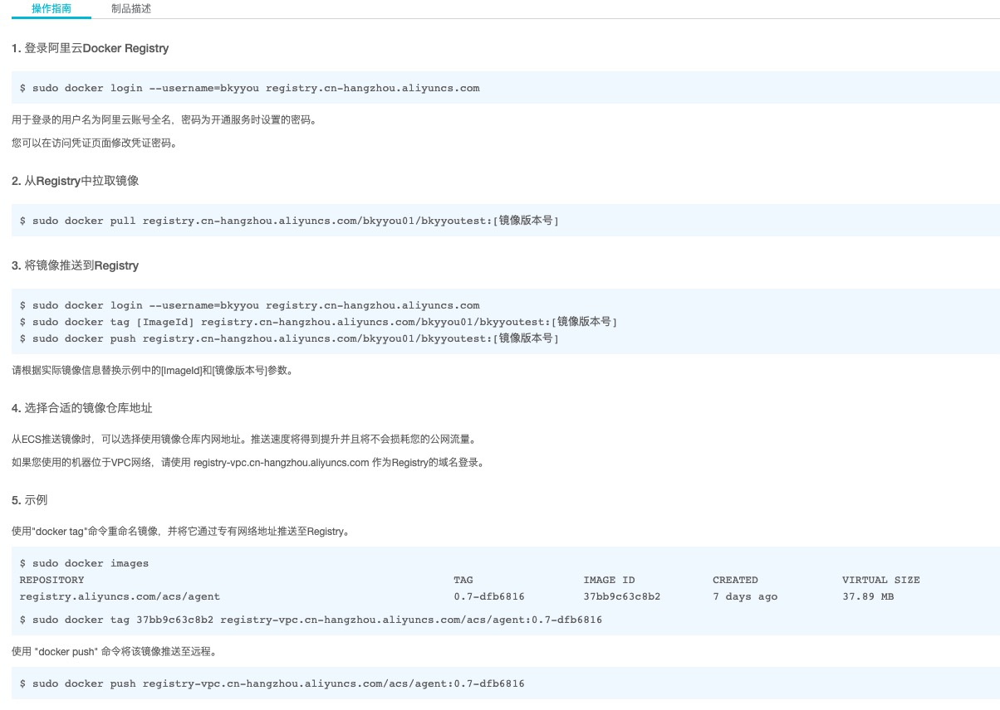


```s
# 推送命令， 之后还有一个 tag， 和推送到 dockerhub 步骤一样
docker push bkyyou/diytomcat:1.0
```

阿里云镜像参照官方文档

https://cr.console.aliyun.com/repository/cn-hangzhou/bkyyou01/bkyyoutest/details

## 小结

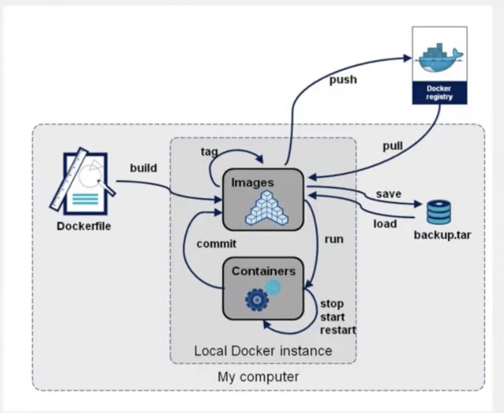

TODO docker save 和  docker load 没有用过


