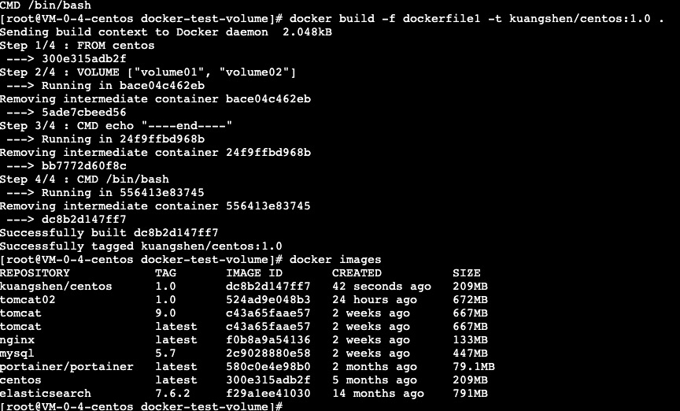

# 7.Dockerfile

## 初识 dockerfile

Dockerfile 就是用来构建 docker 镜像的构建文件，命令脚本

通过这个脚本可以生成镜像，镜像是一层一层的，脚本一个个的命令，每一个命令都是一层


```s
# dockerfile1
# 创建一个dockefile文件，名字可以随意，建议 dockerfile
# 文件中的内容 指令（大写）  参数
FROM centos

VOLUME ["volume01", "volume02"]

CMD echo "----end----"
CMD /bin/bash
```

```s
# 启动的命令，生成新的镜像
docker build -f dockerfile1 -t kuangshen/centos:1.0 .
```

* 效果



* 启动dockerfile生成的镜像


这个卷和外部一定有一个同步的目录， VOLUME ["volume01", "volume02"] 这是一个匿名挂载

* docker inspect 683cc14f1028

查看一下卷挂载的路径


* 在 volume01 下新建 container.txt 文件

```
[root@VM-0-4-centos _data]# docker exec -it  683cc14f1028 /bin/bash
[root@683cc14f1028 /]# ls 
bin  dev  etc  home  lib  lib64  lost+found  media  mnt  opt  proc  root  run  sbin  srv  sys  tmp  usr  var  volume01  volume02
[root@683cc14f1028 /]# 
```

* 查看同步

```
[root@VM-0-4-centos docker-test-volume]# cd /var/lib/docker/volumes/d80b2c4e503acf6d64820f14af70e688e91fbb80da26c013c12441db36c8d33f/_data
[root@VM-0-4-centos _data]# ls
container.txt
```

> 这种方式我们未来使用的非常多，因为我们通常会构建自己的镜像，假设我们构建镜像的时候没有挂载卷，要手动镜像挂载，-v卷名：容器内路径


