# 8.Docker网络

铺垫容器编排，集群部署

* 清空所有环境，方便理解

容器全部清空
docker rm -f $(docker ps -aq)

删除全部镜像
docker rmi -f $(docker images -aq)

## 理解 Docker0

1. 清空所有环境

* 1.1 测试

```s
ip addr
```

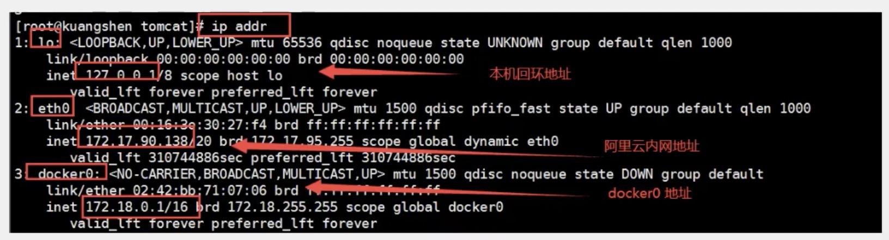

2. 三个网络

问题： docker 是如何处理容器


```s
# 运行 tomcat
docker run -d -P --name tomcat01 tomcat

# 查看运行 tomcat 的 ip， 发现容器启动的时候会得到一个 eth0@if117 的地址， docker 分配的
docker exec -it tomcat01 ip addr
1: lo: <LOOPBACK,UP,LOWER_UP> mtu 65536 qdisc noqueue state UNKNOWN group default qlen 1000
    link/loopback 00:00:00:00:00:00 brd 00:00:00:00:00:00
    inet 127.0.0.1/8 scope host lo
       valid_lft forever preferred_lft forever
116: eth0@if117: <BROADCAST,MULTICAST,UP,LOWER_UP> mtu 1500 qdisc noqueue state UP group default 
    link/ether 02:42:ac:12:00:03 brd ff:ff:ff:ff:ff:ff link-netnsid 0
    inet 172.18.0.3/16 brd 172.18.255.255 scope global eth0
       valid_lft forever preferred_lft forever

# 思考：linux 能不能 ping 通容器内部
[root@VM-0-4-centos ~]# ping 172.18.0.3
PING 172.18.0.3 (172.18.0.3) 56(84) bytes of data.
64 bytes from 172.18.0.3: icmp_seq=1 ttl=64 time=0.065 ms
64 bytes from 172.18.0.3: icmp_seq=2 ttl=64 time=0.043 ms
64 bytes from 172.18.0.3: icmp_seq=3 ttl=64 time=0.042 ms
# linux 可以 ping 通 docker 容器内部
```

## 原理

1. 我们每启动一个 docker 容器，docker 就会给 docker 容器分配一个ip，我们只要安装了 docker ，就会有一个网卡 docker0。
桥接模式，使用的技术 evth-pair 技术

* 再次测试 ip addr

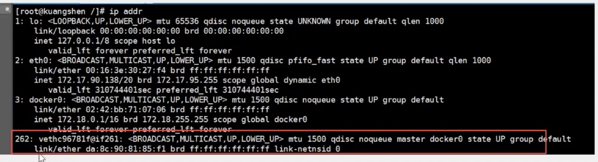

2. 在启动一个容器测试,发现又多了一对网卡

```s
[root@VM-0-4-centos ~]# docker run -d -P --name tomcat02 tomcat
```

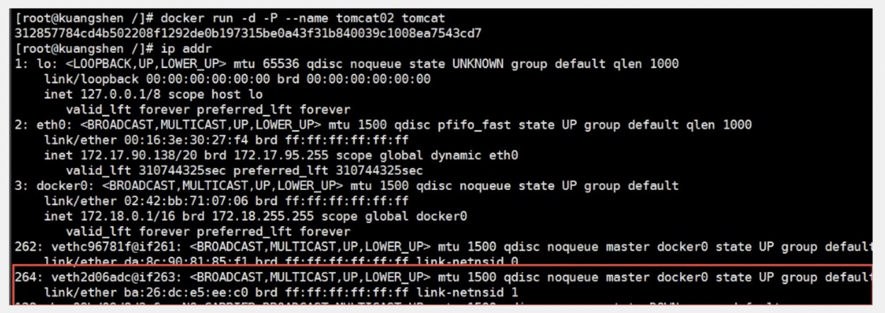

> 我们发现容器带来的网卡，都是一对对的
> evth-pair 就是一对虚拟设备接口，他们都是成对出现的，一端连着协议，一端彼此相连
> 正因为有这个特性，evth-pair 充当一个桥梁，连接各种网络设备
> OpenStac, Docker 容器之间的连接， OVS的连接，都是使用 evth-pair 技术

3. 测试一下 tomcat02 ping tomcat01

```s
[root@VM-0-4-centos ~]# docker exec -it tomcat02 ping 172.18.0.3 
PING 172.18.0.3 (172.18.0.3) 56(84) bytes of data.
64 bytes from 172.18.0.3: icmp_seq=1 ttl=64 time=0.082 ms
64 bytes from 172.18.0.3: icmp_seq=2 ttl=64 time=0.052 ms
64 bytes from 172.18.0.3: icmp_seq=3 ttl=64 time=0.052 ms
```

* 结论：容器和容器之后是可以 ping 通的

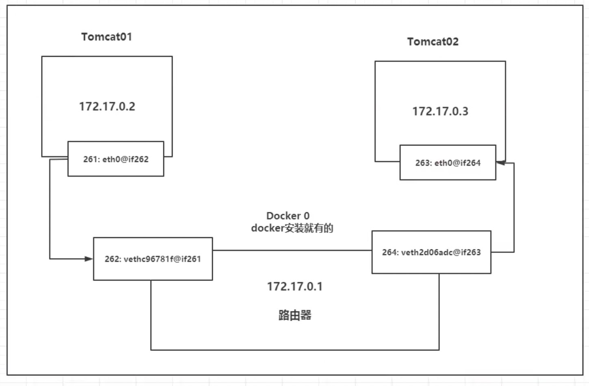

* 结论： tomcat01 和 tomcat02 是公用的一个路由器，docker0。
* 所有容器再不指定网络的情况下，都是 docker0 路由的，docker 会给我们容器分配一个默认的可用 ip

255.255.0.1/16

000000.000000.000000.000000

255.255.255.255

255.255.0.0   代表一个网络

存放个数  255 * 255 - 0.0.0.0(回环地址) - 255.255.255.255(最终地址)   大概约等于 65535


255.255.0.1/24 如果是这种代表最后 255 个代表网络范围的

* 小结

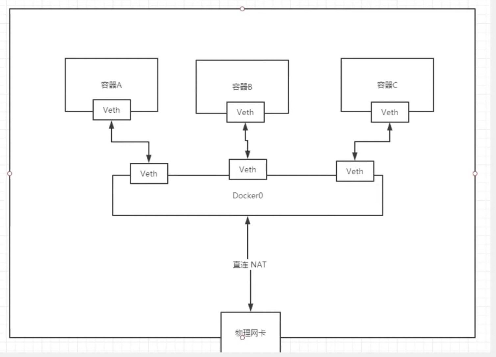

Docker 使用的是 Linux 的桥接，宿主机中是一个 Docker 容器的网桥 docker0。

Docker 中所有的网络接口都是虚拟的。虚拟的转发效率高

只要容器删除，对应的网桥一对就没了

```s
# 查看网卡
[root@VM-0-4-centos ~]# docker network ls
NETWORK ID     NAME      DRIVER    SCOPE
9d496db23b85   bridge    bridge    local
d4b48b153adb   host      host      local
629b73161751   none      null      local
[root@VM-0-4-centos ~]# docker network  inspect 9d496db23b85
```

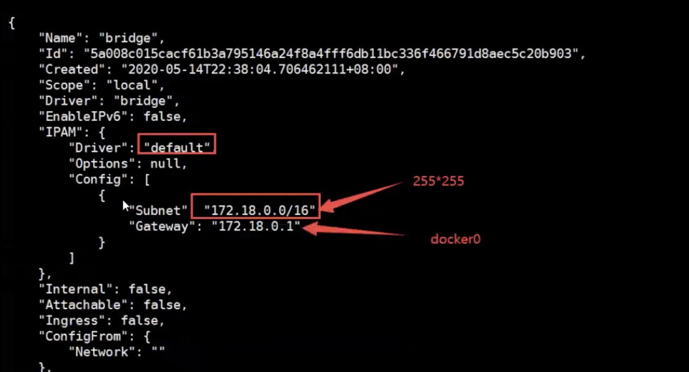

* 思考

我们编写了一个微服务，database url=ip；项目不重启，数据库ip换掉了，我们希望可以处理这个问题，我们可以名字来访问容器？


## 容器互联

* 直接使用名字不行

```s
[root@VM-0-4-centos ~]# docker exec  -it tomcat01 ping tomcat02 
ping: tomcat02: Name or service not known
```

* --link 解决

```s
# 启动，并连接网络
[root@VM-0-4-centos ~]# docker run -d -P --name tomcat03 --link tomcat02 tomcat
4e54df893ce4da6e19df2a28bfe32ebac46971d4b61526dd61f381dfd1ab8b86

# tomcat03 ping tomcat02
[root@VM-0-4-centos ~]# docker exec -it tomcat03 ping tomcat02
PING tomcat02 (172.18.0.4) 56(84) bytes of data.
64 bytes from tomcat02 (172.18.0.4): icmp_seq=1 ttl=64 time=0.101 ms
64 bytes from tomcat02 (172.18.0.4): icmp_seq=2 ttl=64 time=0.055 ms
64 bytes from tomcat02 (172.18.0.4): icmp_seq=3 ttl=64 time=0.055 ms

# 反向可以ping通么
docker network --help
```

* 探究 inspect

```s
# 查看网卡
[root@VM-0-4-centos ~]# docker network ls
NETWORK ID     NAME      DRIVER    SCOPE
9d496db23b85   bridge    bridge    local
d4b48b153adb   host      host      local
629b73161751   none      null      local
[root@VM-0-4-centos ~]# docker network  inspect 9d496db23b85
```

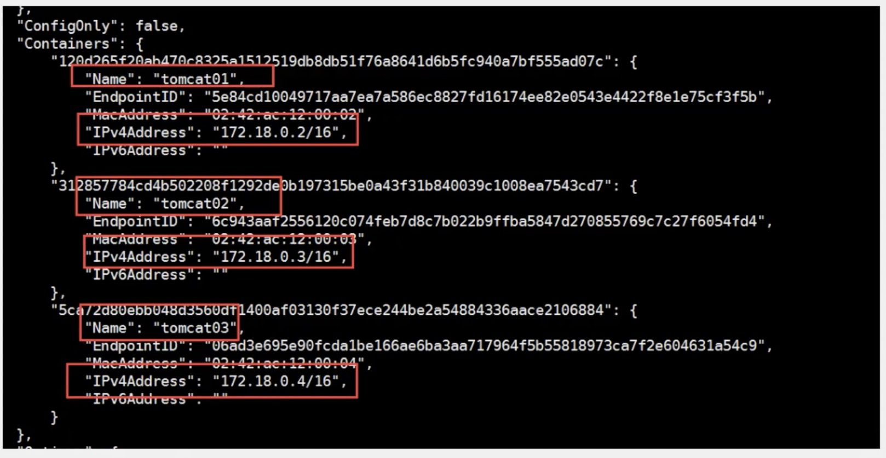

* 其实这个 tomcat03 就是在本地配置了 tomcat02 的配置

* 示范
```s
# hosts  配置之后访问 baidu， 连接到 这个ip
127.0.0.1   www.baidu.com 
```

* 查看真实 hosts 配置
```s
[root@VM-0-4-centos ~]# docker exec -it tomcat03 cat /etc/hosts
127.0.0.1       localhost
::1     localhost ip6-localhost ip6-loopback
fe00::0 ip6-localnet
ff00::0 ip6-mcastprefix
ff02::1 ip6-allnodes
ff02::2 ip6-allrouters
172.18.0.4      tomcat02 e20a7e22a6c9  # 配置
172.18.0.5      4e54df893ce4
```

> 本质探究： --link 就是我们在 hosts 配置增加了一个 172.18.0.4      tomcat02 e20a7e22a6c9

我们现在使用 docker， 不推荐使用 --link 了。 自定义网络不适用 docker0!!!

docker0 问题： 不支持容器名链接访问

## 自定义网络

容器互联

### 查看所有的 docker 网络

```s
# bridge 就是 docker0
[root@VM-0-4-centos ~]# docker network ls
NETWORK ID     NAME      DRIVER    SCOPE   
9d496db23b85   bridge    bridge    local
d4b48b153adb   host      host      local
629b73161751   none      null      local
```

### 网络模式

* bridge

桥接模式： 桥接 docker（默认，自己创建网络也使用 bridge 模式）

* none

不配置网络

* host

和宿主机共享网络

* container 

容器内可以网络联通 （不建议使用，局限很大）

### 测试

1. 删除所有容器，保证环境干净

```s
docker rm -f $(docker ps -aq)
```

2. 自定义网络

* 2.1 分析命令
```s
# 我们直接启动命令 --net bridge, 而这个就是我们的 docker0
# docker run -d -P --name tomcat01 --net bridge tomcat
docker run -d -P --name tomcat01  tomcat  # 直接启动会有默认参数 --net bridge
```

* 2.2 docker0 特点

默认，域名不能访问，--link可以打通

* 2.3 创建网络

```s
docker network create --driver bridge --subnet 192.168.0.0/16 --gateway 192.168.0.1 mynet 

# 自定义网络
# --driver bridge
# --subnet 192.168.0.0/16  192.168.0.2 - 192.168.255.255
# --gateway 192.168.0.1 

# 演示
[root@VM-0-4-centos ~]# docker network create --driver bridge --subnet 192.168.0.0/16 --gateway 192.168.0.1 mynet
9439177a11dd7269a82fcc6d0403340f332c31007d97de24aaa98b4a305a07b0
[root@VM-0-4-centos ~]# docker network ls
NETWORK ID     NAME      DRIVER    SCOPE
9d496db23b85   bridge    bridge    local
d4b48b153adb   host      host      local
9439177a11dd   mynet     bridge    local
629b73161751   none      null      local
```

* 查看自定义网络

我们自己的网络积极创建好了

```s
docker network inspect mynet
```

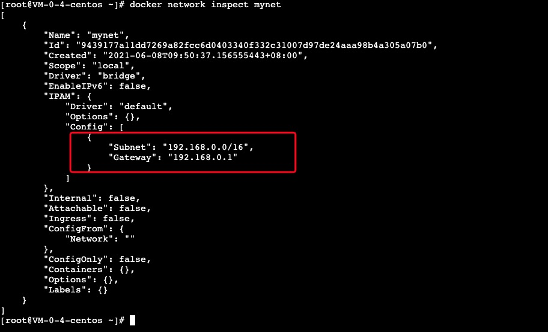

* 测试

```s
[root@VM-0-4-centos ~]# docker run -d -P --name tomcat-net-01 --net mynet tomcat
015fa36baa493235beee6fa5464f4fb8c5d8897ae7bf1b97eab857c6d9c7c197
[root@VM-0-4-centos ~]# docker run -d -P --name tomcat-net-02 --net mynet tomcat
b53af3d80e9c891f4473b4d7159a283714c18ace6eba9bcd1929ada700d0bdeb
```

* 查看

命令

```s
docker inspect mynet

docker network inspect mynet
```

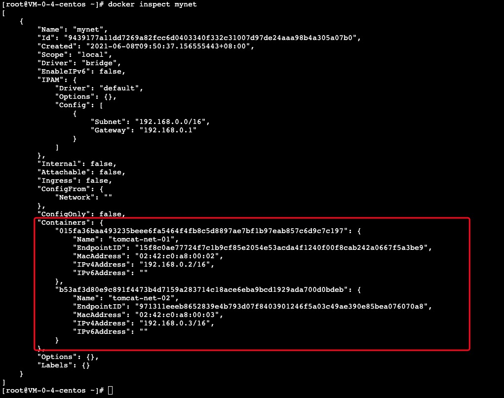


* 再次测试 ping 连接

```s
[root@VM-0-4-centos ~]# docker exec -it tomcat-net-01 ping tomcat-net-02
PING tomcat-net-02 (192.168.0.3) 56(84) bytes of data.
64 bytes from tomcat-net-02.mynet (192.168.0.3): icmp_seq=1 ttl=64 time=0.041 ms
64 bytes from tomcat-net-02.mynet (192.168.0.3): icmp_seq=2 ttl=64 time=0.054 ms
64 bytes from tomcat-net-02.mynet (192.168.0.3): icmp_seq=3 ttl=64 time=0.053 ms
```

> 现在不实用 --link 也可以 ping 名字了

我们自定义的网络 docker 都已经帮我们维护好了对应的关系，推荐我们平时这样使用网络

好处： 

redis: 不同的集群使用不同的网络，保证集群是安全和健康的

mysql: 不同的集群使用不同的网络，保证集群是安全和健康的

## 网络连通

```s
docker network connect [options] network container
```

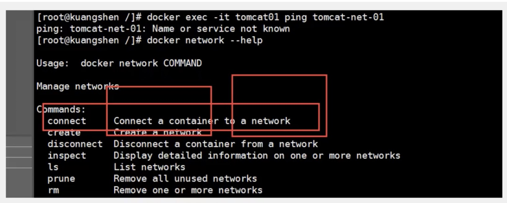

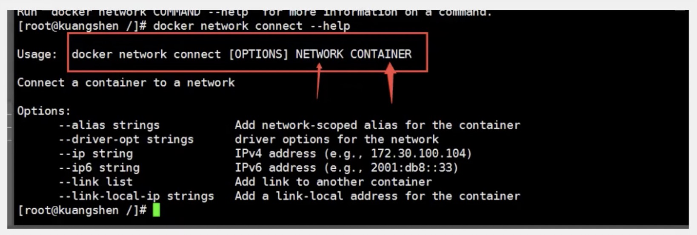


### 测试打通 tomcat01 - mynet

* 命令

```s
docker network connect mynet tomcat01
```

* 效果

```s
[root@VM-0-4-centos ~]# docker network connect mynet tomcat01
[root@VM-0-4-centos ~]# docker network inspect mynet
[
    {
        "Name": "mynet",
        "Id": "9439177a11dd7269a82fcc6d0403340f332c31007d97de24aaa98b4a305a07b0",
        "Created": "2021-06-08T09:50:37.156555443+08:00",
        "Scope": "local",
        "Driver": "bridge",
        "EnableIPv6": false,
        "IPAM": {
            "Driver": "default",
            "Options": {},
            "Config": [
                {
                    "Subnet": "192.168.0.0/16",
                    "Gateway": "192.168.0.1"
                }
            ]
        },
        "Internal": false,
        "Attachable": false,
        "Ingress": false,
        "ConfigFrom": {
            "Network": ""
        },
        "ConfigOnly": false,
        "Containers": {
            "015fa36baa493235beee6fa5464f4fb8c5d8897ae7bf1b97eab857c6d9c7c197": {
                "Name": "tomcat-net-01",
                "EndpointID": "15f8c0ae77724f7c1b9cf85e2054e53acda4f1240f00f8cab242a0667f5a3be9",
                "MacAddress": "02:42:c0:a8:00:02",
                "IPv4Address": "192.168.0.2/16",
                "IPv6Address": ""
            },
            "108ce0bc7c91e5409267b8a224d1fc389c1223937ea6a4b9c2984e83d921c31f": {
                "Name": "tomcat01",
                "EndpointID": "1b83f080b99059cedcb46aff336d2dabb8b514f5031308cc86a9d51ce5cb95db",
                "MacAddress": "02:42:c0:a8:00:04",
                "IPv4Address": "192.168.0.4/16",
                "IPv6Address": ""
            },
            "b53af3d80e9c891f4473b4d7159a283714c18ace6eba9bcd1929ada700d0bdeb": {
                "Name": "tomcat-net-02",
                "EndpointID": "971311eeeb8652839e4b793d07f8403901246f5a03c49ae390e85bea076070a8",
                "MacAddress": "02:42:c0:a8:00:03",
                "IPv4Address": "192.168.0.3/16",
                "IPv6Address": ""
            }
        },
        "Options": {},
        "Labels": {}
    }
]
```

* 联通之后就是将 tomcat01  放到了 mynet 网络下？

* 一个容器两个 ip 地址！！！

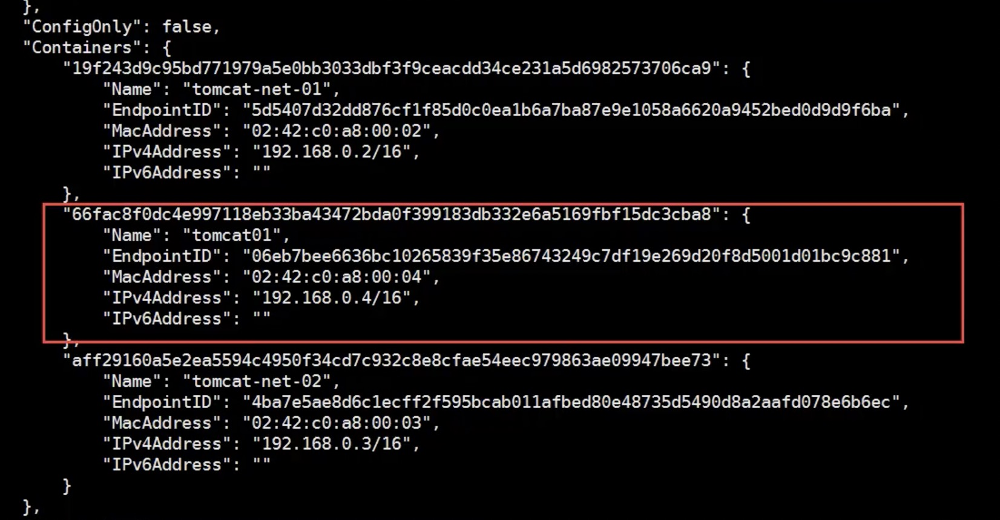

### 再次尝试 ping 连接

```s
[root@VM-0-4-centos ~]# docker exec -it tomcat01 ping tomcat-net-01
PING tomcat-net-01 (192.168.0.2) 56(84) bytes of data.
64 bytes from tomcat-net-01.mynet (192.168.0.2): icmp_seq=1 ttl=64 time=0.063 ms
64 bytes from tomcat-net-01.mynet (192.168.0.2): icmp_seq=2 ttl=64 time=0.056 ms
64 bytes from tomcat-net-01.mynet (192.168.0.2): icmp_seq=3 ttl=64 time=0.053 ms
```

* 结论

假设要跨网络操作别人，就需要使用 docker network connect 进行联通！！！


## 实战：部署 redis 集群

1. 构建网络
```s
[root@VM-0-4-centos ~]# docker network create redis --subnet 172.38.0.0/16
3bb41ccc5128531f6684e6009bd6f9538ac4c38943e61acb5f937803ecd20934
```

2. shell 脚本

```s
for port in $(seq 1 6); \
do \
mkdir -p /mydata/redis/node-${port}/conf
touch /mydata/redis/node-${port}/conf
cat << EOF >/mydata/redis/node-${port}/conf/redis.conf
port 6379
bind 0.0.0.0
cluster-enabled ues
cluster config file nodes.conf
cluster-node-timeout 5000
cluster-announce-ip 172.38.0.1${port}
cluster-announce-port 6379
cluster-announce-bus-port 16379
appendonly yes
EOF
done
```

3. 查看

```s
cd /mydata/redis 
下边有 node-1 node-2 node-3 node-4 node-5 node-6
```

```s
[root@VM-0-4-centos ~]# cd /mydata/
[root@VM-0-4-centos mydata]# ls
redis
[root@VM-0-4-centos mydata]# cd redis/
[root@VM-0-4-centos redis]# ls
node-1  node-2  node-3  node-4  node-5  node-6
[root@VM-0-4-centos redis]# cd node-1
[root@VM-0-4-centos node-1]# ls
conf
[root@VM-0-4-centos node-1]# cd conf/
[root@VM-0-4-centos conf]# ls
redis.conf
[root@VM-0-4-centos conf]# cat redis.conf 
port 6379
bind 0.0.0.0
cluster-enabled ues
cluster config file nodes.conf
cluster-node-timeout 5000
cluster-announce-ip 172.38.0.11
cluster-announce-port 6379
cluster-announce-bus-port 16379
appendonly yes
```

4. 启动

```s
docker run -p 637${port}:6379 -p 1637${port}:16379 --name redis-${port} \
-v /mydata/redis/node-${port}/data:/data \
-v /mydata/redis/node-${port}/conf/redis.conf:/etc/redis/redis.conf \
-d --net redis --ip 172.38.0.1${port} redis:5.0.9-alpine3.11 redis-server /etc/redis/redis.conf

docker run -p 6371:6379 -p 16371:16379 --name redis-1 \
-v /mydata/redis/node-1/data:/data \
-v /mydata/redis/node-1/conf/redis.conf:/etc/redis/redis.conf \
-d --net redis --ip 172.38.0.11 redis:5.0.9-alpine3.11 redis-server /etc/redis/redis.conf

docker run -p 6372:6379 -p 16372:16379 --name redis-2 \
-v /mydata/redis/node-2/data:/data \
-v /mydata/redis/node-2/conf/redis.conf:/etc/redis/redis.conf \
-d --net redis --ip 172.38.0.12 redis:5.0.9-alpine3.11 redis-server /etc/redis/redis.conf

docker run -p 6373:6379 -p 16373:16379 --name redis-3 \
-v /mydata/redis/node-3/data:/data \
-v /mydata/redis/node-3/conf/redis.conf:/etc/redis/redis.conf \
-d --net redis --ip 172.38.0.13 redis:5.0.9-alpine3.11 redis-server /etc/redis/redis.conf

docker run -p 6374:6379 -p 16374:16379 --name redis-4 \
-v /mydata/redis/node-4/data:/data \
-v /mydata/redis/node-4/conf/redis.conf:/etc/redis/redis.conf \
-d --net redis --ip 172.38.0.14 redis:5.0.9-alpine3.11 redis-server /etc/redis/redis.conf

docker run -p 6375:6379 -p 16375:16379 --name redis-5 \
-v /mydata/redis/node-5/data:/data \
-v /mydata/redis/node-5/conf/redis.conf:/etc/redis/redis.conf \
-d --net redis --ip 172.38.0.15 redis:5.0.9-alpine3.11 redis-server /etc/redis/redis.conf

docker run -p 6376:6379 -p 16376:16379 --name redis-6 \
-v /mydata/redis/node-6/data:/data \
-v /mydata/redis/node-6/conf/redis.conf:/etc/redis/redis.conf \
-d --net redis --ip 172.38.0.16 redis:5.0.9-alpine3.11 redis-server /etc/redis/redis.conf
```

5. 创建集群

```s
redis-cli --cluster create 172.38.0.11:6379 172.38.0.12:6379 172.38.0.13:6379 172.38.0.14:6379 172.38.0.15:6379 172.38.0.16:6379 --cluster-replicas 1
```

6. 进入容器

docker exec -it redis-1 /bin/bash bash是找不到

```s
docker exec -it redis-1 /bin/sh 
```


TODO 不会redis，看不懂

https://www.bilibili.com/video/BV1og4y1q7M4?p=38&spm_id_from=pageDriver


