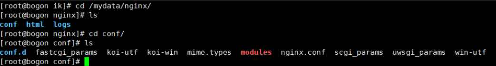

# 3.启动nginx

## 3.1.复制配置

随便启动一个nginx实例，只是为了复制出配置

如果没有对应的nginx版本，会自动去docker仓库下载

```s
docker run -p 80:80 --name nginx -d nginx
```

## 3.2.将容器内的配置文件拷贝到当前文件

我们将配置文件放到 /mydata/nginx目录下

```s
cd /mydata/
mkdir nginx
docker container cp nginx:/etc/nginx .
mv nginx/ conf/
mkdir nginx
mv conf/ nginx/
```

```s
docker cp nginx01:/etc/nginx/nginx.conf /home/nginx/
docker cp nginx01:/etc/nginx/conf.d /home/nginx/conf/
docker cp nginx01:/usr/share/nginx/html /home/nginx/html
docker cp nginx01:/var/log/nginx/ /home/nginx/logs/
// 这里的nginx01是容器名称 
// 第一个路径：容器内的路径
// 第二个路径：主机路径(对应第二步创建的nginx文件夹)
```

```s
docker container cp nginx:/usr/share/nginx/html .
docker container cp nginx:/var/log/nginx .
docker container cp nginx:/etc/nginx  .
```

目录结构如下：



## 3.3.3.终止+删除原容器

```s
docker stop nginx
docker rm nginx
```

## 3.4.4.创建新的nginx，执行以下命令

```s
docker run -p 80:80 --name nginx 
-v /var/lib/docker/volumes/nginx01/html:/usr/share/nginx/html 
-v /var/lib/docker/volumes/nginx01/logs:/var/log/nginx 
-v /var/lib/docker/volumes/nginx01/conf:/etc/nginx 
-d nginx:1.10
```

```s
docker run -d -p 5000:80 --name nginx -v /var/lib/docker/volumes/nginx01/html:/usr/share/nginx/html -v /var/lib/docker/volumes/nginx01/logs:/var/log/nginx -v /var/lib/docker/volumes/nginx01/nginx:/etc/nginx nginx
```

> 对应 nginx 的 html 文件访问位置, nginx 的 日志位置 和 nginx 的配置

## 3.5.创建成功，访问nginx

我们可以在我们挂载的mydata/nginx/html目录下创建 index.html。


