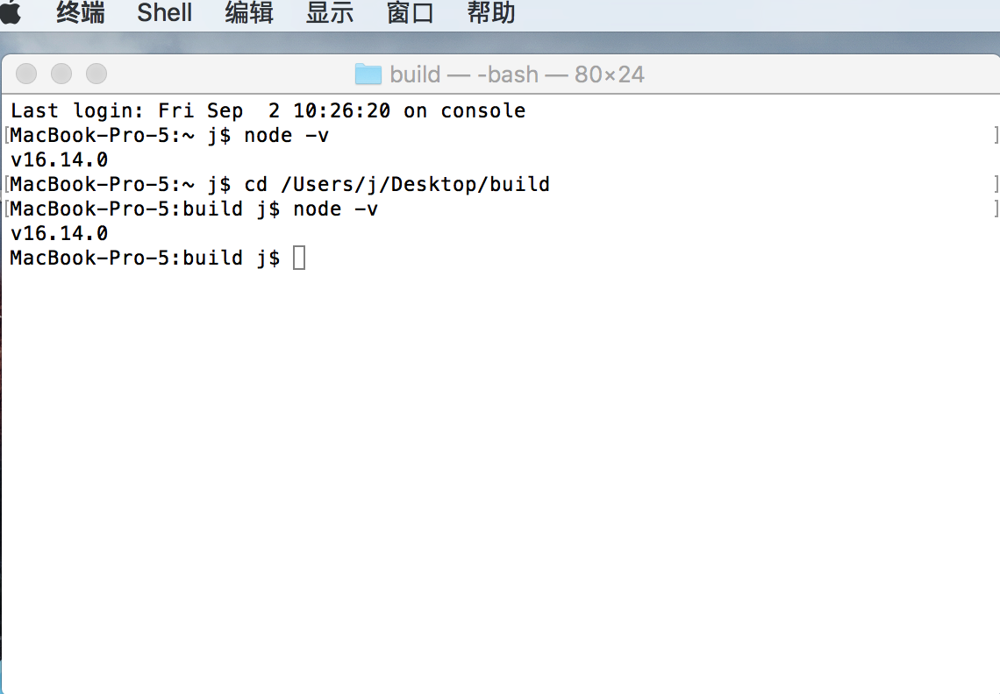
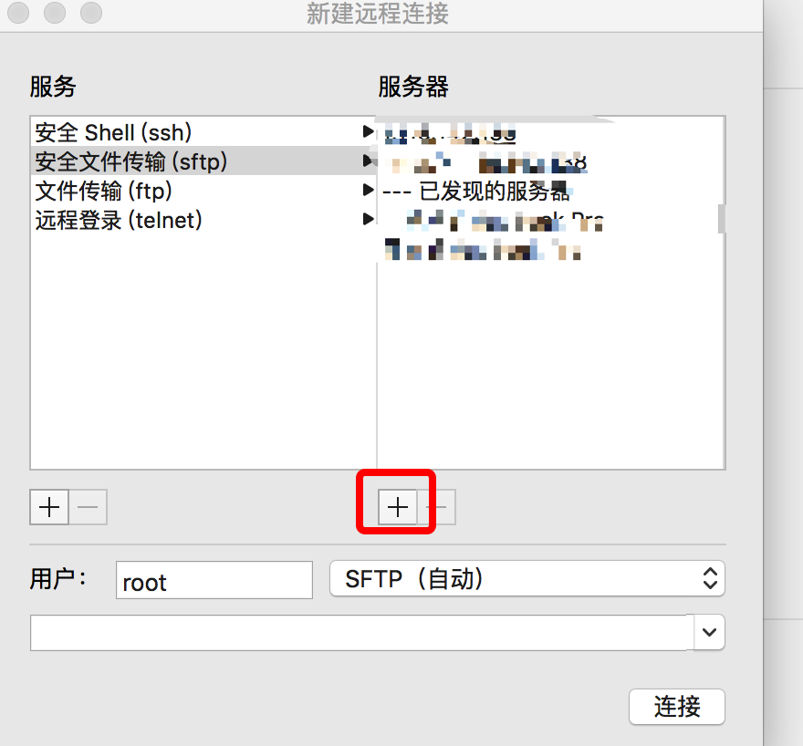

# 1.mac上传文件

# 1.1 打开 mac 终端

# 1.2 点击左上角 shell 中新建远程连接

;

# 1.3 选择 安全文件传输

# 1.4 点击新增，添加ip

;

* 只填写 ip 就可，不用加 http

# 1.5 添加用户名

# 1.6 点击连接 输入密码

# 1.7 上传文件

待测试 put -r /Users/j/Desktop/build/node_modules  /home/react-admin-service-tem-test/node_modules

put -r /Users/j/Desktop/build/*  /var/lib/docker/volumes/tomcat02/webapps/
put -r /Users/j/Desktop/build/static/css/*  /var/lib/docker/volumes/tomcat02/webapps/static/css/
put -r /Users/j/Desktop/build/static/js/*  /var/lib/docker/volumes/tomcat02/webapps/static/js/
put -r /Users/j/Desktop/build/static/media/*  /var/lib/docker/volumes/tomcat02/webapps/static/media/

# 1.8 下载文件 

下载文件到本地：get 【服务器路径】 【本地文件路径】

如：get /home/filename.txt /User/xxxx/Downloads 从服务器的home路径下下载filename文件到本地的Downloads下面

参考： https://blog.csdn.net/qttlsj/article/details/124745021

