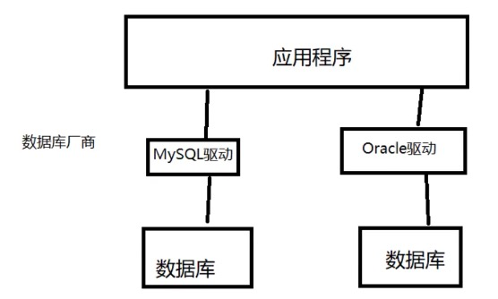

# 11.JDBC

## 11.1 数据库驱动

驱动： 声卡， 显卡， 数据库

我们的程序会通过数据库驱动，和数据库打交道

## 11.2 JDBC

SUN 公司为了简化开发人员的（对数据库的统一）操作，提供一个（java操作数据库的）规范，俗称 JDBC

这些规范的实现由具体的厂商去做

对于开发人员来说，只需要掌握 JDBC 的操作

java.sql javax.sql 还有一个数据库驱动包