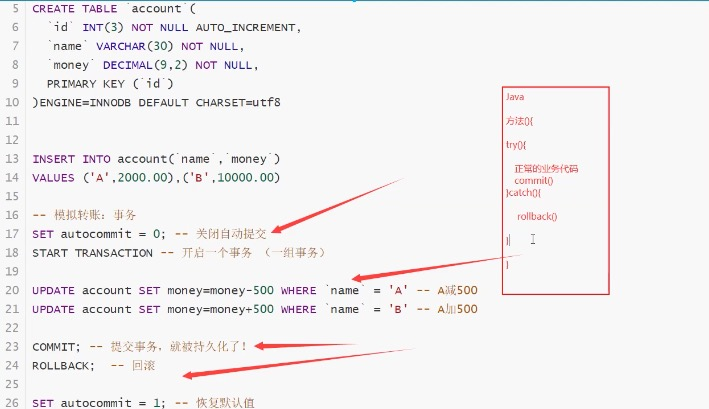

# 7.事务

## 7.1 什么是事务

要么都成功，要么都失败

---
1. sql 执行， A 给 B 钱 转账 A1000 -> 200 B200
2. SQL 执行， B 收到钱 A 800 B400
---

将一组sql放在一个批次中去执行

## 7.2 事务原则

> 事务原则： ACID 原则，原则性，一致性，隔离性，持久性 （脏读...）

最终一致性

* 原则性

要么都成功，要么都失败

* 一致性

事务前后的数据完整性保持一致 （总数不变）

* 隔离性

事务的隔离性是多个用户并发访问数据库时，数据库为每一个用户开启的事务，不能被其他事物的操作数据所干扰，事务之间要相互隔离

* 持久性

事务没有提交，恢复到原装

事务已经提交，持久化到数据库

> 事务一旦提交不可逆

### 7.2.1 隔离性所导致的一些问题

* 脏读

指一个事务读取了另外一个事务未提交的数据

* 不可重复读

在一个事务内读取表中的某一个数据，多次读取结果不同。（这个不一定是错误，只是某些场合不对）

* 虚读 （幻读）

是指一个事务内读取到了别的事务插入的数据，导致前后读取不一致

## 7.3 测试事务

> mysql 是默认开启事务自动提交的

```s
# mysql 是默认开启事务自动提交的
SET autocommit = 0 /* 关闭 */
SET autocommit = 1 /* 开启 （默认开启） */

SET autocommit = 0
-- 开始事务
START TRANSACTION -- 标记一个事务的开始，从这个开始的 sql 都在同一个事务内

-- 提交 持久化 （成功）
COMMIT
-- 回滚 回到以前的样子 （失败）
ROLLBACK

SET autocommit = 1  -- 开启自动提交

-- 事务结束

-- 了解
SAVEPOINT -- 保存点名 设置一个事务的保存点 了解
ROLLBACK TO SAVEPOINT 保存点名 -- 回滚到保存点
RELEASE SAVEPOINT 保存点名 -- 撤销保存点
```

### 7.3.1 模拟场景

```s
-- 转账
CREATE DATABASE shop CHARACTER SET utf8 COLLATE utf8_general_ci;

USE shop;

CREATE TABLE account (
	id INT(3) NOT NULL AUTO_INCREMENT,
	`name` VARCHAR(30) NOT NULL,
	money DECIMAL(9, 2) NOT NULL,
	PRIMARY KEY (id)
) ENGINE=INNODB DEFAULT CHARSET=utf8

INSERT INTO account(`name`, money) VALUE('a', 2000.00), ('b', 10000.00)

-- 模拟转账
SET autocommit = 0; -- 关闭事务
START TRANSACTION; -- 开启一个事务

UPDATE account SET money = money - 500 WHERE `name` = 'a';
UPDATE account SET money = money + 500 WHERE `name` = 'b';

COMMIT; -- 提交事务， 一提交，就被持久化了
ROLLBACK; -- 回滚

SET autocommit = 1; -- 恢复默认值
```

;