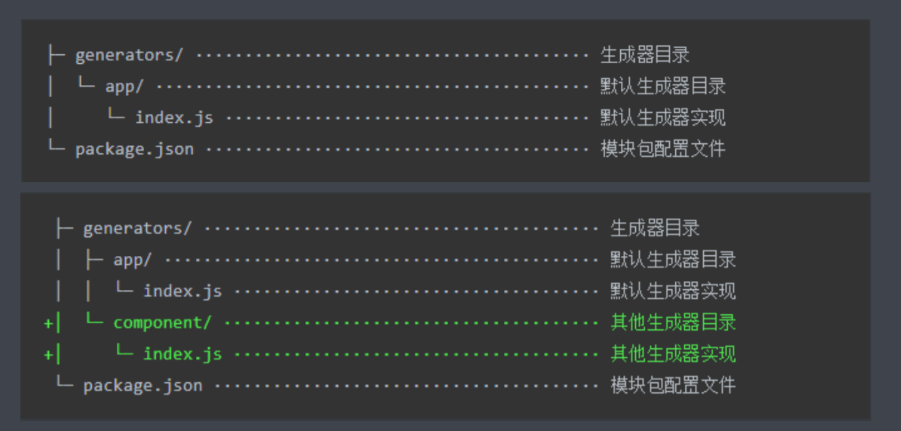

# 创建 Generator 模块

yo 的生成器开发

Generator 本质上就是一个 NPM 模块

## Generator 基本结构

;

generator-<name> 

## 根据模板创建文件

1. mkdir generator-sample

2. cd generator-sample

3. yarn init 

4. yarn add yeoman-generator

增加 yeoman 基类

5. 打开文件

genertaors/app/index.js

此文件作为 Generator 的核心入口

需要导出一个继承自 Yeoman Generator 的类型

Yeoman Generator 在工作时会自动调用我们在此类型中定义的一些生命周期方法

我们在这些方法中可以定义通过调用父类提供的一些工具方法实现一些功能， 比如 文件写入

6. 编写文件

```js
// genertaors/app/index.js

const Genertaor = require('yeoman-generator');

module.exports = class extends Generator {
  writing() {
    // Yeoman 自动在生成文件阶段调用此方法
    // 我们在这里尝试往项目目录中写入文件
    // fs 文件 和 node 中的 fs 不一样，这个功能更加强大
    this.fs.write(
      this.destinationPath('temp.txt'), // 获取绝对目录
      Math.random.toString() // 文本内容
    )
  }
}
```

7. yarn link

8. 运行

yo sample 