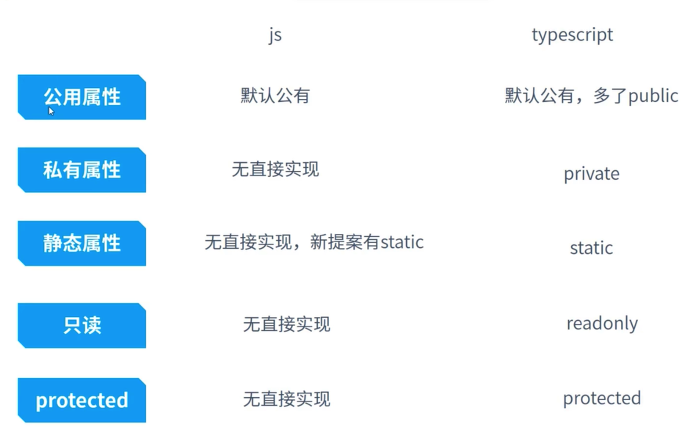

# 5.typescript类

## 5.1.对比js中class和ts中class




```ts
// test.ts
class TsClass {
  a: number;
  fn2(a:number): number;
  fn2(a){
    return a + 1;
  }
  // 加不加 public 都一样
  // a = 123;
  // public a = 123;
  private b = 1;
  static c = 2;
  readonly d = 3;
  protected e = 4;
  private fn() {
    console.log(111);
  }

}

const tsclass = new TsClass();

class TsClass2 {
  a:number;
}

const obj: TsClass2 = {a: 1}
```

```js
class JsClass {
  a = 123;
  static c =1;
  #d = 1
  constructor() {
    this.a = 888;
  }
}

JsClass.c = 99;
```