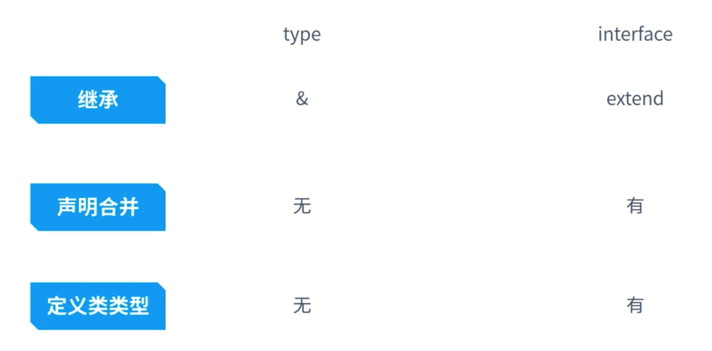

# 7.接口和type

## 7.1.type

1. type 关键字用于给一个类型一个命令，可以用于各种类型的定义

2. 常用于基础类型和类型，交叉类型

```ts
type aString = string | number | number[];
type obj1 = {
 a: number
}
type obj2 = {
 b: number
}
type objAll = obj1 & obj2
// 函数
type f1 = (a: string) => string

const a: aString = 1;
const f1: f1 = () => '1';
f1('111');
```

## 7.2.interface

一般定义 函数， 数组， 对象， 类

1. interface意思为接口，区别于type， 这是定义一个可继承的接口

2. 常用于类，对象的定义

```ts
type obj4 = {
  a1: number
}

// interface obj {
//   type: obj4
// }

interface obj {
  type: {
    a1: number
  },
  type2?: {
    a2: number
  },
  // key 只能有三种 string number symbol
  [key: string]: any
}

interface obj5 {
  a: 123,
  fn1(): (a: number) => string
}
// 只是一个方法
interface f5 {
  (a: number, b: number): number
}

function fun(a: obj) {}
fun({type: {a1: 1}})

let f5:f5 = (a, b) => a + b

// 类
interface person {
  age: number,
  eat(food: string): boolean
}
class Mary implements person {
  age: number
  eat(food: string): boolean
  eat(food) {
    return !!food;
  }
  constructor(age: number) {
    this.age = age;
  }
}

interface arr {
  [index: number]: string
}

let arr1: arr = ['1']
```

## 7.3.interface 和 type 比较



合并（继承）

```ts
// 继承（合并）
type typeobj1 = {
  a: number
}
type typeobj2 = {
  b: number
}
type typeobj3 = typeobj1 & typeobj2

interface interobj1 {
  a: number
}
interface interobj2 {
  b: number
}
interface interobj3 extends interobj1, interobj2 {
  c: number
}
```

```ts
// 声明合并 interobj4 要有 a 和 b
interface interobj4 {
  a: number
}
interface interobj4 {
  b: number
}
```