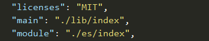

就是webpack中的node_modules提供了两种引入方式，ES6和CommonJS

main 是CommonJS, module是ES6

参考： https://javascript.ruanyifeng.com/nodejs/module.html

* babelrc的详细配置说明
https://blog.csdn.net/Jenn168/article/details/108695065