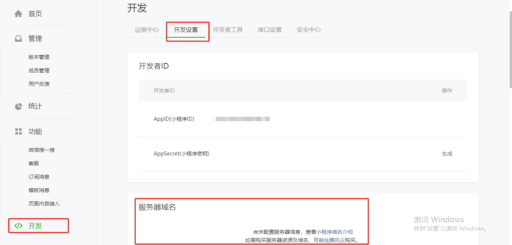

# 1.微信小程序快速入门

## 第一个属于自己的项目

### 账号注册
进入微信公众平台进行注册
>  一个人进行注册， 不支持微信支付

注册的完之后主要获取 appid ，以便进行下一步安装好开发工具后创建项目

微信公众平台 => 立即注册 => 注册小程序 => 登录 => 开发 => 开发设置 => 得到 appID

> 将此处的 appid 获取并保存， 同时下方的 appSecret 也保存

1. 新建appid 

	
> 请求接口需要进行配置 
