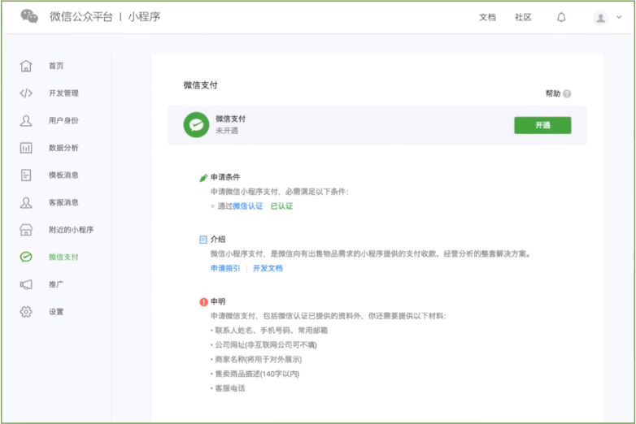
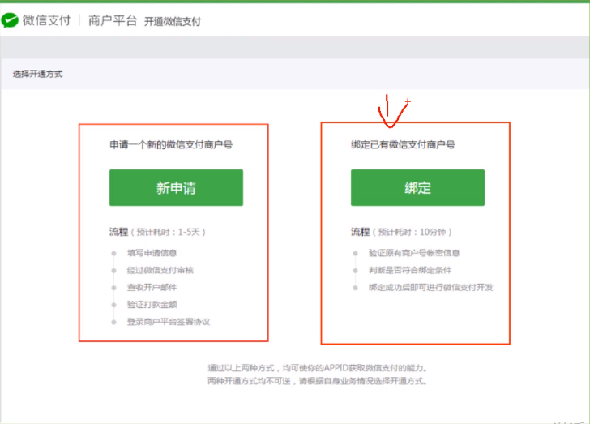

# 13.微信接入支付
最常规的普通模式，适用于有自己开发团队或者外包开发商的直连商户收款。

## 开通支付流程

1. 获取到小程序开发者账号后， 进行微信认证。微信认证指引 : http://mp.weixin.qq.com/debug/wxadoc/introduction/#小程序申请微信认证

2. 小程序开通微信支付，即申请或复用微信支付商户号， 申请完小程序后，登录小程序后台（mp.weixin.qq.com）。 点击左侧导航栏的微信支付， 在页面中进行开通。（开通申请要求小程序已发布上线）

点击开通按钮后，有两种方式可以获取微信支付能力，新申请微信支付商户号或绑定一个已有微信支付商号，请根据你的业务需要和具体情况选择，只能二选一。开通指引：http://kf.qq.com/faq/140225MveaUz161230yqilby.html

3. 商户在微信公众平台或开放平台提交微信支付申请，微信支付工作人员审核资料无误后开通相应的微信支付权限。微信支付申请审核通过后，商户在申请资料填写的邮箱中收取到由微信支付小助手发送邮件，此邮件包含开发时需要使用的支付账户信息。

## 调起支付流程
http://pay.weixin.qq.com/wiki/doc/api/wxa/wxa_api.php?chapter=7_7&index=5

调用统一下单接口进行订单生成

将关键信息返回给微信小程序端口后使用支付接口

wx.requestPayment(Object, Object)

发起微信支付。了解更多，需查看微信支付接口文档

参数 [Object, object]
属性 | 类型 | 默认值 | 必填 | 说明
---- | --- | ----- | ---- | ----
timeStamp | string   |     | 是 | 时间戳，从 1970年1月1日 00：00：00至今的秒数，即当前的时间。
nonceStr  | string   |     | 是 | 随机字符串，长度为 32 个字符一下
package   | string   |     | 是 | 统一下单接口返回的 prepay_id 参数值，提交格式如 prepay_id=""
signType  | string   | MD5 | 是 | 签名算法
paySign   | string   |     | 是 | 签名, 具体签名方案参见 小程序支付接口文档
scuccess  | function |     | 否 | 接口调用成功的回调函数
fail      | function |     | 否 | 接口调用失败的回调函数
complete  | function |     | 否 | 接口调用结束的回调函数 （调用成功，失败都会执行）

objcet.signType 的合法值
值  | 说明 | 最低版本
MD5 | MD5 | 
HMAC-SHA256 | HMAC-SHA256

> 回调接口里面有支付成功， 获取之后失败提示， 失败有失败原因，比如余额不足等。