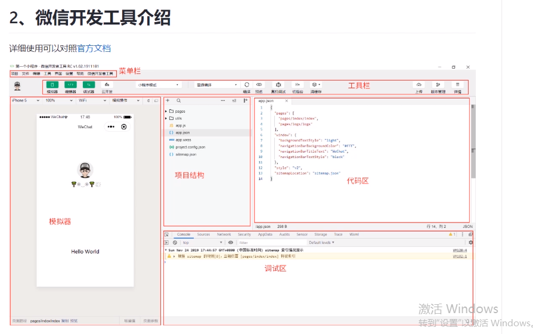
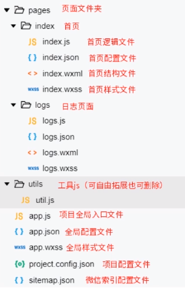

# 2.小程序工具和项目解构

## 微信开发者工具介绍

详情介绍参照官方文档
官方文档地址  https://developers.weixin.qq.com/miniprogram/dev/devtools/page.html#%E5%90%AF%E5%8A%A8%E9%A1%B5

> 小程序开放社区
> https://developers.weixin.qq.com/community/develop/mixflow

工具 => 前后台切换
普通编译 => 入口文件设置

* 服务器域名设置
开发 => 服务器域名设置 (必须设置 服务器域名 才能进行正常的 获取数据)
> 详情 （右上角） => 本地设置 => 不校验合法域名。。。 （会有黄色警告， 不报错）



## 小程序目录结构

整个小程序系统框架分为两个部分： 逻辑层， 视图层。 小程序提供自己的 视图层的描述语言 wxml 和 wxss ， 以及基于 JavaScript 的逻辑框架， 并在视图层和逻辑层间提供了数据传输和事件系统，让开发者能够专注于数据和逻辑

### 小程序文件结构
作用  |  文件类型
----- | -----
逻辑 | js
结构 | wxml
配置 | json
样式表 | wxss

### 小程序简单项目文件结构


>  以 app 命名的文件是全局的

* app.json
配置文件
比如：navigationBarBackgroundColor   小程序顶部背景颜色
			style 暂时限定只能用 v2
			sitemapLocation： 索引，搜索小程序
* sitemap.json
action: allow 所有文件都能被索引 | disallow 当前文件不能被索引
```js
{
  "desc": "关于本文件的更多信息，请参考文档 https://developers.weixin.qq.com/miniprogram/dev/framework/sitemap.html",
  "rules": [
		{
			"action": "allow",
			"page": "*" //  路径
		},
		{
			"action": "disallow",
			"page": "*"
		}
	]
}
```

## 小程序配置文件
小程序主要有两种配置文件， 全局配置 app.json 和 页面配置 .json

> 注意： 配置文件中要严格遵循格式限制，不能出现任何注释，强行要写可以仿照 json 格式加入，这种方式运行时会有 黄色警告 出现

### 全局配置
小程序根目录下的 app.json 文件用来对微信小程序进行全局配置, 决定页面文件的路径， 窗口表现， 设置网络超时时间， 设置 多tab等。
完整的配置说明请参考 小程序全局配置
https://developers.weixin.qq.com/miniprogram/dev/reference/
* app.json
```js
{
  "pages": [  // 注册页面， 注册过的页面才能访问
    "pages/index/index",
    "pages/userConsole/userConsole",
    "pages/storageConsole/storageConsole",
    "pages/databaseGuide/databaseGuide",
    "pages/addFunction/addFunction",
    "pages/deployFunctions/deployFunctions",
    "pages/chooseLib/chooseLib",
    "pages/openapi/openapi",
    "pages/openapi/serverapi/serverapi",
    "pages/openapi/callback/callback",
    "pages/openapi/cloudid/cloudid",
    "pages/im/im",
    "pages/im/room/room"
  ],
  "window": {  // 对页面进行修改
    "backgroundColor": "#F6F6F6",
    "backgroundTextStyle": "light",
    "navigationBarBackgroundColor": "#F6F6F6",  // 标题背景色
    "navigationBarTitleText": "云开发 QuickStart",  // 全局的配置标题， 可以在文件夹中新建一个json，单独进行标题的配置
		"navigationBarTextStyle": "black",  // 标题文件颜色
		
		"enablePullDownRefresh": true, // 默认是 false ， 是否支持下拉刷新
	},
	"tabBar": {  // 底部的导航栏 最少两个， 最多五个
		"list": [
				{
					"pagePath": "pages/demo/demo"， // 路径
					"text": "demo",  // 文件描述 导航栏下部显示的名字
					// "iconPath": "iconPath",
					// "selectedIconPath": "selectedIconPath" 
				}
			
		]
	},
	"networkTimeout": {
		"request": 20000,
		"connectSocket": 20000,
		"uploadFile": 20000,
		"downloadFile": 2000
	},
  "sitemapLocation": "sitemap.json", // 
  "style": "v2"
}
```
创建页面方式
* 可以在 app.json 中 直接写 "pages/demo/demo"(第一个是入口文件)