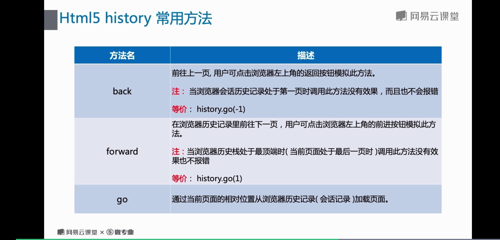
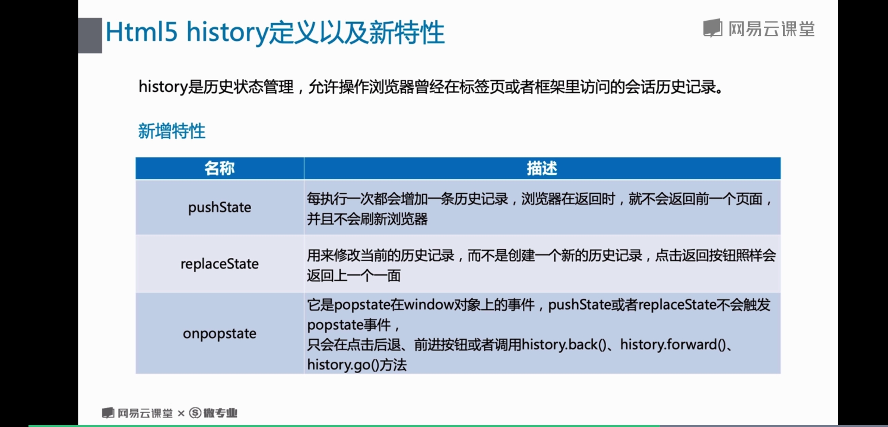
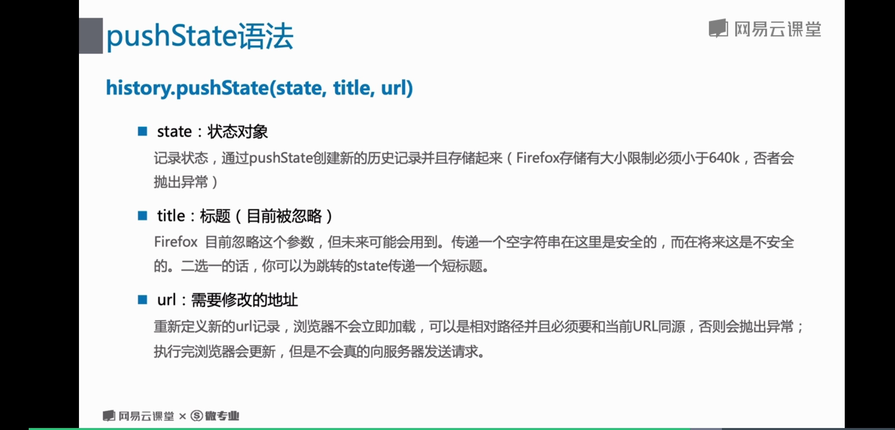
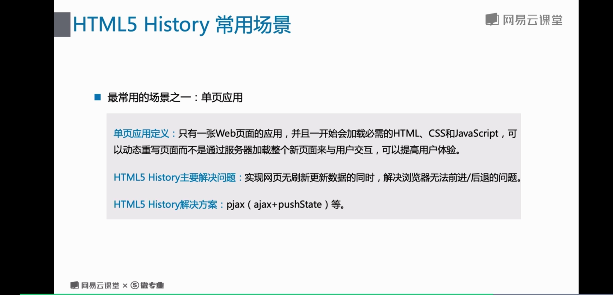

# 3 HTML5选择器/拖拽/History

## HMLT5 选择器
* querySelector
* querySelectorAll

## history 常用方法

## history定义以及新特性

* pushState 语法
history.pushState(state, title, url)

## history 常用场景

> 关闭浏览器同源安全策略的命令

> window 在没有配置环境变量需要到浏览器的安装目录下执行

