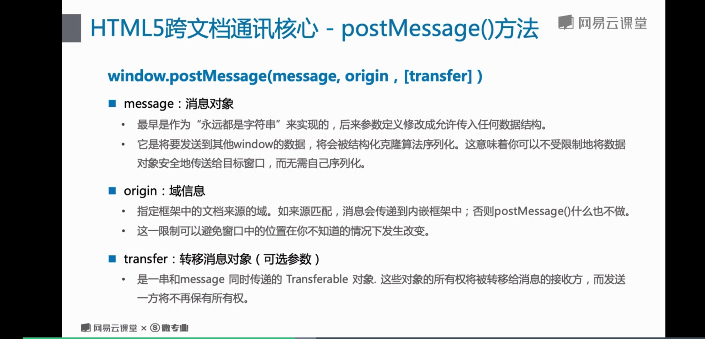

# 4 跨文档消息通讯

## 跨文档通讯概念

>跨html文档，而不是 document

* 定义
跨文档消息传送（cross-document messaging）， 有时候也简称为 XDM，指的是来自不同域的页面间传递消息。

* 使用场景
内嵌框架（iframe）和其父文档相互进行数据传输或者通讯

* html5  跨文档通讯核心 - postMessage() 方法

TODO 代码书写

* message 回调event事件对象
1. event.data
	postMessage 传输过来的第一个参数， 通常是字符串类型数据
2. event.origin
	postMessage 传输过来的第二个参数， 是用来匹配消息来源方的域
3. event.source
	来源方目标文档的window引用， 通常用作单词握手操作回应数据
4. event.ports
	是messageEvent接口的特有属性， 用于获取消息端口集合对象（通常用于 channeIMessage对象）
	> 可以参考 https://html.spec.whatwg.org/multipage/web-messageing.html