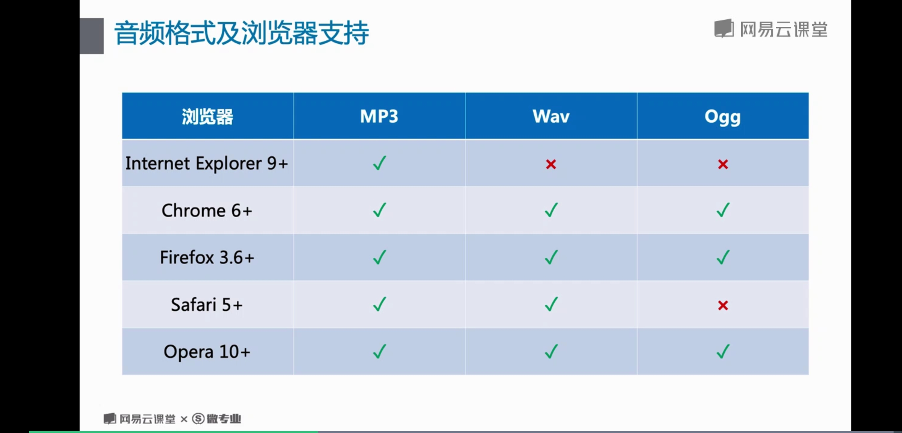
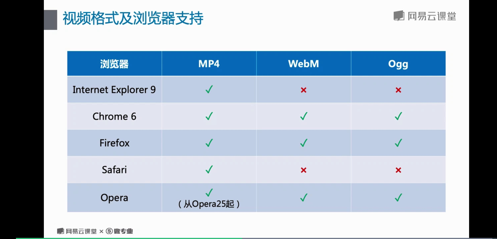
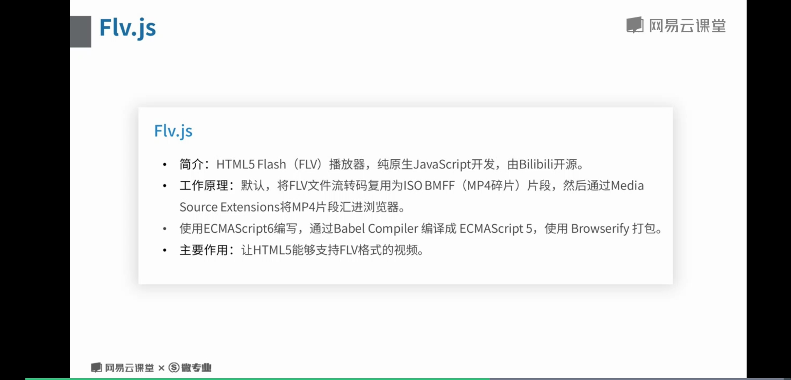

# 6 音频 与 视频

## 音频

### 音频兼容


## 视频

### 视频兼容


### 对flash兼容


### video.js
兼容性好...

### DOM 操作
```html
<div style="text-align:center;">
  <button onclick="playPause()">播放/暂停</button> 
  <button onclick="makeBig()">大</button>
  <button onclick="makeNormal()">中</button>
  <button onclick="makeSmall()">小</button>
  <br /> 
  <video id="video1" width="420" style="margin-top:15px;">
    <source src="http://www.w3school.com.cn/example/html5/mov_bbb.mp4" type="video/mp4" />
    <source src="http://www.w3school.com.cn/example/html5/mov_bbb.ogg" type="video/ogg" />
   你的浏览器不支持html5的video标签
  </video>
</div>
```
```javascript
var myVideo=document.getElementById("video1");
	function playPause(){ 
		if (myVideo.paused) 
			myVideo.play(); 
		else 
			myVideo.pause(); 
	} 
	function makeBig(){ 
		myVideo.width=560; 
	} 
	function makeSmall(){ 
		myVideo.width=320; 
	} 
	function makeNormal(){ 
		myVideo.width=420; 
	} 
    myVideo.addEventListener("loadedmetadata",function () {
        var vLength = myVideo.duration;
        console.log("视频的播放时长为（秒）："+vLength);
    });
    myVideo.addEventListener("play",function(e){
        console.log("视频开始播放了.");
    }); 
    // myVideo.addEventListener("loadstart",function(e){}); //客户端开始请求数据
    // myVideo.addEventListener("progress",function(e){}); //客户端正在请求数据
    // myVideo.addEventListener("suspend",function(e){}); //延迟下载
    // myVideo.addEventListener("abort",function(e){}); //客户端主动终止下载（不是因为错误引起）
    // myVideo.addEventListener("loadstart",function(e){}); //客户端开始请求数据
    // myVideo.addEventListener("progress",function(e){}); //客户端正在请求数据
    // myVideo.addEventListener("suspend",function(e){}); //延迟下载
    // myVideo.addEventListener("abort",function(e){}); //客户端主动终止下载（不是因为错误引起），
    // myVideo.addEventListener("error",function(e){}); //请求数据时遇到错误
    // myVideo.addEventListener("stalled",function(e){}); //网速失速
    // myVideo.addEventListener("play",function(e){}); //play()和autoplay开始播放时触发
    // myVideo.addEventListener("pause",function(e){}); //pause()触发
    // myVideo.addEventListener("loadedmetadata",function(e){}); //成功获取资源长度
    // myVideo.addEventListener("loadeddata",function(e){}); //
    // myVideo.addEventListener("waiting",function(e){}); //等待数据，并非错误
    // myVideo.addEventListener("playing",function(e){}); //开始回放
    // myVideo.addEventListener("canplay",function(e){}); //可以播放，但中途可能因为加载而暂停
    // myVideo.addEventListener("canplaythrough",function(e){}); //可以播放，歌曲全部加载完毕
    // myVideo.addEventListener("seeking",function(e){}); //寻找中
    // myVideo.addEventListener("seeked",function(e){}); //寻找完毕
    // myVideo.addEventListener("timeupdate",function(e){}); //播放时间改变
    // myVideo.addEventListener("ended",function(e){}); //播放结束
    // myVideo.addEventListener("ratechange",function(e){}); //播放速率改变
    // myVideo.addEventListener("durationchange",function(e){}); //资源长度改变
    // myVideo.addEventListener("volumechange",function(e){}); //音量改变
```
