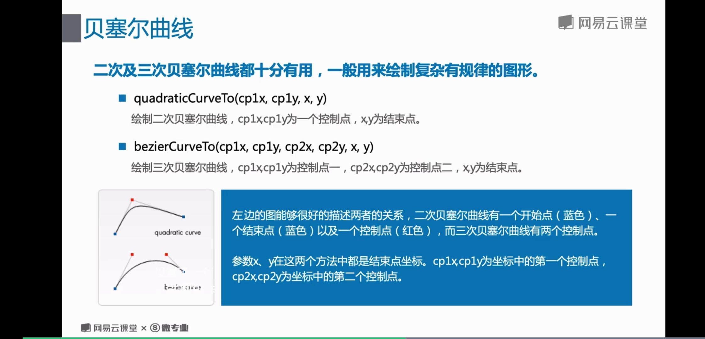
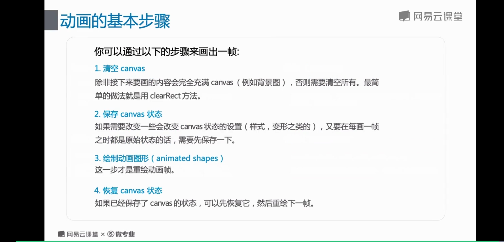

# 7 canvas

## 基础api

### 兼容性内容替换
```javascript
<canvas id='canvas' width='150' height='150'>
/* 可以是任意文本和html代码 */
您的浏览器不兼容
</canvas>
```

### canvas2d 形状绘制
* 矩形 (rectangular) <br>
无论是绘制实心空心矩形还是清除矩形区域， 四个参数分别是x、y、width、height
```javascript
var ctx = canvas.getContent('2d');
ctx.fillRect(25,25,100,100); // 实心矩形
ctx.clearReact(45,45,60,60); // 清除矩形区域
ctx.strokRect(50,50,50,50); // 空心矩形
```

* 圆弧 <br>
x, y为圆心点的以radius为半径的圆弧（圆）， 从startAangle开始到endAngle结束来生成。
```javascript
// x,y,radius,startAngle, endAngle,anticiockwise 参数anticlockwise为一个布尔值，为true时，是逆时针方向，否则顺// 时针方向 （默认顺时针）
ctx.arc(75, 75, 50, 0, 2*Math.PI, true); // 做内存处理
ctx.fill(); // 开始绘图
```

* 路径 <br>
图形的基本元素是路径。 路径是通过不同颜色和宽度的线段或曲线相连形成的不同形状的点的集合
```javascript
ctx.clearRect(0, 0, 150, 150); //清除矩形区域
ctx.beginPath(); // 开始路径
ctx.moveTo(70,50); // 画笔移动到点 70， 50
ctx.lineTo(100,75); shbnagh // 从上个点往100，75绘制直线
ctx.lineTo(45,125); shbnagh // 再从上个点往45，125绘制直线
ctx.stroke();
```

>  有fill地方都可以使用stroke 可以互换， 只是一个是填充，一个不填充。

### canvas2d 色彩
* 填充样式 fillStyle <br>
用于填充颜色
```javascript
ctx.fillStyle = '#fo0';
ctx.fillRect(0,0,75,75);
```

* 轮廓样式 （strokeStyle） <br>
用于描边颜色
```javascript
ctx.strokeStyle = 'rgb(0,255,255)';
ctx.beginPath();
ctx.arc(75, 75, 50, 0, 2*Math.PI, true); // 做内存处理
ctx.stroke();
```

* 设置透明度 <br>
使用canvas的 globalAlpha来绘制半透明的图形

```javascript
ctx.fillStyle = '#fff';
ctx.globalAlpha = 0.2; // 这是透明度
ctx.fillRect(0,0,75,75);
```

* 设置渐变 (Gradients) <br>
就好像一个的绘图软件一样， 我们可以直接用线性或者径向渐变来填充或描边
```javascript
var ctx = canvas.getContext('2d');
var lineargradient = ctx.createLinearGradient(0,0,150,150);
lineargradient.addColorStop(0,'white');
lineargradient.addColorStop(1,'black');
ctx.fillStyle = lineargradient;

ctx.clearRect(0, 0, 150, 150);//清除矩形区域
var radialgradient=ctx.createRadialGradient(75,75,0,75,75,100);
radialgradient.addColorStop(0,'white');
radialgradient.addColorStop(1,'black');
ctx.fillStyle = radialgradient ;
```

### canvan2d线型 (line styles)
* 线宽
```javascript
ctx.width = value; // value为整数
```

* 线条与线条间结合处的样式
```javascript
ctx.lineJion = type;
var lineJoin = ['round', 'bevel', 'miter']
```

* 线条末端样式
```javascript
ctx.lineCap = type;
var lineGap = ['butt', 'round', 'square'];
```

* 虚线样式
```javascript
ctx.setLineDash(segments);
ctx.lineDashOffest = value;
ctx.getLineDash();
// seqments 通常是一个数组， value是个整数;
```

## 曲线和高级路径

### 贝塞尔曲线

二次及三次贝塞尔曲线都十分有用， 一般用来绘制复杂有规律的图形。

> 是通过moveTo 控制起始点的

* 二次贝塞尔曲线

```javascript
quadraticCurveTo(cp1x, cp1y, x, y);
// 绘制二次贝塞尔曲线， cp1x , cp1y为一个控制点， x，y为结束点。
```

* 三次贝塞尔曲线
```javascript
bezierCurveTo(cp1x, cp1y, cp2x, cp2y, x, y);
// cp1x, cp1y为控制点一， cp2x，cp2y为控制点二， x， y为结束点
```


```javascript
var ctx = canvas.getContext('2d');
ctx.beginPath();
ctx.moveTo(0,150);//移动到开始点0,150
ctx.quadraticCurveTo(75,0,150,150);//控制点为75,0    结束点为150,150
ctx.stroke();//绘制

ctx.clearRect(0,0,150,150);//清空画布
ctx.beginPath();
ctx.moveTo(0,100);//移动到开始点0,100
ctx.bezierCurveTo(50,50,100,150,150,100);//控制点1为50,50    控制点二位100,150    控制点3位150
ctx.stroke();//绘制
```

### 高级路径之 path2D

* Path2D 对象用来缓存或记录绘画命令， 一边快速的回顾路径

```javascript
var circle = new Path2D();
cirlel.moveTo(125, 35);
circle.arc(100, 35 ,25 ,0 , 2*Math.PI);
ctx.fill(circle);;
```

* Path2D API 有一个强大的特点
-- 使用svg path data 来初始化canvas上的路径

```javascript
var p = new Path2D("M10 10 h 80 v 80 h -80 Z");
ctx.fill(p);

// 解释： 这条路径将先移动点（M10， 10）， 然后再水平移动80个单位（h 80）， 然后下移80个单位（v 80）， 接着左移80个单位（h - 80）， 再回到起点处（z）
```

## 状态， 变形， 以及动画

### canvas 的状态控制

在了解变形之前， 先介绍两个绘制负责图形必不可少的的方法

* save() <br>
保存画布（canvas）的所有状态， canvas 的状态就是当前画面应用的所有样式和变形的一个快照。

* restore() <br>
save 和 restore 方法是用来保存和恢复canvas 状态的， 都没有参数。

canvas 状态存储在栈中， 每当save() 方法被调用后， 当前的状态就被推送到栈中保存。
一个绘图状态包括： 
1. 当前应用的变形(即移动， 旋转， 和缩放)
2. strokeStyle, fillStyle, globalAlpha, lineWidth, lineCap, lineJoin, meiterLimit等等属性的值
3. 当前的裁切路径(clipping path) 

你可以调用任意多次save方法
每一次调用restore方法， 上一个保存的状态就从栈中弹出，所有设定都恢复

### 变形

* 移动 (translating) <br>
translating(x, y) 接收两个参数， x 是左右偏移量， y是上下偏移量

* 缩放(scaling) <br>
scale(x, y) 参数都是实数，可为负数， x为水平缩放， y为垂直缩放， 如果比1 小， 会缩放图形， 如果比1大， 会放大图形，默认为1.

* 旋转(rotating)
rotate(angle) 这个方法只接收一个参数， 旋转的角度（angle）， 他是顺时针方向的， 以弧度为单位的值。

* 变形(transforms)
transform(m11, m12, m21, m22, dx, dy) 这个方法是将当前的变形矩阵乘以上个一个基于自身参数的矩阵

```javascript
function draw(){
	var canvas = document.getElementById("test");  
	var context = canvas.getContext('2d');  
	context.lineWidth = "10";  
	context.strokeStyle = "#fe9901";  
	context.translate(canvas.width / 2, canvas.height / 2);  
	context.rotate( 30 / 180 * Math.PI);  
	context.beginPath();  
	context.moveTo(0, -180);  
	context.lineTo(0, -200);  
	context.stroke();  
		
	context.rotate( 30 / 180 * Math.PI);  
	context.beginPath();  
	context.moveTo(0, -140);  
	context.lineTo(0, -160);  
	context.stroke();  
	context.save();  
	context.rotate( 30 / 180 * Math.PI);  
	context.beginPath();  
	context.moveTo(0, -180);  
	context.lineTo(0, -200);  
	context.stroke();  
	context.restore();  
		
	context.rotate( 30 / 180 * Math.PI);  
	context.beginPath();  
	context.moveTo(0, -140);  
	context.lineTo(0, -160);  
	context.stroke();  
}
```

